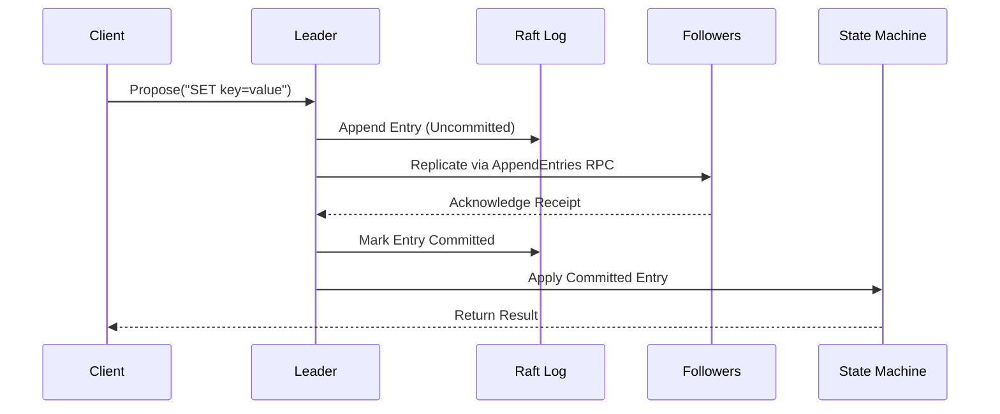

# d-engine 🚀
[](https://codecov.io/gh/deventlab/d-engine)

[](https://github.com/deventlab/d-engine/actions/workflows/ci.yml)

**d-engine** is a lightweight, strongly-consistent Raft engine designed to help developers build scalable and reliable distributed systems. It plans to provide a production-ready implementation of the Raft consensus algorithm, with support for pluggable storage backends, observability, and runtime flexibility.

---

## Features

- **Strong Consistency**: Full implementation of the Raft protocol for distributed consensus.
- **Pluggable Storage**: Supports custom storage backends (e.g., RocksDB, Sled, in-memory).
- **Observability**: Built-in metrics, structured logging, and distributed tracing.
- **Runtime Agnostic**: Works seamlessly with `tokio`.
- **Extensible Design**: Decouples business logic from the protocol layer for easy customization.

---

## Quick Start

### Installation

Add d-engine to your `Cargo.toml`:

```toml
[dependencies]
d-engine = "0.1.0"
```

## Basic Usage (Single-Node Mode)
use d-engine::{RaftCore, MemoryStorage, Config};

```rust
async fn main() -> Result<()> {
    // Initializing Shutdown Signal
    let (graceful_tx, graceful_rx) = watch::channel(());

    // Build Node
    let node = NodeBuilder::new(settings, graceful_rx)
        .build()
        .start_rpc_server()
        .await
        .ready()
        .expect("start node failed.");

    println!("Application started. Waiting for CTRL+C signal...");
    
    // Start Node
    node.run().await?;

    // Listen on Shutdown Signal
    // graceful_shutdown(graceful_tx, node).await?;

    println!("Exiting program.");
    Ok(())
}
```

Note: For production use, a minimum of 3 nodes is required to ensure fault tolerance.

## Core Concepts

### Data Flow

## Architecture Principles

- Single Responsibility Principle (SRP)
- Error Handling Design Principles

## Key Components

### Protocol Core (src/core/)

- `election/`: Leader election and heartbeat management.
- `replication/`: Log replication pipeline with batch buffering and consistency guarantees.
- `raft_role/`: State transition handlers: (leader_state | follower_state | candidate_state)
- `commit_handler/`: Commit application pipeline with default/test implementations
- `state_machine_handler/`: State machine operation executors
- `timer/`: Critical timing components: "Election timeouts" and "Heartbeat intervals"

### Node Control Plane (src/node/)
- `builder.rs`: Type-safe node construction with configurable components
- `type_config/`: Generic type configurations for protocol extensibility
- `settings.rs`: Node configuration parameters and runtime tuning
- `errors.rs`: Unified error handling for node operations

### Storage Abstraction (src/storage/)
- `raft_log.rs`: Raft local log operation definitions.
- `sled_adapter/`: Storage implementations which is based on Sled DB
- `state_machine.rs`: State machine operation definitions

### Network Layer (src/network/)
- `grpc/`: gRPC implementation:
    - `grpc_transport.rs`: Network primitives
    - `grpc_raft_service.rs`: RPC service definitions
- `rpc_peer_channels.rs`: Peer-to-peer communication channels

## Release Plan 

This project follows semantic versioning. Below is our development roadmap:

### Version Status
- ✅ Released | 🚧 In Development | ⏳ Planned

### Upcoming Releases

#### [v0.1.0](link-to-release) - Laying the Foundation ✅
**Key Goals**:  
- Initial implementation of core Raft consensus algorithm  
- Basic cluster communication layer  
- Minimal working example demonstration

#### v0.2.0 - Cluster Scalability 🚧
**Key Features**:  
- Snapshot support for state compaction
- Dynamic membership: Add/remove nodes without full restart  
- Improved leadership transfer mechanics

#### v0.3.0 - Production Ready ⏳
**Milestone**:  
- Publish crate to [crates.io](https://crates.io)  
- Performance benchmarking suite (e.g. 100K RPS)

## Contribution Guide

### Prerequisites
- Rust 1.65+
- Tokio runtime
- Protobuf compiler

### Development Workflow
```bash
# Build and test
cargo test --all-features
cargo clippy --all-targets -- -D clippy::all
cargo fmt --check
```
## Code Style
Follow Rust community standards (rustfmt, clippy).
Write unit tests for all new features.

## FAQ

**Why are 3 nodes required?**
Raft requires a majority quorum (N/2 + 1) to achieve consensus. A 3-node cluster can tolerate 1 node failure.

**How do I customize storage?**
Implement the Storage trait and pass it to RaftCore::new.

**Is d-engine production-ready?**
The current release (v0.0.1) focuses on correctness and reliability. Performance optimizations are planned for future releases.

## Supported Platforms
- Linux: x86_64, aarch64
- macOS: x86_64, aarch64

## License
deninge is licensed under the terms of the [MIT License](https://en.wikipedia.org/wiki/MIT_License#License_terms)
or the [Apache License 2.0](http://www.apache.org/licenses/LICENSE-2.0), at your choosing.
