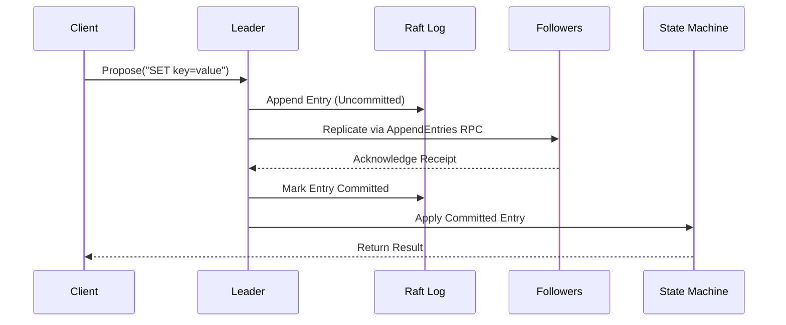

# d-engine 🚀

[](https://crates.io/crates/d-engine)
[](https://docs.rs/d-engine)
[](https://codecov.io/gh/deventlab/d-engine)

[](https://github.com/deventlab/d-engine/actions/workflows/ci.yml)
[](https://deepwiki.com/deventlab/d-engine)

**d-engine** is a lightweight distributed coordination engine written in Rust, designed for embedding into applications that need strong consistency—the consensus layer for building reliable distributed systems. Start with a single node and scale to a cluster when you need high availability. **Designed for resource efficiency**, d-engine employs a single-threaded event-driven architecture that minimizes resource overhead while maintaining high performance. It provides a production-ready implementation of the Raft consensus algorithm,
with pluggable storage backends, built-in observability, and tokio runtime support.

---

## Features

### New in v0.2.0 🎉

- **Modular Workspace**: Feature flags (`client`/`server`) - depend only on what you need
- **TTL/Lease**: Automatic key expiration for distributed locks and session management
- **Watch API**: Real-time key change notifications (config updates, service discovery)
- **EmbeddedEngine**: Single-node start, one-line scale to 3-node cluster
- **LocalKvClient**: Zero-overhead in-process access (<0.1ms latency)

### Core Capabilities

- **Single-Node Start**: Begin with one node, expand to 3-node cluster when needed (zero downtime)
- **Strong Consistency**: Full Raft protocol implementation for distributed consensus
- **Tunable Persistence**: DiskFirst for durability or MemFirst for lower latency
- **Flexible Read Consistency**: Three-tier model (Linearizable/Lease-Based/Eventual)
- **Pluggable Storage**: Custom backends supported (RocksDB, Sled, Raw File)

---

## Quick Start (Embedded Mode)

Add d-engine to your `Cargo.toml`:

```toml
d-engine = "0.2"
```

Example code:

```rust
use d_engine::prelude::*;
use std::time::Duration;

#[tokio::main]
async fn main() {
    // Start embedded engine (uses default config or CONFIG_PATH env)
    let engine = EmbeddedEngine::start().await.unwrap();

    // Wait for leader election (single-node: instant)
    engine.wait_ready(Duration::from_secs(5)).await.unwrap();

    // Get KV client (zero-overhead, in-process)
    let client = engine.client();

    // Store and retrieve data
    client.put(b"hello".to_vec(), b"world".to_vec()).await.unwrap();

    if let Some(value) = client.get_linearizable(b"hello".to_vec()).await.unwrap() {
        println!("Retrieved: hello = {}", String::from_utf8_lossy(&value));
    }

    // Graceful shutdown
    engine.stop().await.unwrap();
}
```

---

## Integration Modes

### Embedded Mode - In-Process Deployment

```toml
d-engine = "0.2"
```

**Use when**: Building Rust applications that need distributed coordination  
**Why**: Zero-overhead (<0.1ms), single binary, zero network cost

---

### Standalone Mode - Separate Service Deployment

```toml
d-engine = { version = "0.2", features = ["client"], default-features = false }
```

**Use when**: Application and d-engine run as separate processes  
**Why**: Language-agnostic (Go/Python/Java/Rust), independent scaling, easier operations

> **Performance note**: Benchmark shows 45% higher write throughput vs etcd 3.5 in high-concurrency tests (M2 Mac single machine vs etcd on 3 GCE instances). See [benches/](benches/d-engine-bench/reports/v0.2.0/) for methodology and hardware details.

**Note**: Rust apps can use both modes - embedded for performance, standalone for operational flexibility

---

## Advanced: Custom Storage Backends

For specific storage requirements (Sled, memory-only, cloud storage):

```toml
d-engine = { version = "0.2", features = ["server"], default-features = false }
```

Implement custom storage engines and state machines by implementing the respective traits:

- **Custom Storage Engines**: [Implementation Guide](https://docs.rs/d-engine/latest/d_engine/docs/server_guide/index.html#implementing-custom-storage-engines)
- **Custom State Machines**: [Implementation Guide](https://docs.rs/d-engine/latest/d_engine/docs/server_guide/index.html#implementing-custom-state-machines)
- **Example**: [Sled Storage Backend](examples/sled-cluster)

---

## Core Concepts

### Data Flow



---

## Performance Comparison (d-engine v0.2.0 vs etcd 3.5)


### View Benchmarks Detailed Reports

```bash
open benches/reports/
```

## Jepsen Tests

d-engine includes [Jepsen](https://jepsen.io/) tests to validate linearizability and fault-tolerance under partitions and crashes.

To run Jepsen tests (requires Docker & Leiningen):
See [examples/three-nodes-cluster/docker/jepsen/README.md](./examples/three-nodes-cluster/docker/jepsen/README.md) for full instructions.

---

## Contribution Guide

### Prerequisites

- Rust 1.65+
- Tokio runtime
- Protobuf compiler

### Development Workflow

```bash
# Build and test
make test
make clippy
make fmt-check
```

---

## Code Style

Follow Rust community standards (rustfmt, clippy).
Write unit tests for all new features.

## FAQ

**Why 3 nodes for HA?**  
Raft requires majority quorum (N/2 + 1). 3-node cluster tolerates 1 failure.

**Can I start with 1 node?**  
Yes. Scale to 3 nodes later with zero downtime (see `examples/single-node-expansion/`).

**How do I customize storage?**  
Implement `StorageEngine` and `StateMachine` traits (see Custom Storage Implementations section).

**Production-ready?**  
Core Raft engine is production-grade (1000+ tests, Jepsen validated). API is stabilizing toward v1.0. Pre-1.0 versions may introduce breaking changes (documented in [MIGRATION_GUIDE.md](./MIGRATION_GUIDE.md)).

## Supported Platforms

- Linux: x86_64, aarch64
- macOS: x86_64, aarch64

## License

d-engine is licensed under the terms of the [MIT License](https://en.wikipedia.org/wiki/MIT_License#License_terms)
or the [Apache License 2.0](http://www.apache.org/licenses/LICENSE-2.0), at your choosing.
