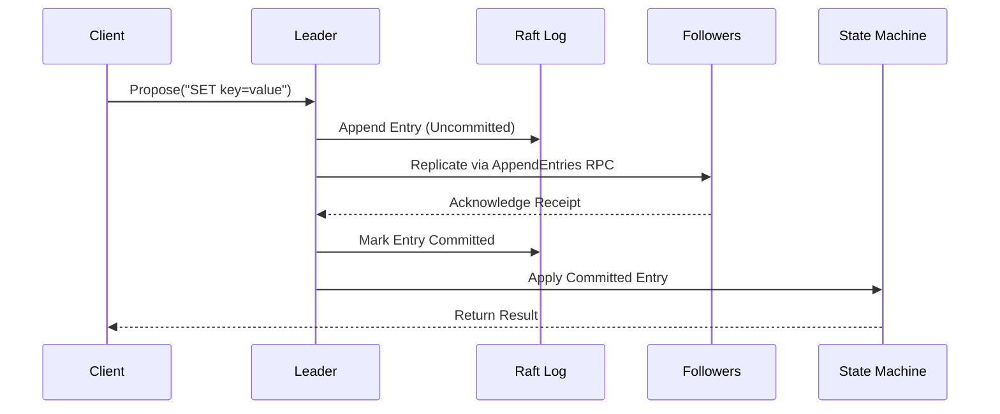

# d-engine 🚀

[](https://crates.io/crates/d-engine)
[](https://docs.rs/d-engine)
[](https://codecov.io/gh/deventlab/d-engine)

[](https://github.com/deventlab/d-engine/actions/workflows/ci.yml)
[](https://deepwiki.com/deventlab/d-engine)

**d-engine** is a lightweight distributed coordination engine written in Rust,
designed for embedding into applications that need strong consistency—the consensus
layer for building reliable distributed systems.

**Built with a simple vision**: make distributed coordination accessible - cheap
to run, simple to use. **Built on a core philosophy**: choose simple architectures
over complex ones.

d-engine's Raft core uses a single-threaded event loop to guarantee strong consistency
and strict ordering while keeping the codebase clean and performant. Production-ready
Raft implementation with flexible read consistency (Linearizable/Lease-Based/Eventual)
and pluggable storage backends. Start with one node, scale to a cluster when needed.

---

## Features

### New in v0.2 🎉

- **EmbeddedEngine**: Single-node start, scale to 3-node cluster when needed
- **LocalKvClient**: Zero-overhead in-process access (<0.1ms latency)
- **Watch API**: Real-time key change notifications (config updates, service discovery)
- **TTL/Lease**: Automatic key expiration for distributed locks and session management
- **Modular Workspace**: Feature flags (`client`/`server`) - depend only on what you need

### Core Capabilities

- **Strong Consistency**: Full Raft protocol implementation for distributed consensus
- **Flexible Read Consistency**: Three-tier model (Linearizable/Lease-Based/Eventual)
- **Single-Node Start**: Begin with one node, expand to 3-node cluster when needed (zero downtime)
- **Tunable Persistence**: DiskFirst for durability or MemFirst for lower latency
- **Pluggable Storage**: Custom backends supported (RocksDB, Sled, Raw File)

---

## Quick Start (Embedded Mode)

Add d-engine to your `Cargo.toml`:

```toml
d-engine = "0.2"
```

Example code:

```rust
use d_engine::prelude::*;
use std::time::Duration;

#[tokio::main]
async fn main() {
    let engine = EmbeddedEngine::start().await.unwrap();
    engine.wait_ready(Duration::from_secs(5)).await.unwrap();

    let client = engine.client();
    client.put(b"hello".to_vec(), b"world".to_vec()).await.unwrap();
    let value = client.get_linearizable(b"hello".to_vec()).await.unwrap();

    println!("Retrieved: {}", String::from_utf8_lossy(&value.unwrap()));
    engine.stop().await.unwrap();
}
```

> **Note**: Release builds require explicit `db_root_dir` configuration. Set `CONFIG_PATH` env or use `EmbeddedEngine::with_config(...)`. See [Quick Start Guide](https://docs.rs/d-engine/latest/d_engine/docs/quick_start_5min/index.html).

**→ Full example:** [examples/quick-start-embedded](examples/quick-start-embedded/README.md)

---

## Integration Modes

### Embedded Mode - In-Process Deployment

```toml
d-engine = "0.2"
```

**Use when**: Building Rust applications that need distributed coordination  
**Why**: Zero-overhead (<0.1ms), single binary, zero network cost

> **Performance note**: Embedded mode delivers exceptional performance - **4.6x higher write throughput** and **2x faster linearizable reads** vs etcd 3.5 (M2 Mac single machine vs etcd on 3 GCE instances). Achieves 203K writes/sec and 279K linearizable reads/sec. See [benches/embedded-bench/reports/v0.2.2/](benches/embedded-bench/reports/v0.2.2/) for detailed benchmarks.

**→ Examples:**

- [Quick Start Embedded](examples/quick-start-embedded/README.md) - Minimal setup
- [Service Discovery Embedded](examples/service-discovery-embedded/README.md) - Watch API with sub-millisecond latency

---

### Standalone Mode - Separate Service Deployment

```toml
d-engine = { version = "0.2", features = ["client"], default-features = false }
```

**Use when**: Application and d-engine run as separate processes  
**Why**: Language-agnostic (Go/Python/Java/Rust), independent scaling, easier operations

> **Performance note**: Standalone mode achieves 64K writes/sec and 12K linearizable reads/sec via gRPC, suitable for multi-language environments. For maximum performance, use embedded mode (3.1x faster writes, 23x faster reads). See [benches/standalone-bench/reports/v0.2.2/](benches/standalone-bench/reports/v0.2.2/) for benchmarks.

**Note**: Rust apps can use both modes - embedded for performance, standalone for operational flexibility

**→ Example:** [Quick Start Standalone (Go client)](examples/quick-start-standalone/README.md)

---

## Advanced: Custom Storage Backends

For specific storage requirements (Sled, memory-only, cloud storage):

```toml
d-engine = { version = "0.2", features = ["server"], default-features = false }
```

Implement custom storage engines and state machines by implementing the respective traits:

- **Custom Storage Engines**: [Implementation Guide](https://docs.rs/d-engine/latest/d_engine/docs/server_guide/index.html#implementing-custom-storage-engines)
- **Custom State Machines**: [Implementation Guide](https://docs.rs/d-engine/latest/d_engine/docs/server_guide/index.html#implementing-custom-state-machines)
- **Example**: [Sled Storage Backend](examples/sled-cluster)

---

## Core Concepts

### Data Flow



---

## Performance Comparison (d-engine v0.2.2 vs etcd 3.5)


### View Benchmarks Detailed Reports

```bash
open benches/reports/
```

---

## Maintainer Philosophy

d-engine is maintained by a single author with a clear vision.
We value quality over quantity:

- **PRs are not guaranteed to be merged** - even good code may be declined
  if it conflicts with roadmap priorities
- **Response time varies** - active development takes precedence over PR reviews
- **Breaking changes are OK pre-1.0** - we prioritize getting it right over
  backward compatibility

This approach keeps d-engine focused and maintainable.

---

## Contribution Guide

d-engine follows the 20/80 rule - solve real production problems, not experiments.
Read [Contributing Guide](CONTRIBUTING.md) and open an issue before feature PRs.
Bug fixes are always welcome.

### Prerequisites

- Rust 1.88+
- Tokio runtime
- Protobuf compiler

### Development Workflow

```bash
# Run all tests (fast, parallel with nextest)
make test
```

---

## Code Style

Follow Rust community standards (rustfmt, clippy).
Write unit tests for all new features.

## FAQ

**Why 3 nodes for HA?**  
Raft requires majority quorum (N/2 + 1). 3-node cluster tolerates 1 failure.

**Can I start with 1 node?**  
Yes. Scale to 3 nodes later with zero downtime (see `examples/single-node-expansion/`).

**How do I customize storage?**  
Implement `StorageEngine` and `StateMachine` traits (see Custom Storage Implementations section).

**Production-ready?**  
Core Raft engine is production-grade (1000+ tests, Jepsen validated). API is stabilizing toward v1.0. Pre-1.0 versions may introduce breaking changes (documented in [MIGRATION_GUIDE.md](./MIGRATION_GUIDE.md)).

## Supported Platforms

- Linux: x86_64, aarch64
- macOS: x86_64, aarch64

## License

d-engine is licensed under the terms of the [MIT License](https://en.wikipedia.org/wiki/MIT_License#License_terms)
or the [Apache License 2.0](http://www.apache.org/licenses/LICENSE-2.0), at your choosing.
