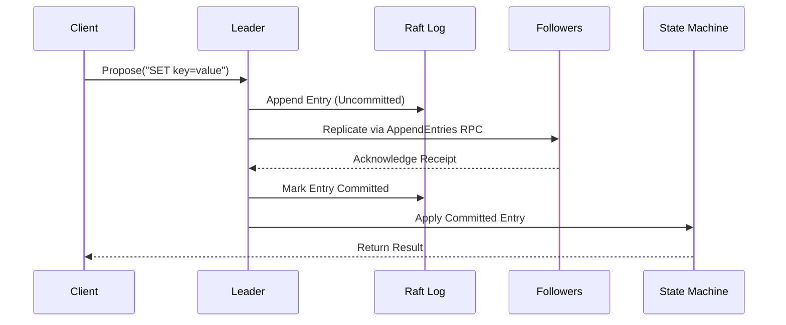

# d-engine 🚀
[](https://crates.io/crates/d-engine)
[](https://docs.rs/d-engine)
[](https://codecov.io/gh/deventlab/d-engine)

[](https://github.com/deventlab/d-engine/actions/workflows/ci.yml)

**d-engine** is a lightweight and strongly consistent Raft consensus engine written in Rust. It is a base to build reliable and scalable distributed systems. **Designed for resource efficiency**, d-engine employs a single-threaded event-driven architecture that maximizes single CPU core performance while minimizing resource overhead. It plans to provide a production-ready implementation of the Raft consensus algorithm, with support for pluggable storage backends, observability, and runtime flexibility.

---

## Features

- **Strong Consistency**: Full implementation of the Raft protocol for distributed consensus.
- **Pluggable Storage**: Supports custom storage backends (e.g., RocksDB, Sled, in-memory).
- **Observability**: Built-in metrics, structured logging, and distributed tracing.
- **Runtime Agnostic**: Works seamlessly with `tokio`.
- **Extensible Design**: Decouples business logic from the protocol layer for easy customization.

---

## Quick Start

### Installation

Add d-engine to your `Cargo.toml`:

```toml
[dependencies]
d-engine = "0.1.2"
```

## Basic Usage (Single-Node Mode)
use d-engine::{RaftCore, MemoryStorage, Config};

```rust
async fn main() -> Result<()> {
    // Initializing Shutdown Signal
    let (graceful_tx, graceful_rx) = watch::channel(());

    // Build Node
    let node = NodeBuilder::new(settings, graceful_rx)
        .build()
        .start_rpc_server()
        .await
        .ready()
        .expect("start node failed.");

    println!("Application started. Waiting for CTRL+C signal...");
    
    // Start Node
    node.run().await?;

    // Listen on Shutdown Signal
    // graceful_shutdown(graceful_tx, node).await?;

    println!("Exiting program.");
    Ok(())
}
```

Note: For production use, a minimum of 3 nodes is required to ensure fault tolerance.

## Core Concepts

### Data Flow

## Architecture Principles

- Single Responsibility Principle (SRP)
- Error Handling Design Principles

## Key Components

### Protocol Core (src/core/)

- `election/`: Leader election and heartbeat management.
- `replication/`: Log replication pipeline with batch buffering and consistency guarantees.
- `raft_role/`: State transition handlers: (leader_state | follower_state | candidate_state)
- `commit_handler/`: Commit application pipeline with default/test implementations
- `state_machine_handler/`: State machine operation executors
- `timer/`: Critical timing components: "Election timeouts" and "Heartbeat intervals"

### Node Control Plane (src/node/)
- `builder.rs`: Type-safe node construction with configurable components
- `type_config/`: Generic type configurations for protocol extensibility
- `settings.rs`: Node configuration parameters and runtime tuning
- `errors.rs`: Unified error handling for node operations

### Storage Abstraction (src/storage/)
- `raft_log.rs`: Raft local log operation definitions.
- `sled_adapter/`: Storage implementations which is based on Sled DB
- `state_machine.rs`: State machine operation definitions

### Network Layer (src/network/)
- `grpc/`: gRPC implementation:
    - `grpc_transport.rs`: Network primitives
    - `grpc_raft_service.rs`: RPC service definitions
- `rpc_peer_channels.rs`: Peer-to-peer communication channels

## Performance Benchmarks 

d-engine is designed for low-latency consensus operations while maintaining strong consistency. Below are key metrics compared to etcd 3.5:

**Test Setup**: d-engine v0.1.2 vs etcd 3.5， 10k ops, 8B keys, 256B values, Apple M2

| **Test Case** | **Metric** | **d-engine** | **etcd** | **Advantage** |
| --- | --- | --- | --- | --- |
| **Basic Write** | Throughput | 385.31 ops/s | 157.85 ops/s | ✅ 2.44× d-engine |
| (1 connection, 1 client) | Avg Latency | 2,594 μs | 6,300 μs | ✅ 59% lower |
|  | p99 Latency | 4,527 μs | 16,700 μs | ✅ 73% lower |
| **High Concurrency** | Throughput | 3,972 ops/s | 5,439 ops/s | ❌ 1.37× etcd |
| (10 conns, 100 clients) | Avg Latency | 2,516 μs | 18,300 μs | ✅ 86% lower |
|  | p99 Latency | 4,359 μs | 32,400 μs | ✅ 87% lower |
| **Linear Read** | Throughput | 8,230 ops/s | 85,904 ops/s | ❌ 10.43× etcd |
| (Strong consistency) | Avg Latency | 1,212 μs | 1,100 μs | ❌ 10% higher |
|  | p99 Latency | 1,467 μs | 3,200 μs | ✅ 54% lower |
| **Sequential Read** | Throughput | 40,860 ops/s | 124,631 ops/s | ❌ 3.05× etcd |
| (Eventual consistency) | Avg Latency | 243 μs | 700 μs | ✅ 65% lower |
|  | p99 Latency | 529 μs | 2,800 μs | ✅ 81% lower |

**Important Notes**  
1. d-engine architecture uses **single-threaded** event-driven design
2. Tested on d-engine v0.1.2 (without snapshot functionality)
3. etcd 3.5 benchmark using official tools
4. All services co-located on same hardware (M2/16GB)

### View Benchmarks Detailed Reports
```bash
open benches/reports/
```

## Contribution Guide

### Prerequisites
- Rust 1.65+
- Tokio runtime
- Protobuf compiler

### Development Workflow
```bash
# Build and test
cargo test --all-features
cargo clippy --all-targets --all-features
cargo fmt --all -- --check
```
## Code Style
Follow Rust community standards (rustfmt, clippy).
Write unit tests for all new features.

## FAQ

**Why are 3 nodes required?**
Raft requires a majority quorum (N/2 + 1) to achieve consensus. A 3-node cluster can tolerate 1 node failure.

**How do I customize storage?**
Implement the Storage trait and pass it to RaftCore::new.

**Is d-engine production-ready?**
The current release (v0.0.1) focuses on correctness and reliability. Performance optimizations are planned for future releases.

## Supported Platforms
- Linux: x86_64, aarch64
- macOS: x86_64, aarch64

## License
d-eninge is licensed under the terms of the [MIT License](https://en.wikipedia.org/wiki/MIT_License#License_terms)
or the [Apache License 2.0](http://www.apache.org/licenses/LICENSE-2.0), at your choosing.
