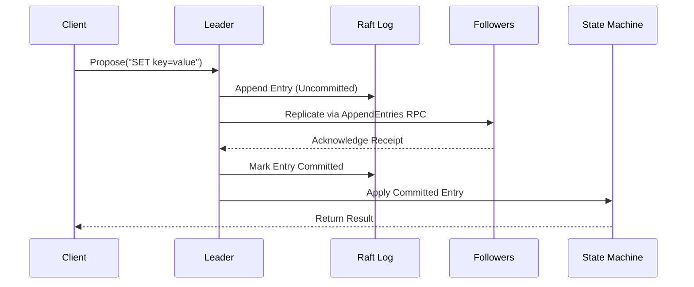
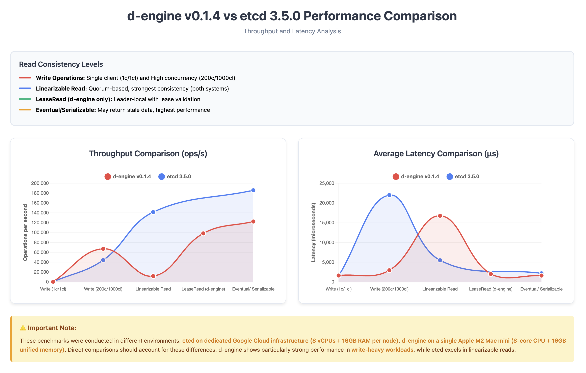

# d-engine 🚀

[](https://crates.io/crates/d-engine)
[](https://docs.rs/d-engine)
[](https://codecov.io/gh/deventlab/d-engine)

[](https://github.com/deventlab/d-engine/actions/workflows/ci.yml)
[](https://deepwiki.com/deventlab/d-engine)

**d-engine** is a lightweight and strongly consistent Raft consensus engine written in Rust. It is a base to build reliable and scalable distributed systems. **Designed for resource efficiency**, d-engine employs a single-threaded event-driven architecture that maximizes single CPU core performance while minimizing resource overhead. It plans to provide a production-ready implementation of the Raft consensus algorithm, with support for pluggable storage backends, observability, and runtime flexibility.

---

## Features

- **Strong Consistency**: Full implementation of the Raft protocol for distributed consensus.
- **Flexible Read Consistency**: Three-tier read model (Linearizable/Lease-Based/Eventual) balancing consistency and performance.
- **Pluggable Storage**: Supports custom storage backends (e.g., RocksDB, Sled, Raw File).
- **Observability**: Built-in metrics, structured logging, and distributed tracing.
- **Runtime Agnostic**: Works seamlessly with `tokio`.
- **Extensible Design**: Decouples business logic from the protocol layer for easy customization.

---

## Quick Start

### Installation

Add d-engine to your `Cargo.toml`:

```toml
[dependencies]
d-engine = "0.1.4"

# or with RocksDB support:
d-engine = { version = "0.1.4", features = ["rocksdb"] }
```

## Basic Usage (Single-Node Mode)

use d-engine::{RaftCore, MemoryStorage, Config};

```rust
use d_engine::{NodeBuilder, FileStorageEngine, FileStateMachine};
use tokio::sync::watch;
use std::sync::Arc;
use std::path::PathBuf;

#[tokio::main]
async fn main() -> Result<(), Box<dyn std::error::Error>> {
    // Initialize graceful shutdown channel
    let (graceful_tx, graceful_rx) = watch::channel(());

    // Configure storage
    let path = PathBuf::from("/tmp/db");
    let storage_engine = Arc::new(FileStorageEngine::new(path.join("storage"))?);
    let state_machine = Arc::new(FileStateMachine::new(path.join("state_machine"))?);

    // Build and start node
    let node = NodeBuilder::new(None, graceful_rx)
        .storage_engine(storage_engine)
        .state_machine(state_machine)
        .build()
        .start_rpc_server()
        .await
        .ready()
        .expect("Failed to start node");

    // Run node (blocks until shutdown)
    node.run().await?;
    Ok(())
}
```

### **Using RocksDB Storage**

Enable the **`rocksdb`** feature and use the RocksDB implementations:

```rust
use d_engine::{NodeBuilder, RocksDBStorageEngine, RocksDBStateMachine};
// ... same setup as above
let storage_engine = Arc::new(RocksDBStorageEngine::new(path.join("storage"))?);
let state_machine = Arc::new(RocksDBStateMachine::new(path.join("state_machine"))?);
```

## **Custom Storage Implementations**

d-engine provides flexible storage abstraction layers. Implement your own storage engines and state machines by implementing the respective traits:

- **Custom Storage Engines**: See [Implementing Custom Storage Engines](https://docs.rs/d-engine/latest/d_engine/docs/server_guide/index.html#implementing-custom-storage-engines)
- **Custom State Machines**: See [Implementing Custom State Machines](https://docs.rs/d-engine/latest/d_engine/docs/server_guide/index.html#implementing-custom-state-machines)

Note: For production use, a minimum of 3 nodes is required to ensure fault tolerance.

---

## Architecture

**Hybrid threading model**: Single-threaded Raft core + async I/O layer

- **Consensus logic**: Dedicated event loop (eliminates lock contention)
- **Network/Storage**: Tokio's async runtime for efficient I/O multiplexing
- **Design goal**: Maximize single CPU core performance while minimizing resource overhead

---

## Core Concepts

### Data Flow



---

## Performance Comparison (d-engine v0.1.4 vs etcd 3.5)



### View Benchmarks Detailed Reports

```bash
open benches/reports/
```

## Jepsen Tests

d-engine includes [Jepsen](https://jepsen.io/) tests to validate linearizability and fault-tolerance under partitions and crashes.

To run Jepsen tests (requires Docker & Leiningen):
See [examples/three-nodes-cluster/docker/jepsen/README.md](./examples/three-nodes-cluster/docker/jepsen/README.md) for full instructions.

---

## Contribution Guide

### Prerequisites

- Rust 1.65+
- Tokio runtime
- Protobuf compiler

### Development Workflow

```bash
# Build and test
make test
make clippy
make fmt-check
```

---

## Code Style

Follow Rust community standards (rustfmt, clippy).
Write unit tests for all new features.

## FAQ

**Why are 3 nodes required?**
Raft requires a majority quorum (N/2 + 1) to achieve consensus. A 3-node cluster can tolerate 1 node failure.

**How do I customize storage?**
Implement the Storage trait and pass it to RaftCore::new.

**Is d-engine production-ready?**
The current release (v0.0.1) focuses on correctness and reliability. Performance optimizations are planned for future releases.

## Supported Platforms

- Linux: x86_64, aarch64
- macOS: x86_64, aarch64

## License

d-eninge is licensed under the terms of the [MIT License](https://en.wikipedia.org/wiki/MIT_License#License_terms)
or the [Apache License 2.0](http://www.apache.org/licenses/LICENSE-2.0), at your choosing.
