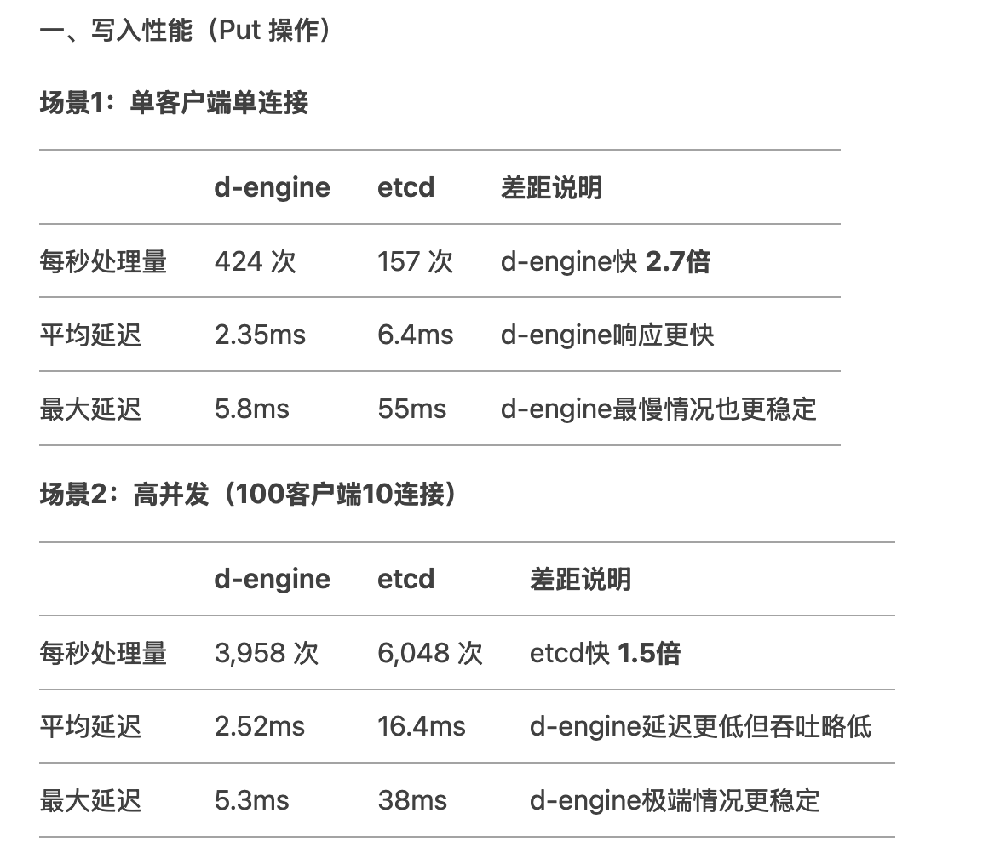
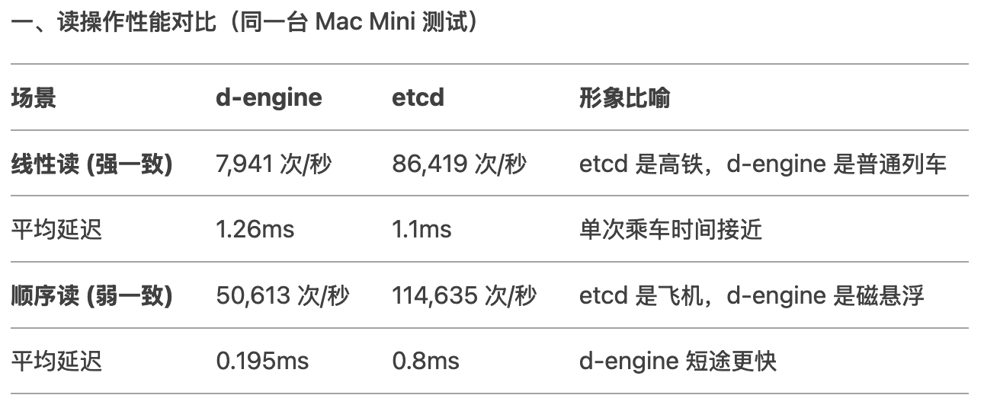

# D-Engine Bench
## Test based on d-engine v0.1.2,
Please note, under v0.1.2, the snapshot feature still missing. So this is not the final performance report.
I suggest you wait for v0.2.0 for final performance report.

## Testing ENV
Mac mini with an Apple M2 chip. All three d-engine nodes are running on this single Mac mini, and the benchmark is also executed on the same machine.

Model Name: Mac mini
Model Identifier: Mac14,3
Model Number: Z16L0002TCH/A
Chip: Apple M2
Total Number of Cores: 8 (4 performance cores and 4 efficiency cores)
Memory: 16 GB

### Put 
 ```shell
RUST_LOG=d-engine-bench=debug ./target/release/d-engine-bench  \
--endpoints http://127.0.0.1:9081 --endpoints  http://127.0.0.1:9082 --endpoints http://127.0.0.1:9083 \
--conns 1 \
--clients 1 \
--total 10000 \
--key-size 8 \
--value-size 256 \
put

Summary:
Total time:	23.55 s
 Requests:	10000
Throughput:	424.67 ops/sec

Latency distribution (μs):
 Avg	2353.96
 Min	674
 Max	5831
 p50	2217
 p90	3171
 p99	4115
 p99.9	4987
```

### Put 
 ```shell
RUST_LOG=d-engine-bench=debug ./target/release/d-engine-bench  \
--endpoints http://127.0.0.1:9081 --endpoints  http://127.0.0.1:9082 --endpoints http://127.0.0.1:9083 \
--conns 10 \
--clients 100 \
--total 10000 \
--key-size 8 \
--value-size 256 \
put

Summary:
Total time:	2.55 s
 Requests:	10099
Throughput:	3958.17 ops/sec

Latency distribution (μs):
 Avg	2524.12
 Min	448
 Max	5323
 p50	2437
 p90	3677
 p99	4267
 p99.9	4903
 ```

 ### Linear Read
 ```shell
 ./target/release/d-engine-bench \
--endpoints http://127.0.0.1:9081 --endpoints  http://127.0.0.1:9082 --endpoints http://127.0.0.1:9083 \
--clients 100 \
--conns 10 \
--total 10000 \
range --key foo --consistency l

Summary:
Total time:	1.27 s
 Requests:	10099
Throughput:	7941.31 ops/sec

Latency distribution (μs):
 Avg	1255.94
 Min	827
 Max	3045
 p50	1245
 p90	1319
 p99	1687
 p99.9	2363
```

### Sequential Read(No consistence promise)

```shell
 ./target/release/d-engine-bench \
--endpoints http://127.0.0.1:9081 --endpoints  http://127.0.0.1:9082 --endpoints http://127.0.0.1:9083 \
--clients 100 \
--conns 10 \
--total 10000 \
range --key foo --consistency s
ClientPool::endpoints=["http://127.0.0.1:9081", "http://127.0.0.1:9082", "http://127.0.0.1:9083"]
Summary:
Total time:	0.20 s
 Requests:	10099
Throughput:	50613.25 ops/sec

Latency distribution (μs):
 Avg	195.86
 Min	54
 Max	760
 p50	179
 p90	312
 p99	477
 p99.9	604
```


# Etcd Bench

# Etcd benchmark 
## start etcd cluster
(https://github.com/etcd-io/etcd/tree/main/tools/benchmark)
>$ cd etcd_benchmark

etcd --name infra0 --initial-advertise-peer-urls http://0.0.0.0:2380 \
  --listen-peer-urls http://0.0.0.0:2380 \
  --listen-client-urls http://0.0.0.0:12379,http://127.0.0.1:12379 \
  --advertise-client-urls http://0.0.0.0:12379 \
  --initial-cluster-token etcd-cluster-1 \
  --initial-cluster infra0=http://0.0.0.0:2380,infra1=http://0.0.0.0:2381,infra2=http://0.0.0.0:2382 \
  --initial-cluster-state new

etcd --name infra1 --initial-advertise-peer-urls http://0.0.0.0:2381 \
  --listen-peer-urls http://0.0.0.0:2381 \
  --listen-client-urls http://0.0.0.0:22379,http://127.0.0.1:22379 \
  --advertise-client-urls http://0.0.0.0:22379 \
  --initial-cluster-token etcd-cluster-1 \
  --initial-cluster infra0=http://0.0.0.0:2380,infra1=http://0.0.0.0:2381,infra2=http://0.0.0.0:2382 \
  --initial-cluster-state new

etcd --name infra2 --initial-advertise-peer-urls http://0.0.0.0:2382 \
  --listen-peer-urls http://0.0.0.0:2382 \
  --listen-client-urls http://0.0.0.0:32379,http://127.0.0.1:32379 \
  --advertise-client-urls http://0.0.0.0:32379 \
  --initial-cluster-token etcd-cluster-1 \
  --initial-cluster infra0=http://0.0.0.0:2380,infra1=http://0.0.0.0:2381,infra2=http://0.0.0.0:2382 \
  --initial-cluster-state new

## Start benchmark script
### Install benchmark
Enter the directory and install the benchmark tool
> $cd etcd
> $go install -v ./tools/benchmark
### Run benchmark


### Put 
```shell
export ENDPOINTS=http://0.0.0.0:2380,http://0.0.0.0:2381,http://0.0.0.0:2382


/Users/joshua/go/bin/benchmark --endpoints=${ENDPOINTS} --target-leader  --conns=1 --clients=1 put --key-size=8 --sequential-keys --total=10000 --val-size=256

2025/04/19 13:31:20 INFO: [core] [Channel #7]Channel Connectivity change to READY
10000 / 10000 [----------------------------------------------------------------------------------------------------] 100.00% 158 p/s

Summary:
  Total:	63.6170 secs.
  Slowest:	0.0558 secs.
  Fastest:	0.0020 secs.
  Average:	0.0064 secs.
  Stddev:	0.0026 secs.
  Requests/sec:	157.1907

Response time histogram:
  0.0020 [1]	|
  0.0074 [8134]	|∎∎∎∎∎∎∎∎∎∎∎∎∎∎∎∎∎∎∎∎∎∎∎∎∎∎∎∎∎∎∎∎∎∎∎∎∎∎∎∎
  0.0127 [1501]	|∎∎∎∎∎∎∎
  0.0181 [311]	|∎
  0.0235 [41]	|
  0.0289 [8]	|
  0.0342 [2]	|
  0.0396 [0]	|
  0.0450 [1]	|
  0.0504 [0]	|
  0.0558 [1]	|

Latency distribution:
  10% in 0.0039 secs.
  25% in 0.0049 secs.
  50% in 0.0060 secs.
  75% in 0.0070 secs.
  90% in 0.0089 secs.
  95% in 0.0112 secs.
  99% in 0.0167 secs.
  99.9% in 0.0247 secs.
```

### Put 
```shell
export ENDPOINTS=http://0.0.0.0:2380,http://0.0.0.0:2381,http://0.0.0.0:2382


/Users/joshua/go/bin/benchmark --endpoints=${ENDPOINTS} --target-leader  --conns=10 --clients=100 put --key-size=8 --sequential-keys --total=10000 --val-size=256

2025/04/19 13:34:05 INFO: [core] [Channel #33]Channel Connectivity change to READY
10000 / 10000 [---------------------------------------------------------------------------------------------------] 100.00% 6882 p/s

Summary:
  Total:	1.6534 secs.
  Slowest:	0.0381 secs.
  Fastest:	0.0055 secs.
  Average:	0.0164 secs.
  Stddev:	0.0047 secs.
  Requests/sec:	6048.1040

Response time histogram:
  0.0055 [1]	|
  0.0087 [91]	|∎
  0.0120 [1607]	|∎∎∎∎∎∎∎∎∎∎∎∎∎∎∎∎∎∎∎∎
  0.0153 [2467]	|∎∎∎∎∎∎∎∎∎∎∎∎∎∎∎∎∎∎∎∎∎∎∎∎∎∎∎∎∎∎∎
  0.0185 [3106]	|∎∎∎∎∎∎∎∎∎∎∎∎∎∎∎∎∎∎∎∎∎∎∎∎∎∎∎∎∎∎∎∎∎∎∎∎∎∎∎∎
  0.0218 [1747]	|∎∎∎∎∎∎∎∎∎∎∎∎∎∎∎∎∎∎∎∎∎∎
  0.0251 [504]	|∎∎∎∎∎∎
  0.0283 [256]	|∎∎∎
  0.0316 [125]	|∎
  0.0349 [95]	|∎
  0.0381 [1]	|

Latency distribution:
  10% in 0.0109 secs.
  25% in 0.0129 secs.
  50% in 0.0165 secs.
  75% in 0.0189 secs.
  90% in 0.0217 secs.
  95% in 0.0250 secs.
  99% in 0.0313 secs.
  99.9% in 0.0340 secs.
```

### Linear Read
```shell
export ENDPOINTS=http://0.0.0.0:2380,http://0.0.0.0:2381,http://0.0.0.0:2382


/Users/joshua/go/bin/benchmark --endpoints=${ENDPOINTS}  --conns=10 --clients=100  \
range key_  --consistency=l --total=10000 

2025/04/19 13:43:07 INFO: [core] [Channel #27]Channel Connectivity change to READY
10000 / 10000 [------------------------------------------------------------------------------------------------------] 100.00% ? p/s

Summary:
  Total:	0.1157 secs.
  Slowest:	0.0045 secs.
  Fastest:	0.0002 secs.
  Average:	0.0011 secs.
  Stddev:	0.0006 secs.
  Requests/sec:	86419.4063

Response time histogram:
  0.0002 [1]	|
  0.0006 [1227]	|∎∎∎∎∎∎∎∎∎∎∎
  0.0010 [4336]	|∎∎∎∎∎∎∎∎∎∎∎∎∎∎∎∎∎∎∎∎∎∎∎∎∎∎∎∎∎∎∎∎∎∎∎∎∎∎∎∎
  0.0015 [2580]	|∎∎∎∎∎∎∎∎∎∎∎∎∎∎∎∎∎∎∎∎∎∎∎
  0.0019 [851]	|∎∎∎∎∎∎∎
  0.0023 [524]	|∎∎∎∎
  0.0027 [256]	|∎∎
  0.0032 [160]	|∎
  0.0036 [50]	|
  0.0040 [11]	|
  0.0045 [4]	|

Latency distribution:
  10% in 0.0006 secs.
  25% in 0.0008 secs.
  50% in 0.0010 secs.
  75% in 0.0013 secs.
  90% in 0.0019 secs.
  95% in 0.0023 secs.
  99% in 0.0030 secs.
  99.9% in 0.0037 secs.
```

### Sequential Read(No consistence promise)

```shell
export ENDPOINTS=http://0.0.0.0:2380,http://0.0.0.0:2381,http://0.0.0.0:2382


/Users/joshua/go/bin/benchmark --endpoints=${ENDPOINTS}  --conns=10 --clients=100  \
range key_  --consistency=s --total=10000 

2025/04/19 13:55:20 INFO: [core] [Channel #24]Channel Connectivity change to READY
10000 / 10000 [------------------------------------------------------------------------------------------------------] 100.00% ? p/s

Summary:
  Total:	0.0872 secs.
  Slowest:	0.0113 secs.
  Fastest:	0.0000 secs.
  Average:	0.0008 secs.
  Stddev:	0.0010 secs.
  Requests/sec:	114635.3521

Response time histogram:
  0.0000 [1]	|
  0.0012 [8553]	|∎∎∎∎∎∎∎∎∎∎∎∎∎∎∎∎∎∎∎∎∎∎∎∎∎∎∎∎∎∎∎∎∎∎∎∎∎∎∎∎
  0.0023 [1159]	|∎∎∎∎∎
  0.0034 [174]	|
  0.0045 [13]	|
  0.0057 [0]	|
  0.0068 [0]	|
  0.0079 [21]	|
  0.0090 [40]	|
  0.0102 [25]	|
  0.0113 [14]	|

Latency distribution:
  10% in 0.0003 secs.
  25% in 0.0004 secs.
  50% in 0.0006 secs.
  75% in 0.0008 secs.
  90% in 0.0015 secs.
  95% in 0.0019 secs.
  99% in 0.0075 secs.
  99.9% in 0.0105 secs.
```

## Summary


