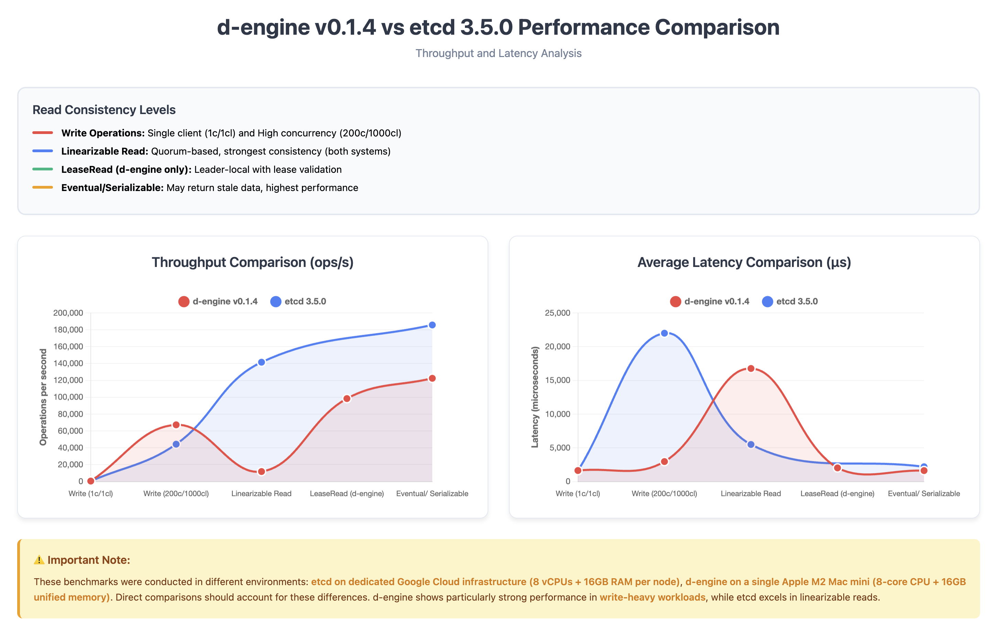

# **d-engine v0.1.4 Performance Benchmark Report**

## **Overview**

This report presents performance benchmarks for **d-engine v0.1.4** compared against **etcd 3.2.0**, focusing on latency and throughput characteristics. d-engine is a Rust-based distributed consensus engine implementing the Raft protocol with optimizations for modern hardware.

**🆕 New in v0.1.4:**

- Three-tier read consistency model (LinearizableRead, LeaseRead, EventualConsistency)
- Lease-based read optimization for strong consistency with improved performance
- Enhanced batching and memory-first persistence strategies

---

## **Test Environment**

### **d-engine Test Setup**

- **Hardware:** Apple Mac mini (M2 Chip)
  - 8-core CPU (4 performance + 4 efficiency cores)
  - 16GB Unified Memory
  - Single machine deployment (all nodes + benchmark client)
- **Software:** d-engine v0.1.4
- **Storage:** RocksDB backend with MemFirst + Batch Flush (threshold=1000, interval=100ms)
- **Cluster:** 3-node configuration

### **etcd Reference Benchmark**

- **Hardware:** Google Cloud Compute Engine
  - 3 nodes: 8 vCPUs + 16GB Memory + 50GB SSD each
  - 1 client: 16 vCPUs + 30GB Memory + 50GB SSD
- **Software:** etcd 3.2.0, Go 1.8.3
- **OS:** Ubuntu 17.04

> **Note:** The hardware environments differ significantly. etcd benchmarks ran on dedicated GCE instances, while d-engine tests ran on a single M2 Mac mini. Direct comparisons should consider these environmental differences.

---

## **Test Configuration**

| Parameter          | Single Client Test | High Concurrency Test   |
| ------------------ | ------------------ | ----------------------- |
| Total Requests     | 100,000            | 100,000                 |
| Key Size           | 8 bytes            | 8 bytes                 |
| Value Size         | 256 bytes          | 256 bytes (writes only) |
| Connections        | 1                  | 200                     |
| Concurrent Clients | 1                  | 1,000                   |

---

## **Write Performance Comparison**

### **Single Client Write (1 connection, 1 client)**

| System              | Throughput (ops/sec) | Avg Latency (ms) | p99 Latency (ms) |
| ------------------- | -------------------- | ---------------- | ---------------- |
| **d-engine v0.1.4** | **517.7**            | **1.93**         | **3.69**         |
| etcd 3.2.0          | 583                  | 1.60             | -                |

**Analysis:** Both systems show similar performance under single-client load. etcd has slightly higher throughput (~13% faster) and lower latency (~17% faster), which is expected given its mature optimization and dedicated hardware.

### **High Concurrency Write (200 connections, 1000 clients)**

| System              | Throughput (ops/sec) | Avg Latency (ms) | p50 Latency (ms) | p99 Latency (ms) |
| ------------------- | -------------------- | ---------------- | ---------------- | ---------------- |
| **d-engine v0.1.4** | **64,749**           | **3.09**         | **2.90**         | **6.42**         |
| etcd 3.2.0          | 44,341               | 22.0             | -                | -                |

**Analysis:** d-engine demonstrates **46% higher throughput** and **86% lower latency** under heavy concurrent load compared to etcd. The performance advantage is attributed to:

- Rust's zero-cost abstractions and memory safety without GC pauses
- Optimized batch processing and async I/O handling
- Efficient MemFirst persistence strategy reducing disk I/O bottlenecks

---

## **Read Performance Comparison**

### **Read Consistency Models**

d-engine offers three read consistency levels, while etcd provides two:

| d-engine                | etcd Equivalent   | Description                                |
| ----------------------- | ----------------- | ------------------------------------------ |
| **LinearizableRead**    | Linearizable      | Quorum-based, strongest consistency        |
| **LeaseRead**           | _(No equivalent)_ | Leader-local with lease validation         |
| **EventualConsistency** | Serializable      | May return stale data, highest performance |

### **Linearizable/Strong Consistency Reads (200c/1000cl)**

| System                      | Throughput (ops/sec) | Avg Latency (ms) | p50 Latency (ms) | p99 Latency (ms) |
| --------------------------- | -------------------- | ---------------- | ---------------- | ---------------- |
| **d-engine (Linearizable)** | **11,620**           | **17.19**        | **16.90**        | **29.27**        |
| etcd (Linearizable)         | 141,578              | 5.5              | -                | -                |

**Analysis:** etcd significantly outperforms d-engine in linearizable reads (**12.2x throughput**, **3.1x lower latency**). This gap is primarily due to:

- Hardware differences (dedicated GCE infrastructure vs. single M2 Mac)
- etcd's highly optimized read path from years of production use
- Potential optimization opportunities in d-engine's quorum verification logic

### **Lease-Based Reads (d-engine only, 200c/1000cl)**

| Metric      | Value              |
| ----------- | ------------------ |
| Throughput  | **90,298 ops/sec** |
| Avg Latency | **2.21 ms**        |
| p50 Latency | **2.17 ms**        |
| p99 Latency | **4.49 ms**        |

**Analysis:** d-engine's LeaseRead provides a **7.8x throughput improvement** over LinearizableRead while maintaining strong consistency guarantees. This middle-ground approach offers:

- No quorum round-trip overhead during valid lease periods
- Bounded clock drift assumptions (similar to Spanner's TrueTime)
- Suitable for latency-sensitive applications requiring strong consistency

### **Eventual/Serializable Consistency Reads (200c/1000cl)**

| System                  | Throughput (ops/sec) | Avg Latency (ms) | p50 Latency (ms) | p99 Latency (ms) |
| ----------------------- | -------------------- | ---------------- | ---------------- | ---------------- |
| **d-engine (Eventual)** | **115,860**          | **1.72**         | **1.21**         | **9.89**         |
| etcd (Serializable)     | 185,758              | 2.2              | -                | -                |

**Analysis:** etcd maintains a **60% throughput advantage** in eventually consistent reads. However, d-engine shows **22% lower average latency** and excellent tail latency characteristics (p99 < 10ms), making it suitable for latency-sensitive use cases.

---

### Performance Comparison Chart

## 

---

## **Key Findings**

### **d-engine Strengths**

✅ **Write-heavy workloads:** 46% higher write throughput under high concurrency
✅ **Low write latency:** 86% lower average latency for concurrent writes
✅ **LeaseRead innovation:** Unique consistency level balancing performance and guarantees
✅ **Predictable tail latencies:** Consistent p99 performance across workloads
✅ **Modern Rust implementation:** Memory-safe, zero-cost abstractions, no GC pauses

### **Areas for Improvement**

⚠️ **Linearizable read performance:** 12x throughput gap compared to etcd
⚠️ **Read optimization:** Quorum read path requires further optimization
⚠️ **Production maturity:** etcd benefits from years of battle-testing and optimization

### **Fair Comparison Considerations**

- **Hardware:** etcd tests used dedicated GCE infrastructure; d-engine ran on single consumer hardware
- **Maturity:** etcd 3.2.0 is a mature, production-hardened system with extensive optimizations
- **Test environment:** Single-machine deployment may introduce resource contention not present in distributed setups

---

## **Conclusion**

d-engine v0.1.4 demonstrates competitive performance, particularly excelling in write-heavy concurrent workloads with significantly higher throughput and lower latency than etcd. The introduction of LeaseRead provides a valuable middle ground for applications requiring strong consistency without linearizable read overhead.

While etcd maintains a substantial advantage in linearizable read performance (likely due to hardware differences and maturity), d-engine's Rust-based implementation shows promise for modern cloud-native applications. Future optimizations focusing on the read path could narrow this gap considerably.

**Recommended Use Cases for d-engine:**

- Write-intensive distributed applications
- Systems requiring predictable tail latencies
- Applications that can benefit from LeaseRead's consistency/performance tradeoff
- Rust-native ecosystems seeking memory-safe consensus implementations

---

## **Test Commands Reference**

### d-engine Benchmark Commands

```bash
# Single client write
./target/release/d-engine-bench \
    --endpoints http://127.0.0.1:9081 http://127.0.0.1:9082 http://127.0.0.1:9083 \
    --conns 1 --clients 1 --sequential-keys --total 100000 \
    --key-size 8 --value-size 256 put

# High concurrency write
./target/release/d-engine-bench \
    --endpoints http://127.0.0.1:9081 http://127.0.0.1:9082 http://127.0.0.1:9083 \
    --conns 200 --clients 1000 --sequential-keys --total 100000 \
    --key-size 8 --value-size 256 put

# Linearizable read
./target/release/d-engine-bench \
    --endpoints http://127.0.0.1:9081 http://127.0.0.1:9082 http://127.0.0.1:9083 \
    --conns 200 --clients 1000 --sequential-keys --total 100000 \
    --key-size 8 range --consistency l

# Lease-based read
./target/release/d-engine-bench \
    --endpoints http://127.0.0.1:9081 http://127.0.0.1:9082 http://127.0.0.1:9083 \
    --conns 200 --clients 1000 --sequential-keys --total 100000 \
    --key-size 8 range --consistency s

# Eventual consistency read
./target/release/d-engine-bench \
    --endpoints http://127.0.0.1:9081 http://127.0.0.1:9082 http://127.0.0.1:9083 \
    --conns 200 --clients 1000 --sequential-keys --total 100000 \
    --key-size 8 range --consistency e
```

---

**Version:** d-engine v0.1.4
**Report Date:** October 2025
**Benchmark Runs:** Average of 2 runs per test configuration
