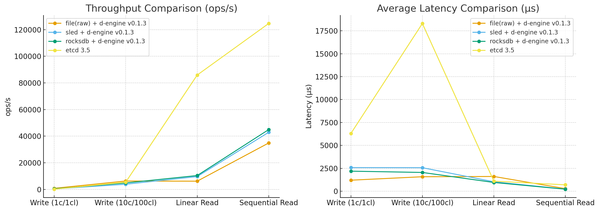

# **d-engine vs etcd Benchmark Report (v0.1.3)**

**Important Notice**

⚠️ This report is based on **d-engine v0.1.3**, with additional testing under different snapshot and cluster configurations.

✅ Snapshot functionality is now available but optional, and performance varies depending on cluster size and persistence strategy.

---

## **Test Environment**

**Hardware**

Apple Mac mini (M2 Chip)

- 8-core CPU (4 performance + 4 efficiency cores)
- 16GB Unified Memory
- All nodes and benchmarks running on a single machine

**Software Versions**

- d-engine: v0.1.3
- etcd: 3.5.x (official benchmark tool)

---

## **Benchmark Methodology**

### **Test Configuration**

| **Parameter**  | **Value** |
| -------------- | --------- |
| Key Size       | 8B        |
| Value Size     | 256B      |
| Total Requests | 10,000    |
| Connections    | 1/10      |
| Clients        | 1/100     |

**Persistence & Snapshot Settings**

- **MemFirst + Batch Flush** (threshold=1000, interval=100ms)
- Snapshot tested **on** and **off**
- Snapshot parameters:

```
[raft.snapshot]
enable = true
max_log_entries_before_snapshot = 100000
snapshot_cool_down_since_last_check = { secs = 10 }
```

---

## Performance Comparison (d-engine v0.1.3 vs etcd 3.5)

**Test Configuration**

- Key size: 8 bytes
- Value size: 256 bytes
- Total operations: 10,000
- Single machine deployment (Apple M2 Mac mini, all services co-located)

| **Test Case**            | **Metric**  | **file(raw)**   | **sled v0.34.7** | **rocksdb v0.24.0** | **etcd 3.5**  | **Advantage**                |
| ------------------------ | ----------- | --------------- | ---------------- | ------------------- | ------------- | ---------------------------- |
| **Basic Write**          | Throughput  | 829.29 ops/s    | 387.30 ops/s     | 456.28 ops/s        | 157.85 ops/s  | ✅ 2.89× RocksDB vs etcd     |
| (1 connection, 1 client) | Avg Latency | 1,205 μs        | 2,580 μs         | 2,190 μs            | 6,300 μs      | ✅ 65% lower RocksDB vs etcd |
|                          | p99 Latency | 1,768 μs        | 5,227 μs         | 5,023 μs            | 16,700 μs     | ✅ 70% lower RocksDB vs etcd |
| **High Concurrency**     | Throughput  | 6,314.32 ops/s  | 3,889.77 ops/s   | 4,869.72 ops/s      | 5,439 ops/s   | ❌ 1.12× etcd vs RocksDB     |
| (10 conns, 100 clients)  | Avg Latency | 1,582 μs        | 2,568 μs         | 2,050 μs            | 18,300 μs     | ✅ 89% lower RocksDB vs etcd |
|                          | p99 Latency | 2,353 μs        | 12,103 μs        | 4,143 μs            | 32,400 μs     | ✅ 87% lower RocksDB vs etcd |
| **Linear Read**          | Throughput  | 6,189.87 ops/s  | 9,648.43 ops/s   | 10,423.33 ops/s     | 85,904 ops/s  | ❌ 8.24× etcd vs RocksDB     |
| (Strong consistency)     | Avg Latency | 1,611 μs        | 1,033 μs         | 956 μs              | 1,100 μs      | ✅ 13% lower RocksDB vs etcd |
|                          | p99 Latency | 2,151 μs        | 2,027 μs         | 1,166 μs            | 3,200 μs      | ✅ 64% lower RocksDB vs etcd |
| **Sequential Read**      | Throughput  | 34,873.76 ops/s | 42,919.47 ops/s  | 44,927.66 ops/s     | 124,631 ops/s | ❌ 2.77× etcd vs RocksDB     |
| (Eventual consistency)   | Avg Latency | 285 μs          | 231 μs           | 221 μs              | 700 μs        | ✅ 68% lower RocksDB vs etcd |
|                          | p99 Latency | 1,211 μs        | 583 μs           | 462 μs              | 2,800 μs      | ✅ 83% lower RocksDB vs etcd |

**Important Notes**

1. d-engine architecture uses single-threaded, event-driven design
2. Tested on **d-engine v0.1.3 (3-node, snapshot OFF, MemFirst+Batch Flush)**
3. etcd 3.5 benchmark uses official tools and default configuration
4. All services co-located on the same Apple M2 (16GB) machine

### Performance Comparison Chart

## 

## **Performance Results (d-engine v0.1.3)**

We conducted three series of tests:

1. **A. 3 Nodes, Snapshot OFF, MemFirst + Batch Flush**
2. **B. 3 Nodes, Snapshot ON**
3. **C. 5 Nodes (3 voters + 2 learners), Snapshot ON**

### **A. 3 Nodes – Snapshot OFF (MemFirst + Batch Flush)**

| **Test Case**                      | **Throughput (ops/s)** | **Avg Latency (μs)** | **p99 (μs)** |
| ---------------------------------- | ---------------------- | -------------------- | ------------ |
| **Write – 1 conn / 1 client**      | 358.28                 | 2,789                | 5,719        |
| **Write – 10 conns / 100 clients** | 4,088.54               | 2,443                | 7,511        |
| **Linearizable Read (L)**          | 6,739.00               | 1,480                | 2,953        |
| **Sequential Read (S)**            | 39,156.57              | 254                  | 579          |

---

### **B. 3 Nodes – Snapshot ON**

| **Test Case**                      | **Throughput (ops/s)** | **Avg Latency (μs)** | **p99 (μs)** |
| ---------------------------------- | ---------------------- | -------------------- | ------------ |
| **Write – 1 conn / 1 client**      | 356.12                 | 2,807                | 5,483        |
| **Write – 10 conns / 100 clients** | 4,229.52               | 2,362                | 7,883        |
| **Linearizable Read (L)**          | 8,294.53               | 1,203                | 1,907        |
| **Sequential Read (S)**            | 39,938.10              | 249                  | 555          |

_Observation:_

Enabling snapshots did **not significantly degrade performance** under normal 3-node conditions. Linearizable read throughput slightly improved due to reduced log growth.

---

### **C. 5 Nodes – Snapshot ON**

| **Test Case**                      | **Throughput (ops/s)** | **Avg Latency (μs)** | **p99 (μs)** |
| ---------------------------------- | ---------------------- | -------------------- | ------------ |
| **Write – 1 conn / 1 client**      | 302.44                 | 3,305                | 6,903        |
| **Write – 10 conns / 100 clients** | 3,902.31               | 2,560                | 7,995        |
| **Linearizable Read (L)**          | 5,386.14               | 1,853                | 3,771        |
| **Sequential Read (S)**            | 25,135.58\*            | 244                  | 604          |

> ⚠️
>
> **Note:**

> Consider excluding learners from read traffic in production.

---

## **Key Observations**

1. **Snapshot ON vs OFF** (3-node):
   - Minimal impact on single-node throughput.
   - Linearizable reads show better throughput with snapshot enabled.
2. **Scaling to 5 Nodes**:
   - Throughput decreases due to Raft quorum overhead and learners.
   - Sequential reads impacted by learners rejecting client requests.
3. **Latency Trends**:
   - Even under higher concurrency, average latency remains under ~2.6 ms for writes and ~1.9 ms for strong reads.
   - p99 latency grows with cluster size.

---

## **Limitations & Next Steps**

1. **Known Limitations**
   - All tests run on single Apple M2 machine.
   - 5-node tests exposed learner read issues.
   - etcd comparison not yet repeated for v0.1.3.
2. **Next Steps**
   - Run distributed multi-machine benchmarks.
   - Evaluate long-running workloads with snapshots and log compaction.
   - Re-run etcd comparison for v0.1.3 parity.

---

## **Conclusion (v0.1.3)**

- **d-engine v0.1.3** introduces snapshot support without noticeable overhead in 3-node clusters.
- Write performance slightly improved at high concurrency.
- Scaling to 5 nodes introduces quorum cost and learner read issues.
- Latency remains competitive, suitable for latency-sensitive workloads.

---

## Test Details

### d-engine tests

```bash
# Write Performance Test, Single Client (PUT Operation)
./target/release/d-engine-bench  \
    --endpoints http://127.0.0.1:9081 --endpoints http://127.0.0.1:9082 --endpoints http://127.0.0.1:9083 \
    --conns 1 --clients 1 --sequential-keys --total 10000 --key-size 8 --value-size 256 \
    put

# Write Performance Test, High Concurrency (PUT Operation)
./target/release/d-engine-bench  \
    --endpoints http://127.0.0.1:9081 --endpoints http://127.0.0.1:9082 --endpoints http://127.0.0.1:9083 \
    --conns 10 --clients 100 --sequential-keys --total 10000 --key-size 8 --value-size 256 \
    put

# Linearizable Read Performance Test
./target/release/d-engine-bench \
    --endpoints http://127.0.0.1:9081 --endpoints http://127.0.0.1:9082 --endpoints http://127.0.0.1:9083 \
    --conns 10 --clients 100 --sequential-keys --total 10000 --key-size 8 \
    range --consistency l

# Serializable Read Performance Test
./target/release/d-engine-bench \
    --endpoints http://127.0.0.1:9081 --endpoints http://127.0.0.1:9082 --endpoints http://127.0.0.1:9083 \
    --conns 10 --clients 100 --sequential-keys --total 10000 --key-size 8 \
    range --consistency s
```

### etcd tests

```bash
# Write Performance Test, Single Client (PUT Operation)
export ENDPOINTS=http://0.0.0.0:2380,http://0.0.0.0:2381,http://0.0.0.0:2382
benchmark \
  --endpoints=${ENDPOINTS} --target-leader --conns=1 --clients=1 put --key-size=8 --sequential-keys --total=10000 --val-size=256

# Write Performance Test, High Concurrency (PUT Operation)
benchmark \
  --endpoints=${ENDPOINTS} --target-leader --conns=10 --clients=100 put --key-size=8 --sequential-keys --total=10000 --val-size=256

# Linearizable Read Performance Test
benchmark \
  --endpoints=${ENDPOINTS} --conns=10 --clients=100 range key_ --consistency=l --total=10000

# Serializable Read Performance Test
benchmark \
  --endpoints=${ENDPOINTS} --conns=10 --clients=100 range key_ --consistency=s --total=10000
```

---
