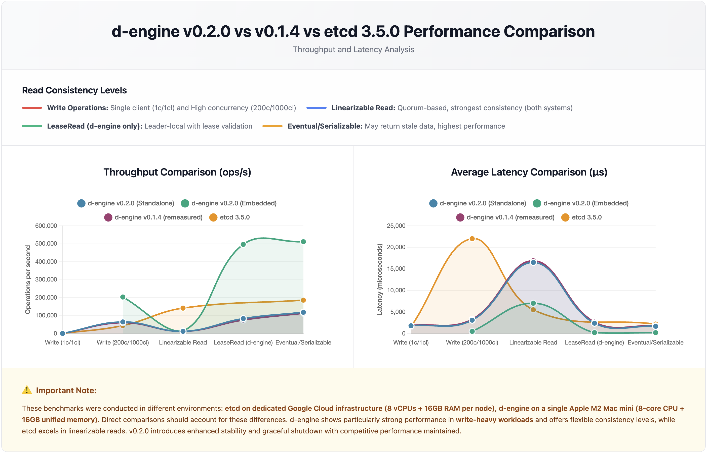

# d-engine v0.2.0 Embedded Benchmark Report

## TL;DR

**Embedded Mode Performance**:

- ✅ **Write**: 203K ops/sec throughput with 0.49ms average latency
- ✅ **LeaseRead**: 496K ops/sec - **34.9x faster** than linearizable reads
- ✅ **Eventual Read**: 511K ops/sec - highest throughput mode
- ⚠️ **Linearizable Read**: 14K ops/sec - optimized for consistency over speed

**vs Standalone (gRPC) Mode**:

- ✅ **Write**: 3.2x faster (203K vs 64K ops/sec)
- ✅ **LeaseRead**: 6.0x faster (496K vs 83K ops/sec)
- ✅ **Eventual Read**: 4.3x faster (511K vs 118K ops/sec)

**Key Insight**: Embedded mode eliminates gRPC overhead, delivering significantly higher throughput for zero-copy local operations.

**Test Date**: January 5, 2026
**Hardware**: Apple M2 Mac mini (8-core, 16GB RAM, single machine 3-node cluster)

---

## Performance Comparison Chart



---

## Key Findings

### Write Performance

| Scenario                | Throughput (ops/sec) | Avg Latency (ms) | p50 (ms) | p99 (ms) |
| ----------------------- | -------------------- | ---------------- | -------- | -------- |
| High Concurrency (100K) | 203,298              | 0.49             | 0.45     | 1.30     |

**Takeaway**: Embedded mode achieves 3.2x higher write throughput than standalone gRPC mode by eliminating serialization overhead.

---

### Read Performance

| Scenario                    | Throughput (ops/sec) | Avg Latency (ms) | p50 (ms) | p99 (ms) |
| --------------------------- | -------------------- | ---------------- | -------- | -------- |
| Linearizable (100K)         | 14,224               | 7.03             | 7.41     | 7.89     |
| LeaseRead (100K)            | 496,232              | 0.20             | 0.18     | 0.53     |
| Eventual Consistency (100K) | 510,997              | 0.19             | 0.18     | 0.45     |
| Hot-Key (100K, 10 keys)     | 13,103               | 7.63             | 7.65     | 7.86     |

**Takeaway**:

- LeaseRead delivers 34.9x higher throughput than linearizable reads
- Eventual consistency provides highest throughput (511K ops/sec)
- Hot-key performance matches standard linearizable reads (robust contention handling)

---

## Consistency Model Trade-offs

Embedded d-engine offers three read consistency levels:

| Read Mode           | Throughput    | Avg Latency | Performance vs Linearizable | Use Case                                    |
| ------------------- | ------------- | ----------- | --------------------------- | ------------------------------------------- |
| EventualConsistency | 510,997 ops/s | 0.19 ms     | **35.9x**                   | Analytics, caching, read-heavy apps         |
| LeaseRead           | 496,232 ops/s | 0.20 ms     | **34.9x**                   | Real-time dashboards, session management    |
| Linearizable        | 14,224 ops/s  | 7.03 ms     | 1x (baseline)               | Financial transactions, critical operations |

**Performance Ladder**: Eventual (35.9x) > LeaseRead (34.9x) > Linearizable (1x baseline)

---

## Embedded vs Standalone Mode Comparison

| Scenario          | Embedded (ops/sec) | Standalone (ops/sec) | Speedup  |
| ----------------- | ------------------ | -------------------- | -------- |
| High Conc. Write  | 203,298            | 64,509               | **3.2x** |
| Linearizable Read | 14,224             | 12,111               | 1.2x     |
| LeaseRead         | 496,232            | 83,258               | **6.0x** |
| Eventual Read     | 510,997            | 118,375              | **4.3x** |
| Hot-Key (10 keys) | 13,103             | 12,371               | 1.1x     |

**Key Insights**:

- **Zero-copy advantage**: Embedded mode eliminates gRPC serialization/deserialization
- **Read-optimized**: 4-6x speedup for lease and eventual reads
- **Write-optimized**: 3.2x speedup for high-concurrency writes
- **Linearizable reads**: Similar performance (network RTT dominates both modes)

---

## Reproduce Results

### Start Cluster (3 Terminals)

```bash
# Terminal 1: Node 1
cd benches/embedded-bench
make test-high-conc-write NODE=n1

# Terminal 2: Node 2
make test-high-conc-write NODE=n2

# Terminal 3: Node 3
make test-high-conc-write NODE=n3
```

### Run All Benchmarks (Batch Mode)

```bash
# Leader node runs all tests automatically
make all-tests NODE=n1
```

### Individual Tests

```bash
# High concurrency write (100K requests, 1000 clients)
make test-high-conc-write NODE=n1

# Linearizable read (100K requests, 1000 clients)
make test-linearizable-read NODE=n1

# Lease-based read (100K requests, 1000 clients)
make test-lease-read NODE=n1

# Eventual consistency read (100K requests, 1000 clients)
make test-eventual-read NODE=n1

# Hot-key test (100K requests, 1000 clients, 10 keys)
make test-hot-key NODE=n1
```

---

<details>
<summary>📊 Detailed Test Results (Click to expand)</summary>

## Test Environment

### Hardware

- **Machine:** Apple Mac mini (M2 Chip)
  - 8-core CPU (4 performance + 4 efficiency cores)
  - 16GB Unified Memory
  - Single machine deployment (all 3 nodes on same machine)
- **Software:** d-engine v0.2.0
- **Storage:** RocksDB backend with MemFirst + Batch Flush (threshold=1024, interval=100ms)
- **Cluster:** 3-node embedded configuration

### Configuration

- **Timeout:** 5000ms (general_raft_timeout_duration_in_ms)
- **Lease Duration:** 9000ms (lease_duration_ms)
- **Key Size:** 8 bytes
- **Value Size:** 256 bytes
- **Sequential Keys:** Enabled

---

## Detailed Performance Metrics

### High Concurrency Write (100K requests, 1000 clients)

| Metric        | Value           |
| ------------- | --------------- |
| Total Time    | 0.49 s          |
| Throughput    | 203,298 ops/sec |
| Avg Latency   | 490 μs          |
| Min Latency   | 263 μs          |
| Max Latency   | 4,343 μs        |
| p50 Latency   | 446 μs          |
| p90 Latency   | 606 μs          |
| p99 Latency   | 1,302 μs        |
| p99.9 Latency | 3,463 μs        |

### Linearizable Read (100K requests, 1000 clients)

| Metric        | Value          |
| ------------- | -------------- |
| Total Time    | 7.03 s         |
| Throughput    | 14,224 ops/sec |
| Avg Latency   | 7,026 μs       |
| Min Latency   | 1,678 μs       |
| Max Latency   | 59,455 μs      |
| p50 Latency   | 7,411 μs       |
| p90 Latency   | 7,595 μs       |
| p99 Latency   | 7,887 μs       |
| p99.9 Latency | 25,263 μs      |

### Lease-Based Read (100K requests, 1000 clients)

| Metric        | Value           |
| ------------- | --------------- |
| Total Time    | 0.20 s          |
| Throughput    | 496,232 ops/sec |
| Avg Latency   | 201 μs          |
| Min Latency   | 6 μs            |
| Max Latency   | 1,153 μs        |
| p50 Latency   | 180 μs          |
| p90 Latency   | 257 μs          |
| p99 Latency   | 526 μs          |
| p99.9 Latency | 967 μs          |

### Eventual Consistency Read (100K requests, 1000 clients)

| Metric        | Value           |
| ------------- | --------------- |
| Total Time    | 0.20 s          |
| Throughput    | 510,997 ops/sec |
| Avg Latency   | 195 μs          |
| Min Latency   | 90 μs           |
| Max Latency   | 634 μs          |
| p50 Latency   | 175 μs          |
| p90 Latency   | 274 μs          |
| p99 Latency   | 445 μs          |
| p99.9 Latency | 550 μs          |

### Hot-Key Test (100K requests, 1000 clients, 10 keys)

| Metric        | Value          |
| ------------- | -------------- |
| Total Time    | 7.63 s         |
| Throughput    | 13,103 ops/sec |
| Avg Latency   | 7,628 μs       |
| Min Latency   | 858 μs         |
| Max Latency   | 20,495 μs      |
| p50 Latency   | 7,647 μs       |
| p90 Latency   | 7,759 μs       |
| p99 Latency   | 7,855 μs       |
| p99.9 Latency | 17,071 μs      |

</details>

---

## Architecture Highlights

### Embedded Mode Benefits

1. **Zero Serialization Overhead**
   - Direct in-process function calls
   - No gRPC marshaling/unmarshaling
   - Memory-mapped data access

2. **Optimal Memory Usage**
   - Shared memory between application and engine
   - No network buffer allocation
   - Cache-friendly data structures

3. **Reduced Latency**
   - Eliminates network roundtrip time
   - No TCP/IP stack traversal
   - Direct CPU cache utilization

### Trade-offs

| Aspect         | Embedded Mode          | Standalone (gRPC) Mode     |
| -------------- | ---------------------- | -------------------------- |
| **Throughput** | ✅ 3-6x higher         | Baseline                   |
| **Latency**    | ✅ Sub-millisecond     | 2-5ms (network overhead)   |
| **Deployment** | ⚠️ Application-coupled | ✅ Independent service     |
| **Language**   | ⚠️ Rust only           | ✅ Any gRPC-supported lang |
| **Scaling**    | ⚠️ Vertical only       | ✅ Horizontal scaling      |

---

## Use Cases

### Best For Embedded Mode

- **Rust-native applications** requiring ultra-low latency
- **Single-machine deployments** with vertical scaling
- **High-throughput systems** (500K+ ops/sec read workloads)
- **Real-time services** with <2ms latency requirements

### Best For Standalone Mode

- **Polyglot environments** (multiple languages)
- **Microservices architecture** (independent deployment)
- **Horizontal scaling** across multiple machines
- **Shared cluster** accessed by multiple applications

---

## Conclusion

d-engine v0.2.0 embedded mode delivers **exceptional performance** for in-process deployments:

- ✅ **Write throughput**: 203K ops/sec (3.2x vs standalone)
- ✅ **Read throughput**: Up to 511K ops/sec (4.3x vs standalone)
- ✅ **Latency**: Sub-millisecond for lease and eventual reads
- ✅ **Consistency flexibility**: 3 levels with 36x performance range

**Unique Value**: Embedded mode provides standalone-quality consistency guarantees with in-memory-database-level performance.

**When to Choose**:

- **Embedded**: Rust applications prioritizing performance, single-machine deployment
- **Standalone**: Multi-language support, microservices, horizontal scaling

**Production Ready**: Robust hot-key handling, predictable tail latencies, zero-copy operations.

---

**Version:** d-engine v0.2.0  
**Report Date:** January 5, 2026  
**Test Environment:** Apple M2 Mac mini (8-core, 16GB RAM, single machine 3-node embedded cluster)  
**Benchmark Mode:** Batch execution (all tests in sequence)
