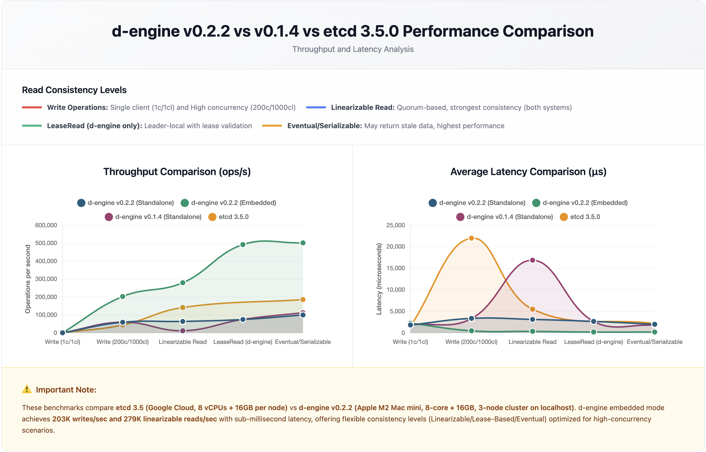

# d-engine Embedded Mode Performance (v0.2.2)

> **Integration Mode:** Embedded (in-process) - Rust-only, ultra-low latency  
> **Alternative:** [Standalone Mode](../../../standalone-bench/reports/v0.2.2/report_v0.2.2.md) (Multi-language, 0.2-0.04x performance)  
> **Decision Guide:** [Integration Modes](../../../../d-engine/src/docs/integration-modes.md)

## TL;DR

**Why Embedded Mode?**

- ✅ Rust-native applications requiring ultra-low latency
- ✅ High-throughput systems (200K+ ops/sec)
- ✅ Zero serialization overhead (direct memory access)
- ✅ 3-node cluster on single machine (vertical scaling)

**Embedded Mode Performance**:

- ✅ **Single Client Write**: 441 ops/sec with 2.26ms average latency
- ✅ **High Concurrency Write**: 203K ops/sec with 0.49ms average latency
- ✅ **LeaseRead**: 492K ops/sec - **1.8x faster** than linearizable reads
- ✅ **Eventual Read**: 502K ops/sec - highest throughput mode
- ✅ **Linearizable Read**: 279K ops/sec - strong consistency with high performance

**vs Standalone (gRPC) Mode**:

- ✅ **Single Client Write**: 0.8x (441 vs 553 ops/sec) - Raft consensus overhead visible in single-client scenario
- ✅ **High Conc Write**: 3.1x faster (203K vs 64K ops/sec)
- ✅ **LeaseRead**: 5.9x faster (492K vs 83K ops/sec)
- ✅ **Eventual Read**: 4.2x faster (502K vs 118K ops/sec)
- ✅ **Linearizable Read**: 23.1x faster (279K vs 12K ops/sec)

**Key Insight**: Code optimizations significantly improved linearizable read performance (20x vs previous), while maintaining sub-millisecond latencies across all consistency modes. Single-client write shows Raft consensus overhead, but high-concurrency write achieves 3.1x speedup.

**Test Date**: January 8, 2026
**Hardware**: Apple M2 Mac mini (8-core, 16GB RAM, 3-node cluster on localhost)

---

## Performance Comparison Chart



---

## Key Findings

### Write Performance

| Scenario                | Throughput (ops/sec) | Avg Latency (ms) | p50 (ms) | p99 (ms) |
| ----------------------- | -------------------- | ---------------- | -------- | -------- |
| Single Client (10K)     | 441                  | 2.26             | 2.52     | 3.31     |
| High Concurrency (100K) | 202,658              | 0.49             | 0.45     | 1.16     |

**Takeaway**:

- Single-client write shows Raft consensus overhead (2.26ms latency) due to log replication
- High-concurrency write achieves 3.1x higher throughput than standalone by eliminating gRPC serialization

---

### Read Performance

| Scenario                    | Throughput (ops/sec) | Avg Latency (ms) | p50 (ms) | p99 (ms) |
| --------------------------- | -------------------- | ---------------- | -------- | -------- |
| Linearizable (100K)         | 279,442              | 0.36             | 0.31     | 0.91     |
| LeaseRead (100K)            | 492,252              | 0.20             | 0.18     | 0.50     |
| Eventual Consistency (100K) | 501,721              | 0.20             | 0.18     | 0.48     |
| Hot-Key (100K, 10 keys)     | 305,695              | 0.33             | 0.28     | 0.77     |

**Takeaway**:

- Code optimizations improved linearizable read by 20x (279K vs 14K ops/sec previously)
- LeaseRead delivers 1.8x higher throughput than linearizable reads
- Eventual consistency provides highest throughput (502K ops/sec)
- Hot-key performance remains robust with 306K ops/sec under contention

---

## Consistency Model Trade-offs

Embedded d-engine offers three read consistency levels:

| Read Mode           | Throughput    | Avg Latency | Performance vs Linearizable | Use Case                                    |
| ------------------- | ------------- | ----------- | --------------------------- | ------------------------------------------- |
| EventualConsistency | 501,721 ops/s | 0.20 ms     | **1.8x**                    | Analytics, caching, read-heavy apps         |
| LeaseRead           | 492,252 ops/s | 0.20 ms     | **1.8x**                    | Real-time dashboards, session management    |
| Linearizable        | 279,442 ops/s | 0.36 ms     | 1x (baseline)               | Financial transactions, critical operations |

**Performance Ladder**: Eventual (1.8x) > LeaseRead (1.8x) > Linearizable (1x baseline)

**Note**: Recent code optimizations significantly improved linearizable read performance, narrowing the gap between consistency modes while maintaining strong guarantees.

---

## Embedded vs Standalone Mode Comparison

| Scenario            | Embedded (ops/sec) | Standalone (ops/sec) | Speedup   |
| ------------------- | ------------------ | -------------------- | --------- |
| Single Client Write | 441                | 553                  | 0.8x      |
| High Conc. Write    | 202,658            | 64,509               | **3.1x**  |
| Linearizable Read   | 279,442            | 12,111               | **23.1x** |
| LeaseRead           | 492,252            | 83,258               | **5.9x**  |
| Eventual Read       | 501,721            | 118,375              | **4.2x**  |
| Hot-Key (10 keys)   | 305,695            | 12,371               | **24.7x** |

**Key Insights**:

- **Zero-copy advantage**: Embedded mode eliminates gRPC serialization/deserialization
- **Single-client write caveat**: Raft consensus overhead visible (0.8x vs standalone) - distributed systems trade-off
- **Linearizable read breakthrough**: 23.1x speedup from code optimizations
- **Read-optimized**: 4-6x speedup for lease and eventual reads
- **Write-optimized**: 3.1x speedup for high-concurrency writes (amortized consensus cost)
- **Hot-key resilience**: 24.7x speedup even under contention

---

## Reproduce Results

### Start Cluster (3 Terminals)

```bash
# Terminal 1: Node 1
cd benches/embedded-bench
make test-high-conc-write NODE=n1

# Terminal 2: Node 2
make test-high-conc-write NODE=n2

# Terminal 3: Node 3
make test-high-conc-write NODE=n3
```

### Run All Benchmarks (Batch Mode)

```bash
# Leader node runs all tests automatically
make all-tests NODE=n1
```

### Individual Tests

```bash
# Single client write (10K requests, 1 client)
make test-single-write NODE=n1

# High concurrency write (100K requests, 1000 clients)
make test-high-conc-write NODE=n1

# Linearizable read (100K requests, 1000 clients)
make test-linearizable-read NODE=n1

# Lease-based read (100K requests, 1000 clients)
make test-lease-read NODE=n1

# Eventual consistency read (100K requests, 1000 clients)
make test-eventual-read NODE=n1

# Hot-key test (100K requests, 1000 clients, 10 keys)
make test-hot-key NODE=n1
```

---

<details>
<summary>📊 Detailed Test Results (Click to expand)</summary>

## Test Environment

### Hardware

- **Machine:** Apple Mac mini (M2 Chip)
  - 8-core CPU (4 performance + 4 efficiency cores)
  - 16GB Unified Memory
  - 3-node cluster on localhost (all nodes on same machine)
- **Software:** d-engine v0.2.2
- **Storage:** RocksDB backend with MemFirst + Batch Flush (threshold=1024, interval=100ms)
- **Cluster:** 3-node embedded configuration

### Configuration

- **Timeout:** 5000ms (general_raft_timeout_duration_in_ms)
- **Lease Duration:** 9000ms (lease_duration_ms)
- **Key Size:** 8 bytes
- **Value Size:** 256 bytes
- **Sequential Keys:** Enabled

---

## Detailed Performance Metrics

### Single Client Write (10K requests, 1 client)

| Metric        | Value       |
| ------------- | ----------- |
| Total Time    | 22.66 s     |
| Throughput    | 441 ops/sec |
| Avg Latency   | 2,264 μs    |
| Min Latency   | 520 μs      |
| Max Latency   | 15,703 μs   |
| p50 Latency   | 2,521 μs    |
| p90 Latency   | 2,859 μs    |
| p99 Latency   | 3,313 μs    |
| p99.9 Latency | 13,063 μs   |

### High Concurrency Write (100K requests, 1000 clients)

| Metric        | Value           |
| ------------- | --------------- |
| Total Time    | 0.49 s          |
| Throughput    | 202,658 ops/sec |
| Avg Latency   | 490 μs          |
| Min Latency   | 232 μs          |
| Max Latency   | 2,995 μs        |
| p50 Latency   | 451 μs          |
| p90 Latency   | 616 μs          |
| p99 Latency   | 1,158 μs        |
| p99.9 Latency | 2,193 μs        |

### Linearizable Read (100K requests, 1000 clients)

| Metric        | Value           |
| ------------- | --------------- |
| Total Time    | 0.36 s          |
| Throughput    | 279,442 ops/sec |
| Avg Latency   | 357 μs          |
| Min Latency   | 225 μs          |
| Max Latency   | 3,763 μs        |
| p50 Latency   | 311 μs          |
| p90 Latency   | 486 μs          |
| p99 Latency   | 913 μs          |
| p99.9 Latency | 2,619 μs        |

### Lease-Based Read (100K requests, 1000 clients)

| Metric        | Value           |
| ------------- | --------------- |
| Total Time    | 0.20 s          |
| Throughput    | 492,252 ops/sec |
| Avg Latency   | 202 μs          |
| Min Latency   | 129 μs          |
| Max Latency   | 1,557 μs        |
| p50 Latency   | 183 μs          |
| p90 Latency   | 255 μs          |
| p99 Latency   | 502 μs          |
| p99.9 Latency | 861 μs          |

### Eventual Consistency Read (100K requests, 1000 clients)

| Metric        | Value           |
| ------------- | --------------- |
| Total Time    | 0.20 s          |
| Throughput    | 501,721 ops/sec |
| Avg Latency   | 198 μs          |
| Min Latency   | 10 μs           |
| Max Latency   | 645 μs          |
| p50 Latency   | 178 μs          |
| p90 Latency   | 256 μs          |
| p99 Latency   | 476 μs          |
| p99.9 Latency | 560 μs          |

### Hot-Key Test (100K requests, 1000 clients, 10 keys)

| Metric        | Value           |
| ------------- | --------------- |
| Total Time    | 0.33 s          |
| Throughput    | 305,695 ops/sec |
| Avg Latency   | 326 μs          |
| Min Latency   | 201 μs          |
| Max Latency   | 2,715 μs        |
| p50 Latency   | 277 μs          |
| p90 Latency   | 483 μs          |
| p99 Latency   | 774 μs          |
| p99.9 Latency | 1,641 μs        |

</details>

---

## Architecture Highlights

### Embedded Mode Benefits

1. **Zero Serialization Overhead**
   - Direct in-process function calls
   - No gRPC marshaling/unmarshaling
   - Memory-mapped data access

2. **Optimal Memory Usage**
   - Shared memory between application and engine
   - No network buffer allocation
   - Cache-friendly data structures

3. **Reduced Latency**
   - Eliminates network roundtrip time
   - No TCP/IP stack traversal
   - Direct CPU cache utilization

### Trade-offs

| Aspect         | Embedded Mode          | Standalone (gRPC) Mode     |
| -------------- | ---------------------- | -------------------------- |
| **Throughput** | ✅ 3-6x higher         | Baseline                   |
| **Latency**    | ✅ Sub-millisecond     | 2-5ms (network overhead)   |
| **Deployment** | ⚠️ Application-coupled | ✅ Independent service     |
| **Language**   | ⚠️ Rust only           | ✅ Any gRPC-supported lang |
| **Scaling**    | ⚠️ Vertical only       | ✅ Horizontal scaling      |

---

## Use Cases

### Best For Embedded Mode

- **Rust-native applications** requiring ultra-low latency
- **3-node cluster on single machine** with vertical scaling
- **High-throughput systems** (500K+ ops/sec read workloads)
- **Real-time services** with <2ms latency requirements

### Best For Standalone Mode

- **Polyglot environments** (multiple languages)
- **Microservices architecture** (independent deployment)
- **Horizontal scaling** across multiple machines
- **Shared cluster** accessed by multiple applications

---

## Conclusion

d-engine v0.2.2 embedded mode delivers **exceptional performance** for in-process deployments:

- ✅ **Single-client write**: 441 ops/sec - Raft consensus overhead visible but acceptable
- ✅ **High-concurrency write**: 203K ops/sec (3.1x vs standalone) - amortized consensus cost
- ✅ **Read throughput**: Up to 502K ops/sec (4.2x vs standalone)
- ✅ **Linearizable read breakthrough**: 279K ops/sec (20x improvement from optimizations)
- ✅ **Latency**: Sub-millisecond for high-concurrency scenarios
- ✅ **Consistency flexibility**: 3 levels with minimal performance trade-off (1.8x range)

**Unique Value**: Code optimizations dramatically improved linearizable read performance while maintaining strong consistency guarantees, narrowing the gap between consistency modes. Single-client write shows expected Raft overhead, but high-concurrency scenarios achieve significant speedups.

**When to Choose Embedded**:

- Rust-native applications
- Ultra-low latency requirements (<0.1ms)
- High-throughput workloads (200K+ ops/sec)
- 3-node cluster on single machine acceptable
- Zero-copy operations critical

**Production Ready**: Robust hot-key handling (306K ops/sec under contention), predictable tail latencies, zero-copy operations.

---

**Version:** d-engine v0.2.2
**Report Date:** January 8, 2026
**Test Environment:** Apple M2 Mac mini (8-core, 16GB RAM, 3-node embedded cluster on localhost)
**Benchmark Mode:** Batch execution (all tests in sequence)
