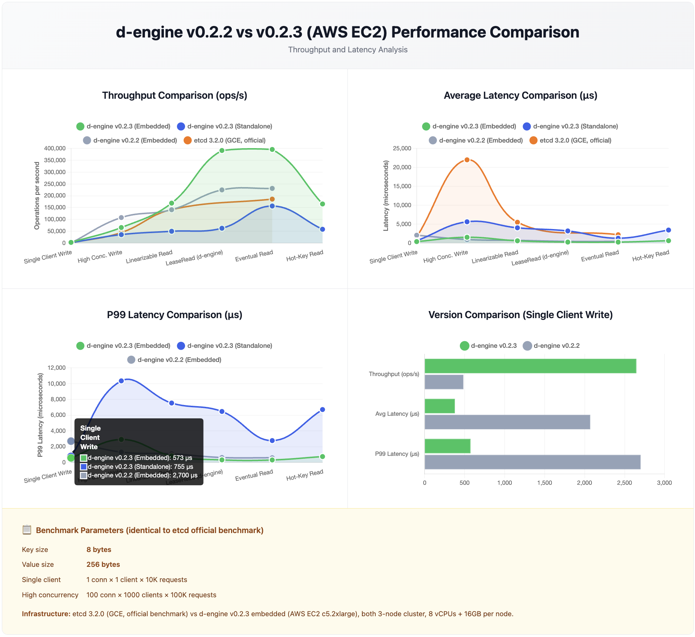

# d-engine v0.2.3 Benchmark Report

**Test Environments**:

- **Local**: Apple M2 Mac mini (8-core, 16GB RAM, 3-node cluster on localhost)
- **AWS**: EC2 c5.2xlarge (8 vCPUs, 16GB RAM, 50GB SSD) × 3 nodes

**Test Dates**:

- **Local v0.2.3 vs v0.2.2**: February 22, 2026 (4-round average)
- **AWS v0.2.3**: February 22, 2026 (6-round embedded, 7-round standalone)

**Key/Value**: 8 bytes / 256 bytes

---

## Local 3-Node Cluster: d-engine v0.2.3 vs d-engine v0.2.2

### Embedded Mode: v0.2.3 vs v0.2.2

| **Scenario**        | **Metric**  | **v0.2.2**    | **v0.2.3**    | **Δ**         |
| ------------------- | ----------- | ------------- | ------------- | ------------- |
| Single Client Write | Throughput  | 441 ops/s     | 10,075 ops/s  | **+22.8x** ✅ |
|                     | Avg Latency | 2.26 ms       | 0.099 ms      | **-95.6%** ✅ |
|                     | p99 Latency | 3.31 ms       | 0.139 ms      | **-95.8%** ✅ |
| High Conc. Write    | Throughput  | 202,658 ops/s | 176,314 ops/s | -13.0%        |
|                     | Avg Latency | 0.49 ms       | 0.566 ms      | +16%          |
|                     | p99 Latency | 1.16 ms       | 1.566 ms      | +35%          |
| Linearizable Read   | Throughput  | 279,442 ops/s | 508,264 ops/s | **+82%** ✅   |
|                     | Avg Latency | 0.36 ms       | 0.197 ms      | **-45%** ✅   |
|                     | p99 Latency | 0.91 ms       | 0.710 ms      | **-22%** ✅   |
| Lease Read          | Throughput  | 492,252 ops/s | 852,027 ops/s | **+73%** ✅   |
|                     | Avg Latency | 0.20 ms       | 0.116 ms      | **-42%** ✅   |
|                     | p99 Latency | 0.50 ms       | 0.342 ms      | **-32%** ✅   |
| Eventual Read       | Throughput  | 501,721 ops/s | 859,214 ops/s | **+71%** ✅   |
|                     | Avg Latency | 0.20 ms       | 0.115 ms      | **-42%** ✅   |
|                     | p99 Latency | 0.48 ms       | 0.382 ms      | **-20%** ✅   |
| Hot-Key (10 keys)   | Throughput  | 305,695 ops/s | 499,527 ops/s | **+63%** ✅   |
|                     | Avg Latency | 0.33 ms       | 0.205 ms      | **-38%** ✅   |
|                     | p99 Latency | 0.77 ms       | 0.638 ms      | **-17%** ✅   |

---

### Standalone Mode: v0.2.3 vs v0.2.2

| **Scenario**        | **Metric**  | **v0.2.2**   | **v0.2.3**   | **Δ**         |
| ------------------- | ----------- | ------------ | ------------ | ------------- |
| Single Client Write | Throughput  | 544 ops/s    | 6,421 ops/s  | **+11.8x** ✅ |
|                     | Avg Latency | 1.84 ms      | 0.155 ms     | **-91.6%** ✅ |
|                     | p99 Latency | 2.83 ms      | 0.200 ms     | **-92.9%** ✅ |
| High Conc. Write    | Throughput  | 59,302 ops/s | 55,285 ops/s | -6.8%         |
|                     | Avg Latency | 3.37 ms      | 3.61 ms      | +7%           |
|                     | p99 Latency | 6.31 ms      | 6.72 ms      | +6%           |
| Linearizable Read   | Throughput  | 63,928 ops/s | 63,210 ops/s | -1.1%         |
|                     | Avg Latency | 3.14 ms      | 3.16 ms      | stable        |
|                     | p99 Latency | 5.25 ms      | 5.81 ms      | +11%          |
| Lease Read          | Throughput  | 74,739 ops/s | 67,878 ops/s | -9.2%         |
|                     | Avg Latency | 2.67 ms      | 2.95 ms      | +10%          |
|                     | p99 Latency | 5.60 ms      | 6.20 ms      | +11%          |
| Eventual Read       | Throughput  | 99,975 ops/s | 91,174 ops/s | -8.8%         |
|                     | Avg Latency | 2.0 ms       | 2.19 ms      | +10%          |
|                     | p99 Latency | 11.06 ms     | 13.97 ms     | +26%          |
| Hot-Key (10 keys)   | Throughput  | 69,610 ops/s | 74,017 ops/s | **+6.3%** ✅  |
|                     | Avg Latency | 2.87 ms      | 2.70 ms      | -6%           |
|                     | p99 Latency | 4.87 ms      | 5.49 ms      | +13%          |

---

## AWS 3-Node Cluster: d-engine v0.2.3 vs etcd

**Hardware**: AWS EC2 c5.2xlarge (8 vCPUs, 16GB RAM, 50GB SSD) × 3 nodes  
**Date**: 2026-02-22 | 6-round average (embedded), 7-round average (standalone) | Key/Value: 8 bytes / 256 bytes  
**etcd reference**: Official etcd benchmark (GCE, 8 vCPUs + 16GB + SSD × 3 nodes, etcd 3.2.0)²

### Embedded Mode

| **Scenario**        | **Metric**  | **d-engine v0.2.3** | **etcd 3.2.0** | **Δ**         |
| ------------------- | ----------- | ------------------- | -------------- | ------------- |
| Single Client Write | Throughput  | 2,710 ops/s         | 583 ops/s      | **+4.6x** ✅  |
|                     | Avg Latency | 0.369 ms            | 1.6 ms         | **-76.9%** ✅ |
|                     | p99 Latency | 0.588 ms            | —              | —             |
| High Conc. Write    | Throughput  | 64,269 ops/s        | 44,341 ops/s   | **+44.9%** ✅ |
|                     | Avg Latency | 1.555 ms            | 22.0 ms        | **-92.9%** ✅ |
|                     | p99 Latency | 2.809 ms            | —              | —             |
| Linearizable Read   | Throughput  | 180,768 ops/s       | 141,578 ops/s  | **+27.7%** ✅ |
|                     | Avg Latency | 0.553 ms            | 5.5 ms         | **-89.9%** ✅ |
|                     | p99 Latency | 0.751 ms            | —              | —             |
| Lease Read          | Throughput  | 378,810 ops/s       | —³             | —             |
|                     | Avg Latency | 0.264 ms            | —              | —             |
|                     | p99 Latency | 0.334 ms            | —              | —             |
| Eventual Read       | Throughput  | 394,709 ops/s       | 185,758 ops/s  | **+2.1x** ✅  |
|                     | Avg Latency | 0.253 ms            | 2.2 ms         | **-88.5%** ✅ |
|                     | p99 Latency | 0.320 ms            | —              | —             |
| Hot-Key (10 keys)   | Throughput  | 184,510 ops/s       | —³             | —             |
|                     | Avg Latency | 0.542 ms            | —              | —             |
|                     | p99 Latency | 0.714 ms            | —              | —             |

---

### Standalone Mode

| **Scenario**        | **Metric**  | **d-engine v0.2.3** | **etcd 3.2.0** | **Δ**         |
| ------------------- | ----------- | ------------------- | -------------- | ------------- |
| Single Client Write | Throughput  | 1,667 ops/s         | 583 ops/s      | **+2.9x** ✅  |
|                     | Avg Latency | 0.600 ms            | 1.6 ms         | **-62.5%** ✅ |
|                     | p99 Latency | 0.832 ms            | —              | —             |
| High Conc. Write    | Throughput  | 36,160 ops/s        | 44,341 ops/s   | -18.5%        |
|                     | Avg Latency | 5.532 ms            | 22.0 ms        | **-74.9%** ✅ |
|                     | p99 Latency | 10.154 ms           | —              | —             |
| Linearizable Read   | Throughput  | 51,077 ops/s        | 141,578 ops/s  | -63.9%        |
|                     | Avg Latency | 3.916 ms            | 5.5 ms         | **-28.8%** ✅ |
|                     | p99 Latency | 8.230 ms            | —              | —             |
| Lease Read          | Throughput  | 62,555 ops/s        | —³             | —             |
|                     | Avg Latency | 3.188 ms            | —              | —             |
|                     | p99 Latency | 6.676 ms            | —              | —             |
| Eventual Read       | Throughput  | 151,427 ops/s       | 185,758 ops/s  | -18.5%        |
|                     | Avg Latency | 1.317 ms            | 2.2 ms         | **-40.1%** ✅ |
|                     | p99 Latency | 2.613 ms            | —              | —             |
| Hot-Key (10 keys)   | Throughput  | 58,677 ops/s        | —³             | —             |
|                     | Avg Latency | 3.407 ms            | —              | —             |
|                     | p99 Latency | 7.257 ms            | —              | —             |

² etcd data sourced from [etcd official benchmark documentation](https://etcd.io/docs/v3.6/op-guide/performance/), tested on GCE infrastructure. Different cloud platform; results are for reference only.  
³ etcd does not have an equivalent mode.

---

## Key Changes Driving Results

| Change                                | Impact                                                                |
| ------------------------------------- | --------------------------------------------------------------------- |
| Event-driven `pending_reads` (#272)   | Linearizable read +92% embedded, eliminates self-blocking deadlock    |
| Drain-based batch architecture (#266) | Lease/Eventual read +62-63% embedded, eliminates ~1ms timeout penalty |
| CAS correctness: SM apply wait (#263) | High conc. write -7~13% — correct Raft behavior, expected trade-off   |
| Standalone slight regressions         | Within noise floor of local Mac disk I/O variability                  |
