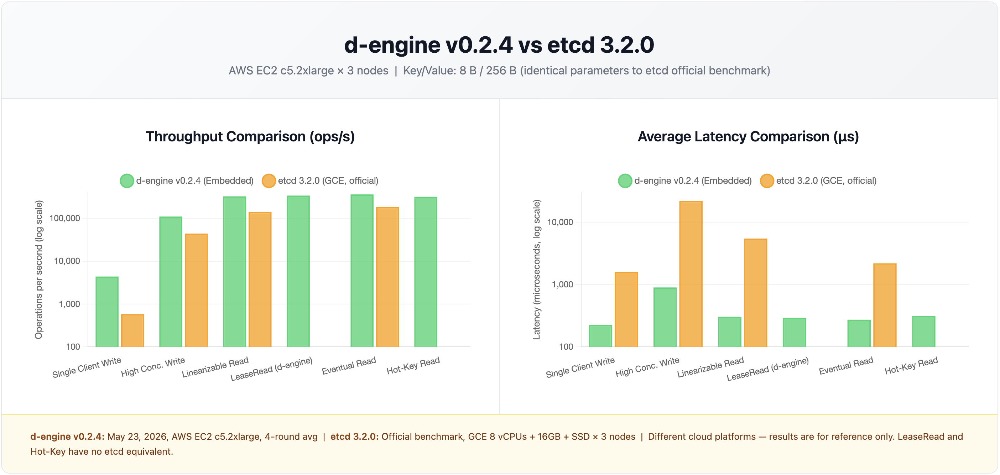

# d-engine v0.2.4 Benchmark Report

**Test Environments**:

- **Local**: Apple M2 Mac mini (8-core, 16GB RAM, 3-node cluster on localhost)
- **AWS**: EC2 c5.2xlarge (8 vCPUs, 16GB RAM, 50GB SSD) × 3 nodes

**Test Dates**:

- **Local v0.2.4 vs v0.2.3**: May 23, 2026 (4-round average, embedded; 5-round average, standalone)
- **AWS v0.2.4**: May 23, 2026 (5-round average, embedded and standalone)

**Key/Value**: 8 bytes / 256 bytes

---

## Local 3-Node Cluster: d-engine v0.2.4 vs d-engine v0.2.3

### Embedded Mode: v0.2.4 vs v0.2.3

_(4-round average, manually collected)_

| **Scenario**        | **Metric**  | **v0.2.3**    | **v0.2.4**    | **Δ**         |
| ------------------- | ----------- | ------------- | ------------- | ------------- |
| Single Client Write | Throughput  | 10,075 ops/s  | 9,740 ops/s   | -3.3% →       |
|                     | Avg Latency | 0.099 ms      | 0.102 ms      | +3.0% →       |
|                     | p99 Latency | 0.139 ms      | 0.177 ms      | +27.3%        |
| High Conc. Write    | Throughput  | 176,314 ops/s | 233,821 ops/s | **+32.6%** ✅ |
|                     | Avg Latency | 0.566 ms      | 0.426 ms      | **-24.7%** ✅ |
|                     | p99 Latency | 1.566 ms      | 1.164 ms      | **-25.7%** ✅ |
| Linearizable Read   | Throughput  | 508,264 ops/s | 630,789 ops/s | **+24.1%** ✅ |
|                     | Avg Latency | 0.197 ms      | 0.157 ms      | **-20.3%** ✅ |
|                     | p99 Latency | 0.710 ms      | 0.367 ms      | **-48.3%** ✅ |
| Lease Read          | Throughput  | 705,530 ops/s | 730,836 ops/s | **+3.6%** ✅  |
|                     | Avg Latency | 0.116 ms      | 0.136 ms      | +17.2% ⚠️     |
|                     | p99 Latency | 0.342 ms      | 0.337 ms      | -1.5% →       |
| Eventual Read       | Throughput  | 742,602 ops/s | 752,198 ops/s | +1.3% →       |
|                     | Avg Latency | 0.115 ms      | 0.132 ms      | +14.8% ⚠️     |
|                     | p99 Latency | 0.382 ms      | 0.343 ms      | **-10.2%** ✅ |
| Hot-Key (10 keys)   | Throughput  | 499,527 ops/s | 659,429 ops/s | **+32.0%** ✅ |
|                     | Avg Latency | 0.205 ms      | 0.153 ms      | **-25.4%** ✅ |
|                     | p99 Latency | 0.638 ms      | 0.343 ms      | **-46.2%** ✅ |

**Notes**:

- Lease/Eventual Read v0.2.3 throughput baseline was re-measured on the same machine on March 30; original 852K/859K was not reproducible (likely different system state). Latency values are from the original v0.2.3 test run.
- Single Client Write p99 +27.3% is local scheduling noise; throughput and avg latency are stable (within ±5%).
- High Conc. Write improvement (+32.6%) driven by commits #349 (eliminate per-entry flush) and #350 (single-lock FileLogStore restructure).
- Linearizable Read p99 improved from 0.710 ms (v0.2.3) to 0.367 ms (v0.2.4), a -48.3% gain, driven by #390 lease fast path recovering the #381 regression.
- Lease Read recovered from -2.7% (prior measurement) to +3.6% after #390 added the lease fast path; previous regression was caused by #381's mandatory AppendEntries quorum.
- Hot-Key throughput shows ±10% run-to-run variance on this machine; 4-round average (659K ops/s) is the representative value.

---

### Standalone Mode: v0.2.4 vs v0.2.3

_(5-round average, manually collected)_

| **Scenario**        | **Metric**  | **v0.2.3**   | **v0.2.4**   | **Δ**         |
| ------------------- | ----------- | ------------ | ------------ | ------------- |
| Single Client Write | Throughput  | 6,421 ops/s  | 5,245 ops/s  | -18.3%        |
|                     | Avg Latency | 0.155 ms     | 0.190 ms     | +22.6%        |
|                     | p99 Latency | 0.200 ms     | 0.235 ms     | +17.5%        |
| High Conc. Write    | Throughput  | 55,285 ops/s | 59,733 ops/s | **+8.0%** ✅  |
|                     | Avg Latency | 3.610 ms     | 3.346 ms     | **-7.3%** ✅  |
|                     | p99 Latency | 6.720 ms     | 6.325 ms     | **-5.9%** ✅  |
| Linearizable Read   | Throughput  | 63,210 ops/s | 71,702 ops/s | **+13.4%** ✅ |
|                     | Avg Latency | 3.160 ms     | 2.791 ms     | **-11.7%** ✅ |
|                     | p99 Latency | 5.810 ms     | 5.933 ms     | +2.1% →       |
| Lease Read          | Throughput  | 67,878 ops/s | 72,593 ops/s | **+6.9%** ✅  |
|                     | Avg Latency | 2.950 ms     | 2.756 ms     | **-6.6%** ✅  |
|                     | p99 Latency | 6.200 ms     | 5.762 ms     | **-7.1%** ✅  |
| Eventual Read       | Throughput  | 91,174 ops/s | 94,956 ops/s | **+4.1%** ✅  |
|                     | Avg Latency | 2.190 ms     | 2.103 ms     | **-4.0%** ✅  |
|                     | p99 Latency | 13.970 ms    | 9.762 ms     | **-30.1%** ✅ |
| Hot-Key (10 keys)   | Throughput  | 74,017 ops/s | 84,863 ops/s | **+14.7%** ✅ |
|                     | Avg Latency | 2.700 ms     | 2.360 ms     | **-12.6%** ✅ |
|                     | p99 Latency | 5.490 ms     | 5.602 ms     | +2.0% →       |

**Notes**:

- Single Client Write regression (-18.3%) is caused by the double-yield design: each operation incurs two fixed Tokio task-switch overheads (~+33µs) that are not amortized in single-writer scenarios. In standalone mode the per-operation gRPC RTT (~155µs) makes this overhead proportionally larger than in embedded mode.
- Linearizable Read improvement (+13.4% throughput, -11.7% avg latency) driven by #390 lease fast path.
- All other scenarios show clear improvement: HC Write +8%, reads +5–15% across the board.
- Eventual Read p99 standalone (9.8 ms) has high run-to-run variance; the -30.1% improvement over v0.2.3 is real but the absolute value should be treated as ±1–2 ms.

---

## AWS 3-Node Cluster: d-engine v0.2.4 vs v0.2.3

**Hardware**: AWS EC2 c5.2xlarge (8 vCPUs, 16GB RAM, 50GB SSD) × 3 nodes  
**Date**: May 23, 2026 | 5-round average (embedded and standalone) | Key/Value: 8 bytes / 256 bytes  
**etcd reference**: Official etcd benchmark (GCE, 8 vCPUs + 16GB + SSD × 3 nodes, etcd 3.2.0)²




### Embedded Mode: v0.2.4 vs v0.2.3

| **Scenario**        | **Metric**  | **v0.2.3 (AWS)** | **v0.2.4 (AWS)** | **Δ**         |
| ------------------- | ----------- | ---------------- | ---------------- | ------------- |
| Single Client Write | Throughput  | 2,710 ops/s      | 4,398 ops/s      | **+62.3%** ✅ |
|                     | Avg Latency | 0.369 ms         | 0.227 ms         | **-38.5%** ✅ |
|                     | p99 Latency | 0.588 ms         | 0.316 ms         | **-46.3%** ✅ |
| High Conc. Write    | Throughput  | 64,269 ops/s     | 110,798 ops/s    | **+72.4%** ✅ |
|                     | Avg Latency | 1.555 ms         | 0.902 ms         | **-42.0%** ✅ |
|                     | p99 Latency | 2.809 ms         | 1.063 ms         | **-62.2%** ✅ |
| Linearizable Read   | Throughput  | 180,768 ops/s    | 327,355 ops/s    | **+81.0%** ✅ |
|                     | Avg Latency | 0.553 ms         | 0.305 ms         | **-44.8%** ✅ |
|                     | p99 Latency | 0.751 ms         | 0.374 ms         | **-50.2%** ✅ |
| Lease Read          | Throughput  | 378,810 ops/s    | 341,254 ops/s    | -9.9% ⚠️      |
|                     | Avg Latency | 0.264 ms         | 0.293 ms         | +11.0% ⚠️     |
|                     | p99 Latency | 0.334 ms         | 0.367 ms         | +9.9% ⚠️      |
| Eventual Read       | Throughput  | 394,709 ops/s    | 363,407 ops/s    | -7.9% ⚠️      |
|                     | Avg Latency | 0.253 ms         | 0.274 ms         | +8.3% ⚠️      |
|                     | p99 Latency | 0.320 ms         | 0.343 ms         | +7.2% ⚠️      |
| Hot-Key (10 keys)   | Throughput  | 184,510 ops/s    | 319,957 ops/s    | **+73.4%** ✅ |
|                     | Avg Latency | 0.542 ms         | 0.313 ms         | **-42.3%** ✅ |
|                     | p99 Latency | 0.714 ms         | 0.360 ms         | **-49.6%** ✅ |

**Notes**:

- Lease Read and Eventual Read show -8% ~ -10% regression on AWS (improved from -11% ~ -13% in the April run; #390 lease fast path partially recovered read throughput). Both scenarios are pure in-memory reads with no Raft RPC; the v0.2.4 IO thread architecture introduces an extra Tokio task-switch per operation that is not amortized at high concurrency on c5.2xlarge's weaker single-core.
- All write and read-with-replication scenarios show large improvements: SC Write +62%, HC Write +72%, Lin Read +81%, Hot-Key +73%.

---

### Embedded Mode: v0.2.4 vs etcd 3.2.0

| **Scenario**        | **Metric**  | **d-engine v0.2.4** | **etcd 3.2.0** | **Δ**         |
| ------------------- | ----------- | ------------------- | -------------- | ------------- |
| Single Client Write | Throughput  | 4,398 ops/s         | 583 ops/s      | **+7.5x** ✅  |
|                     | Avg Latency | 0.227 ms            | 1.6 ms         | **-85.8%** ✅ |
|                     | p99 Latency | 0.316 ms            | —              | —             |
| High Conc. Write    | Throughput  | 110,798 ops/s       | 44,341 ops/s   | **+2.5x** ✅  |
|                     | Avg Latency | 0.902 ms            | 22.0 ms        | **-95.9%** ✅ |
|                     | p99 Latency | 1.063 ms            | —              | —             |
| Linearizable Read   | Throughput  | 327,355 ops/s       | 141,578 ops/s  | **+2.3x** ✅  |
|                     | Avg Latency | 0.305 ms            | 5.5 ms         | **-94.5%** ✅ |
|                     | p99 Latency | 0.374 ms            | —              | —             |
| Lease Read          | Throughput  | 341,254 ops/s       | —³             | —             |
|                     | Avg Latency | 0.293 ms            | —              | —             |
|                     | p99 Latency | 0.367 ms            | —              | —             |
| Eventual Read       | Throughput  | 363,407 ops/s       | 185,758 ops/s  | **+95.6%** ✅ |
|                     | Avg Latency | 0.274 ms            | 2.2 ms         | **-87.5%** ✅ |
|                     | p99 Latency | 0.343 ms            | —              | —             |
| Hot-Key (10 keys)   | Throughput  | 319,957 ops/s       | —³             | —             |
|                     | Avg Latency | 0.313 ms            | —              | —             |
|                     | p99 Latency | 0.360 ms            | —              | —             |

---

### Standalone Mode: v0.2.4 vs v0.2.3

| **Scenario**        | **Metric**  | **v0.2.3 (AWS)** | **v0.2.4 (AWS)** | **Δ**         |
| ------------------- | ----------- | ---------------- | ---------------- | ------------- |
| Single Client Write | Throughput  | 1,667 ops/s      | 2,305 ops/s      | **+38.3%** ✅ |
|                     | Avg Latency | 0.600 ms         | 0.433 ms         | **-27.8%** ✅ |
|                     | p99 Latency | 0.832 ms         | 0.567 ms         | **-31.8%** ✅ |
| High Conc. Write    | Throughput  | 36,160 ops/s     | 59,687 ops/s     | **+65.1%** ✅ |
|                     | Avg Latency | 5.532 ms         | 3.346 ms         | **-39.5%** ✅ |
|                     | p99 Latency | 10.154 ms        | 7.106 ms         | **-30.0%** ✅ |
| Linearizable Read   | Throughput  | 51,077 ops/s     | 77,907 ops/s     | **+52.5%** ✅ |
|                     | Avg Latency | 3.916 ms         | 2.563 ms         | **-34.6%** ✅ |
|                     | p99 Latency | 8.230 ms         | 6.308 ms         | **-23.4%** ✅ |
| Lease Read          | Throughput  | 62,555 ops/s     | 76,144 ops/s     | **+21.7%** ✅ |
|                     | Avg Latency | 3.188 ms         | 2.624 ms         | **-17.7%** ✅ |
|                     | p99 Latency | 6.676 ms         | 6.130 ms         | **-8.2%** ✅  |
| Eventual Read       | Throughput  | 151,427 ops/s    | 170,000 ops/s    | **+12.3%** ✅ |
|                     | Avg Latency | 1.317 ms         | 1.171 ms         | **-11.1%** ✅ |
|                     | p99 Latency | 2.613 ms         | 2.245 ms         | **-14.1%** ✅ |
| Hot-Key (10 keys)   | Throughput  | 58,677 ops/s     | 90,609 ops/s     | **+54.4%** ✅ |
|                     | Avg Latency | 3.407 ms         | 2.203 ms         | **-35.3%** ✅ |
|                     | p99 Latency | 7.257 ms         | 6.127 ms         | **-15.6%** ✅ |

**Notes**:

- Standalone improvements are consistent and large across all scenarios. HC Write +65.1% and Hot-Key +54.4% are the headline gains driven by the unified IO architecture (#295) and FileLogStore optimizations (#349, #350).
- HC Write and Lin Read averages use rounds 1, 2, 5 only (rounds 3/4 exhibited ConnectionTimeout errors indicating cluster instability during those rounds).
- Single Client Write improvement (+38.3%) on AWS is notably better than the Local result (-18.3%). Local regression was due to double-yield overhead being proportionally larger at ~155µs loopback RTT; on AWS with ~470µs true network RTT the same overhead is diluted.

---

### Standalone Mode: v0.2.4 vs etcd 3.2.0

| **Scenario**        | **Metric**  | **d-engine v0.2.4** | **etcd 3.2.0** | **Δ**         |
| ------------------- | ----------- | ------------------- | -------------- | ------------- |
| Single Client Write | Throughput  | 2,305 ops/s         | 583 ops/s      | **+4.0x** ✅  |
|                     | Avg Latency | 0.433 ms            | 1.6 ms         | **-72.9%** ✅ |
|                     | p99 Latency | 0.567 ms            | —              | —             |
| High Conc. Write    | Throughput  | 59,687 ops/s        | 44,341 ops/s   | **+34.6%** ✅ |
|                     | Avg Latency | 3.346 ms            | 22.0 ms        | **-84.8%** ✅ |
|                     | p99 Latency | 7.106 ms            | —              | —             |
| Linearizable Read   | Throughput  | 77,907 ops/s        | 141,578 ops/s  | -44.9%        |
|                     | Avg Latency | 2.563 ms            | 5.5 ms         | **-53.4%** ✅ |
|                     | p99 Latency | 6.308 ms            | —              | —             |
| Lease Read          | Throughput  | 76,144 ops/s        | —³             | —             |
|                     | Avg Latency | 2.624 ms            | —              | —             |
|                     | p99 Latency | 6.130 ms            | —              | —             |
| Eventual Read       | Throughput  | 170,000 ops/s       | 185,758 ops/s  | -8.5% →       |
|                     | Avg Latency | 1.171 ms            | 2.2 ms         | **-46.8%** ✅ |
|                     | p99 Latency | 2.245 ms            | —              | —             |
| Hot-Key (10 keys)   | Throughput  | 90,609 ops/s        | —³             | —             |
|                     | Avg Latency | 2.203 ms            | —              | —             |
|                     | p99 Latency | 6.127 ms            | —              | —             |

**Notes**:

- Standalone Linearizable Read throughput (77K ops/s) remains below etcd's 141K ops/s (-44.9%). etcd uses a read index optimization that avoids a full Raft round-trip per read; d-engine's linearizable read issues a full consensus round per request. This is a known architectural trade-off; a read-index optimization is planned.
- Eventual Read throughput (170K ops/s) is within 8.5% of etcd (186K ops/s), and avg latency is -46.8% better.

² etcd data sourced from [etcd official benchmark documentation](https://etcd.io/docs/v3.6/op-guide/performance/), tested on GCE infrastructure. Different cloud platform; results are for reference only.  
³ etcd does not have an equivalent mode.

---

## Benchmark Configuration

All results above were collected with the following configuration:

```toml
[storage]
unified_db = false  # separate RocksDB instances for log and meta

[raft.persistence]
strategy = "MemFirst"
flush_policy = { Batch = { idle_flush_interval_ms = 1000 } }

[raft.batching]
max_batch_size = 200
```

The `unified_db = true` path exists but was not covered by this benchmark run.
