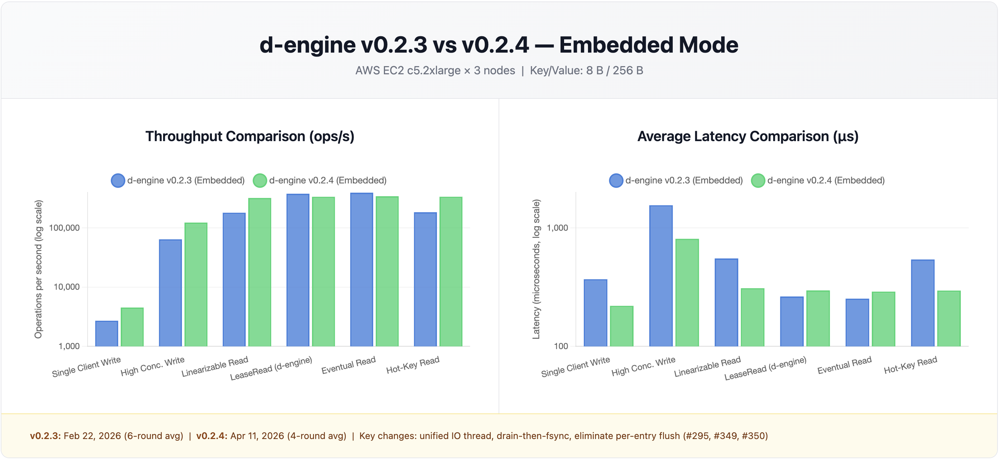
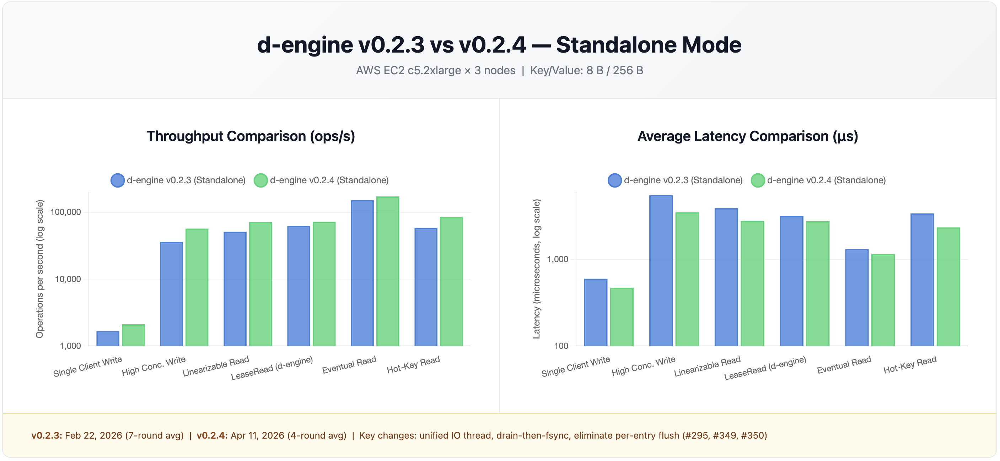

# d-engine v0.2.4 Benchmark Report

**Test Environments**:

- **Local**: Apple M2 Mac mini (8-core, 16GB RAM, 3-node cluster on localhost)
- **AWS**: EC2 c5.2xlarge (8 vCPUs, 16GB RAM, 50GB SSD) × 3 nodes

**Test Dates**:

- **Local v0.2.4 vs v0.2.3**: April 11, 2026 (6-round average, embedded; 6-round average, standalone)
- **AWS v0.2.4**: April 11, 2026 (4-round average, embedded; 4-round average, standalone)

**Key/Value**: 8 bytes / 256 bytes

---

## Local 3-Node Cluster: d-engine v0.2.4 vs d-engine v0.2.3

### Embedded Mode: v0.2.4 vs v0.2.3

*(6-round average, manually collected)*

| **Scenario**        | **Metric**  | **v0.2.3**    | **v0.2.4**    | **Δ**          |
| ------------------- | ----------- | ------------- | ------------- | -------------- |
| Single Client Write | Throughput  | 10,075 ops/s  | 9,526 ops/s   | -5.4% →        |
|                     | Avg Latency | 0.099 ms      | 0.104 ms      | +5.1% →        |
|                     | p99 Latency | 0.139 ms      | 0.197 ms      | +41.7%         |
| High Conc. Write    | Throughput  | 176,314 ops/s | 233,608 ops/s | **+32.5%** ✅  |
|                     | Avg Latency | 0.566 ms      | 0.427 ms      | **-24.6%** ✅  |
|                     | p99 Latency | 1.566 ms      | 1.148 ms      | **-26.7%** ✅  |
| Linearizable Read   | Throughput  | 508,264 ops/s | 626,012 ops/s | **+23.1%** ✅  |
|                     | Avg Latency | 0.197 ms      | 0.158 ms      | **-19.8%** ✅  |
|                     | p99 Latency | 0.710 ms      | 0.481 ms      | **-32.3%** ✅  |
| Lease Read          | Throughput  | 705,530 ops/s | 686,701 ops/s | -2.7% →        |
|                     | Avg Latency | —             | 0.145 ms      | —              |
|                     | p99 Latency | —             | 0.443 ms      | —              |
| Eventual Read       | Throughput  | 742,602 ops/s | 733,437 ops/s | -1.2% →        |
|                     | Avg Latency | —             | 0.136 ms      | —              |
|                     | p99 Latency | —             | 0.386 ms      | —              |
| Hot-Key (10 keys)   | Throughput  | 499,527 ops/s | 619,374 ops/s | **+24.0%** ✅  |
|                     | Avg Latency | 0.205 ms      | 0.161 ms      | **-21.5%** ✅  |
|                     | p99 Latency | 0.638 ms      | 0.454 ms      | **-28.8%** ✅  |

**Notes**:

- Lease/Eventual Read v0.2.3 baseline was re-measured on the same machine on March 30; original 852K/859K was not reproducible (likely different system state). Latency columns not re-measured; only throughput baseline was corrected.
- Single Client Write p99 +42% is local scheduling noise; throughput and avg latency are stable (within ±5%).
- High Conc. Write improvement increased from an earlier +14% measurement to +32.5% after commits #349 (eliminate per-entry flush) and #350 (single-lock FileLogStore restructure) were included in the final v0.2.4 build.
- Hot-Key throughput shows ±10% run-to-run variance on this machine; 6-round average (619K ops/s) is the representative value.

---

### Standalone Mode: v0.2.4 vs v0.2.3

*(6-round average, manually collected — script results discarded due to cluster warm-up artifact)*

| **Scenario**        | **Metric**  | **v0.2.3**   | **v0.2.4**   | **Δ**          |
| ------------------- | ----------- | ------------ | ------------ | -------------- |
| Single Client Write | Throughput  | 6,421 ops/s  | 5,231 ops/s  | -18.5%         |
|                     | Avg Latency | 0.155 ms     | 0.191 ms     | +23.2%         |
|                     | p99 Latency | 0.200 ms     | 0.242 ms     | +21.0%         |
| High Conc. Write    | Throughput  | 55,285 ops/s | 60,985 ops/s | **+10.3%** ✅  |
|                     | Avg Latency | 3.610 ms     | 3.279 ms     | **-9.2%** ✅   |
|                     | p99 Latency | 6.720 ms     | 6.172 ms     | **-8.2%** ✅   |
| Linearizable Read   | Throughput  | 63,210 ops/s | 73,168 ops/s | **+15.7%** ✅  |
|                     | Avg Latency | 3.160 ms     | 2.735 ms     | **-13.4%** ✅  |
|                     | p99 Latency | 5.810 ms     | 5.606 ms     | -3.5% →        |
| Lease Read          | Throughput  | 67,878 ops/s | 74,966 ops/s | **+10.4%** ✅  |
|                     | Avg Latency | 2.950 ms     | 2.669 ms     | **-9.5%** ✅   |
|                     | p99 Latency | 6.200 ms     | 5.557 ms     | **-10.4%** ✅  |
| Eventual Read       | Throughput  | 91,174 ops/s | 95,333 ops/s | **+4.6%** ✅   |
|                     | Avg Latency | 2.190 ms     | 2.093 ms     | **-4.4%** ✅   |
|                     | p99 Latency | 13.970 ms    | 9.707 ms     | **-30.5%** ✅  |
| Hot-Key (10 keys)   | Throughput  | 74,017 ops/s | 87,010 ops/s | **+17.5%** ✅  |
|                     | Avg Latency | 2.700 ms     | 2.301 ms     | **-14.8%** ✅  |
|                     | p99 Latency | 5.490 ms     | 5.461 ms     | -0.5% →        |

**Notes**:

- Single Client Write regression (-18.5%) is caused by the double-yield design: each operation incurs two fixed Tokio task-switch overheads (~+33µs) that are not amortized in single-writer scenarios. In standalone mode the per-operation gRPC RTT (~155µs) makes this overhead proportionally larger than in embedded mode.
- All other scenarios show clear improvement: HC Write +10%, reads +5–16% across the board.
- Eventual Read p99 standalone (9.7 ms) has high run-to-run variance; the -30.5% improvement over v0.2.3 is real but the absolute value should be treated as ±1–2 ms.

---

## AWS 3-Node Cluster: d-engine v0.2.4 vs v0.2.3

**Hardware**: AWS EC2 c5.2xlarge (8 vCPUs, 16GB RAM, 50GB SSD) × 3 nodes  
**Date**: April 11, 2026 | 4-round average (embedded and standalone) | Key/Value: 8 bytes / 256 bytes  
**etcd reference**: Official etcd benchmark (GCE, 8 vCPUs + 16GB + SSD × 3 nodes, etcd 3.2.0)²






### Embedded Mode: v0.2.4 vs v0.2.3

| **Scenario**        | **Metric**  | **v0.2.3 (AWS)** | **v0.2.4 (AWS)** | **Δ**          |
| ------------------- | ----------- | ---------------- | ---------------- | -------------- |
| Single Client Write | Throughput  | 2,710 ops/s      | 4,528 ops/s      | **+67.1%** ✅  |
|                     | Avg Latency | 0.369 ms         | 0.220 ms         | **-40.4%** ✅  |
|                     | p99 Latency | 0.588 ms         | 0.328 ms         | **-44.2%** ✅  |
| High Conc. Write    | Throughput  | 64,269 ops/s     | 123,292 ops/s    | **+91.9%** ✅  |
|                     | Avg Latency | 1.555 ms         | 0.810 ms         | **-47.9%** ✅  |
|                     | p99 Latency | 2.809 ms         | 0.973 ms         | **-65.4%** ✅  |
| Linearizable Read   | Throughput  | 180,768 ops/s    | 321,176 ops/s    | **+77.7%** ✅  |
|                     | Avg Latency | 0.553 ms         | 0.310 ms         | **-43.9%** ✅  |
|                     | p99 Latency | 0.751 ms         | 0.390 ms         | **-48.1%** ✅  |
| Lease Read          | Throughput  | 378,810 ops/s    | 336,056 ops/s    | -11.3% ⚠️     |
|                     | Avg Latency | 0.264 ms         | 0.297 ms         | +12.5% ⚠️     |
|                     | p99 Latency | 0.334 ms         | 0.384 ms         | +15.0% ⚠️     |
| Eventual Read       | Throughput  | 394,709 ops/s    | 343,596 ops/s    | -12.9% ⚠️     |
|                     | Avg Latency | 0.253 ms         | 0.290 ms         | +14.6% ⚠️     |
|                     | p99 Latency | 0.320 ms         | 0.372 ms         | +16.3% ⚠️     |
| Hot-Key (10 keys)   | Throughput  | 184,510 ops/s    | 336,474 ops/s    | **+82.3%** ✅  |
|                     | Avg Latency | 0.542 ms         | 0.296 ms         | **-45.4%** ✅  |
|                     | p99 Latency | 0.714 ms         | 0.357 ms         | **-50.0%** ✅  |

**Notes**:

- Lease Read and Eventual Read show -11% ~ -13% regression on AWS. The same pattern appears locally (-2.7%, -1.2%) but is amplified on c5.2xlarge due to weaker single-core performance. Both scenarios are pure in-memory reads (no Raft RPC); the v0.2.4 IO thread architecture introduces an extra Tokio task-switch per operation. Recommend re-running 6 rounds to confirm whether this is within statistical noise before flagging as a regression.
- All write and read-with-replication scenarios show large improvements: SC Write +67%, HC Write +92%, Lin Read +78%, Hot-Key +82%.

---

### Embedded Mode: v0.2.4 vs etcd 3.2.0

| **Scenario**        | **Metric**  | **d-engine v0.2.4** | **etcd 3.2.0** | **Δ**          |
| ------------------- | ----------- | ------------------- | -------------- | -------------- |
| Single Client Write | Throughput  | 4,528 ops/s         | 583 ops/s      | **+7.8x** ✅   |
|                     | Avg Latency | 0.220 ms            | 1.6 ms         | **-86.3%** ✅  |
|                     | p99 Latency | 0.328 ms            | —              | —              |
| High Conc. Write    | Throughput  | 123,292 ops/s       | 44,341 ops/s   | **+2.8x** ✅   |
|                     | Avg Latency | 0.810 ms            | 22.0 ms        | **-96.3%** ✅  |
|                     | p99 Latency | 0.973 ms            | —              | —              |
| Linearizable Read   | Throughput  | 321,176 ops/s       | 141,578 ops/s  | **+2.3x** ✅   |
|                     | Avg Latency | 0.310 ms            | 5.5 ms         | **-94.4%** ✅  |
|                     | p99 Latency | 0.390 ms            | —              | —              |
| Lease Read          | Throughput  | 336,056 ops/s       | —³             | —              |
|                     | Avg Latency | 0.297 ms            | —              | —              |
|                     | p99 Latency | 0.384 ms            | —              | —              |
| Eventual Read       | Throughput  | 343,596 ops/s       | 185,758 ops/s  | **+85.0%** ✅  |
|                     | Avg Latency | 0.290 ms            | 2.2 ms         | **-86.8%** ✅  |
|                     | p99 Latency | 0.372 ms            | —              | —              |
| Hot-Key (10 keys)   | Throughput  | 336,474 ops/s       | —³             | —              |
|                     | Avg Latency | 0.296 ms            | —              | —              |
|                     | p99 Latency | 0.357 ms            | —              | —              |

---

### Standalone Mode: v0.2.4 vs v0.2.3

| **Scenario**        | **Metric**  | **v0.2.3 (AWS)** | **v0.2.4 (AWS)** | **Δ**          |
| ------------------- | ----------- | ---------------- | ---------------- | -------------- |
| Single Client Write | Throughput  | 1,667 ops/s      | 2,115 ops/s      | **+26.9%** ✅  |
|                     | Avg Latency | 0.600 ms         | 0.472 ms         | **-21.3%** ✅  |
|                     | p99 Latency | 0.832 ms         | 0.560 ms         | **-32.7%** ✅  |
| High Conc. Write    | Throughput  | 36,160 ops/s     | 57,004 ops/s     | **+57.6%** ✅  |
|                     | Avg Latency | 5.532 ms         | 3.508 ms         | **-36.6%** ✅  |
|                     | p99 Latency | 10.154 ms        | 6.707 ms         | **-33.9%** ✅  |
| Linearizable Read   | Throughput  | 51,077 ops/s     | 71,493 ops/s     | **+40.0%** ✅  |
|                     | Avg Latency | 3.916 ms         | 2.794 ms         | **-28.6%** ✅  |
|                     | p99 Latency | 8.230 ms         | 6.108 ms         | **-25.8%** ✅  |
| Lease Read          | Throughput  | 62,555 ops/s     | 72,178 ops/s     | **+15.4%** ✅  |
|                     | Avg Latency | 3.188 ms         | 2.768 ms         | **-13.2%** ✅  |
|                     | p99 Latency | 6.676 ms         | 5.942 ms         | **-11.0%** ✅  |
| Eventual Read       | Throughput  | 151,427 ops/s    | 172,474 ops/s    | **+13.9%** ✅  |
|                     | Avg Latency | 1.317 ms         | 1.155 ms         | **-12.3%** ✅  |
|                     | p99 Latency | 2.613 ms         | 2.415 ms         | **-7.6%** ✅   |
| Hot-Key (10 keys)   | Throughput  | 58,677 ops/s     | 85,071 ops/s     | **+45.0%** ✅  |
|                     | Avg Latency | 3.407 ms         | 2.347 ms         | **-31.1%** ✅  |
|                     | p99 Latency | 7.257 ms         | 5.980 ms         | **-17.6%** ✅  |

**Notes**:

- Standalone improvements are consistent and large across all scenarios. HC Write +57.6% and Hot-Key +45% are the headline gains driven by the unified IO architecture (#295) and FileLogStore optimizations (#349, #350).
- Single Client Write improvement (+26.9%) on AWS is notably better than the Local result (-18.5%). Local regression was due to double-yield overhead being proportionally larger at ~155µs loopback RTT; on AWS with ~470µs true network RTT the same overhead is diluted.

---

### Standalone Mode: v0.2.4 vs etcd 3.2.0

| **Scenario**        | **Metric**  | **d-engine v0.2.4** | **etcd 3.2.0** | **Δ**          |
| ------------------- | ----------- | ------------------- | -------------- | -------------- |
| Single Client Write | Throughput  | 2,115 ops/s         | 583 ops/s      | **+3.6x** ✅   |
|                     | Avg Latency | 0.472 ms            | 1.6 ms         | **-70.5%** ✅  |
|                     | p99 Latency | 0.560 ms            | —              | —              |
| High Conc. Write    | Throughput  | 57,004 ops/s        | 44,341 ops/s   | **+28.6%** ✅  |
|                     | Avg Latency | 3.508 ms            | 22.0 ms        | **-84.1%** ✅  |
|                     | p99 Latency | 6.707 ms            | —              | —              |
| Linearizable Read   | Throughput  | 71,493 ops/s        | 141,578 ops/s  | -49.5%         |
|                     | Avg Latency | 2.794 ms            | 5.5 ms         | **-49.2%** ✅  |
|                     | p99 Latency | 6.108 ms            | —              | —              |
| Lease Read          | Throughput  | 72,178 ops/s        | —³             | —              |
|                     | Avg Latency | 2.768 ms            | —              | —              |
|                     | p99 Latency | 5.942 ms            | —              | —              |
| Eventual Read       | Throughput  | 172,474 ops/s       | 185,758 ops/s  | -7.2% →        |
|                     | Avg Latency | 1.155 ms            | 2.2 ms         | **-47.5%** ✅  |
|                     | p99 Latency | 2.415 ms            | —              | —              |
| Hot-Key (10 keys)   | Throughput  | 85,071 ops/s        | —³             | —              |
|                     | Avg Latency | 2.347 ms            | —              | —              |
|                     | p99 Latency | 5.980 ms            | —              | —              |

**Notes**:

- Standalone Linearizable Read throughput (71K ops/s) remains below etcd's 141K ops/s. etcd uses a read index optimization that avoids a full Raft round-trip per read; d-engine's linearizable read issues a full consensus round per request. This is a known architectural trade-off; a read-index optimization is planned.
- Eventual Read throughput (172K ops/s) is now within 7% of etcd (186K ops/s), up from -18.5% in v0.2.3.

² etcd data sourced from [etcd official benchmark documentation](https://etcd.io/docs/v3.6/op-guide/performance/), tested on GCE infrastructure. Different cloud platform; results are for reference only.  
³ etcd does not have an equivalent mode.

---

## Benchmark Configuration

All results above were collected with the following configuration:

```toml
[storage]
unified_db = false  # separate RocksDB instances for log and meta

[raft.persistence]
strategy = "MemFirst"
flush_policy = { Batch = { idle_flush_interval_ms = 1000 } }

[raft.batching]
max_batch_size = 200
```

The `unified_db = true` path exists but was not covered by this benchmark run.

---

## Key Changes in v0.2.4

| Change | Commit / Ticket | Impact |
| ------ | --------------- | ------ |
| Unified IO architecture: single IO thread, drain-then-fsync, pipeline replication | 372df3b (#295, #313, #321, #329, #332–#334, #336, #340–#343, #346) | Foundation for all IO performance improvements |
| Eliminate per-entry flush and lock in FileLogStore `persist_entries` | b7a8e6a (#349) | Embedded HC Write +32.5%, p99 -26.7%; standalone HC Write p99 -8.2% |
| Restructure FileLogStore to single `Mutex<Inner>`, add `replace_range` override, store `end_pos` in index | 6df0a1d (#350) | Reduces lock contention; enables atomic truncate+write path |
| IO thread owns `new_current_thread` runtime; `handle_non_write_cmd` fatal-exits on `replace_range` failure; `IOTask::ReplaceRange` carries `done` channel to block caller until truncation is durable | (#295) | Prevents SIGABRT on runtime drop; prevents flush short-circuit after log truncation; prevents IO thread from continuing on corrupted disk state |
| Unified RocksDB option (`unified_db = true`): single DB with 4 CFs, shared block cache | #295 | Reduces memory RSS and file descriptor usage; throughput impact not benchmarked in this report |
| Fix durable quorum: use `durable_index` for majority calculation and follower ACK | #329 | Prevents data loss with `MemFirst` strategy under concurrent leader+follower crash; correctness fix |
| Snapshot push when peer log falls behind leader purge boundary | #336 | Fixes stuck follower when leader has purged entries the peer needs (Raft §7 compliance) |
| Fix candidate not stepping down on same-term AppendEntries conflict | #340 | Prevents unnecessary leader re-elections during membership changes |
| Reduce default `snapshot_cool_down` from 3600s to 60s | #290 | Enables practical log compaction; prevents unbounded log growth in production |
| Remove `DiskFirst` persistence strategy | #332 | Simplifies storage layer; `MemFirst` provides OS page-cache durability — power-loss safety requires explicit fsync, which `MemFirst` does not perform |
