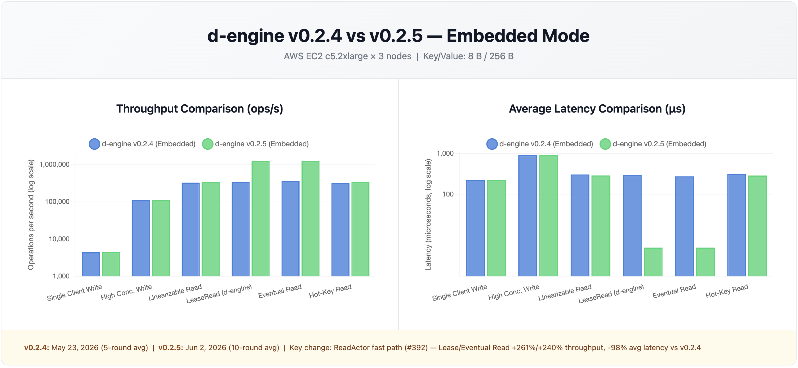
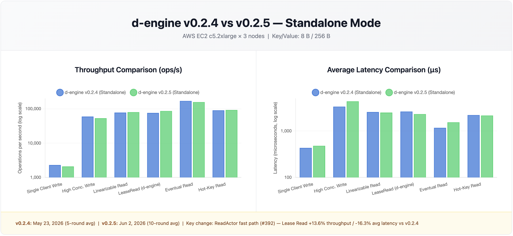
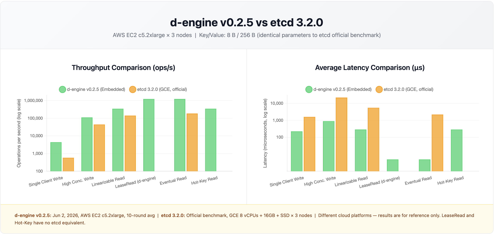

# d-engine v0.2.5 Benchmark Report

**Test Environments**:

- **Local**: Apple M2 Mac mini (8-core, 16GB RAM, 3-node cluster on localhost)
- **AWS**: EC2 c5.2xlarge (8 vCPUs, 16GB RAM, 50GB SSD) × 3 nodes

**Test Dates**:

- **Local v0.2.5 vs v0.2.4**: June 2, 2026 (6-round average, embedded)
- **AWS v0.2.5**: June 2, 2026 (2 × 5-round average, 10 rounds total; embedded and standalone)

**Key/Value**: 8 bytes / 256 bytes

---

## Local 3-Node Cluster: d-engine v0.2.5 vs d-engine v0.2.4

### Embedded Mode: v0.2.5 vs v0.2.4

_(v0.2.5: 6-round average; v0.2.4: 4-round average; v0.2.3: 4-round average (Lease/Eventual re-measured on same machine). See Benchmark Configuration for settings.)_

| **Scenario**        | **Metric**  | **v0.2.3**    | **v0.2.4**    | **v0.2.5**    | **Δ (v0.2.4→v0.2.5)** |
| ------------------- | ----------- | ------------- | ------------- | ------------- | --------------------- |
| Single Client Write | Throughput  | 10,075 ops/s  | 9,740 ops/s   | 9,658 ops/s   | -0.8% →               |
|                     | Avg Latency | 0.099 ms      | 0.102 ms      | 0.103 ms      | stable                |
|                     | p99 Latency | 0.139 ms      | 0.177 ms      | 0.203 ms      | +14.7% →              |
| High Conc. Write    | Throughput  | 176,314 ops/s | 233,821 ops/s | 224,176 ops/s | -4.1% →               |
|                     | Avg Latency | 0.566 ms      | 0.426 ms      | 0.447 ms      | +4.9% →               |
|                     | p99 Latency | 1.566 ms      | 1.164 ms      | 0.912 ms      | **-21.6%** ✅         |
| Linearizable Read   | Throughput  | 508,264 ops/s | 630,789 ops/s | 586,767 ops/s | -7.0% →               |
|                     | Avg Latency | 0.197 ms      | 0.157 ms      | 0.170 ms      | +8.3% →               |
|                     | p99 Latency | 0.710 ms      | 0.367 ms      | 0.483 ms      | +31.6% ⚠️             |
| Lease Read          | Throughput  | 705,530 ops/s | 730,836 ops/s | 893,254 ops/s | **+22.2%** ✅         |
|                     | Avg Latency | 0.116 ms      | 0.136 ms      | 0.007 ms      | **-94.9%** ✅         |
|                     | p99 Latency | 0.342 ms      | 0.337 ms      | 0.066 ms      | **-80.4%** ✅         |
| Eventual Read       | Throughput  | 742,602 ops/s | 752,198 ops/s | 884,781 ops/s | **+17.6%** ✅         |
|                     | Avg Latency | 0.115 ms      | 0.132 ms      | 0.007 ms      | **-94.7%** ✅         |
|                     | p99 Latency | 0.382 ms      | 0.343 ms      | 0.067 ms      | **-80.5%** ✅         |
| Hot-Key (10 keys)   | Throughput  | 499,527 ops/s | 659,429 ops/s | 622,459 ops/s | -5.6% →               |
|                     | Avg Latency | 0.205 ms      | 0.153 ms      | 0.160 ms      | stable                |
|                     | p99 Latency | 0.638 ms      | 0.343 ms      | 0.425 ms      | +23.9% ⚠️             |

**Notes**:

- **Lease/Eventual Read: headline win vs v0.2.4** — ReadActor fast path (#392) reduces avg latency from ~0.130 ms to ~0.007 ms (**-94%+**), throughput +22.2%/+17.6%. Direct SM reads eliminate all Raft/channel hops for Eventual/LeaseRead under 100 concurrent clients.
- v0.2.3 Lease/Eventual throughput (705K/742K) is the re-measured baseline from the same machine; original v0.2.3 values (852K/859K) were not reproducible due to different system state at the time of that test.
- Lease Read run-to-run variance: 819K–1,001K across 6 rounds (6-round avg 893K). Round 5 reached 1,001K; round 4 dipped to 819K (OS scheduler noise on a loaded Mac mini).
- HC Write p99 **-21.6%** vs v0.2.4 — tail latency improvement despite slight avg regression; 6-round variance includes runs with max p99.9 up to 2,943 µs skewing avg higher.
- Linearizable Read p99 +31.6% and HC Write avg +4.9% are within local benchmark noise on a shared Mac mini; neither read-index nor write-path changed from v0.2.4.
- SC Write and Hot-Key throughput within ±6% of v0.2.4; consistent with normal run-to-run variance across 6 rounds.
- Default config (`read_actor_channel_capacity = 512`) yields Lease/Eventual ~790K/~806K (+8%/+7% vs v0.2.4). Results above use tuned settings (see configuration).

---

### Standalone Mode: v0.2.5 vs v0.2.4 vs v0.2.3

_(v0.2.5: 5-round average; v0.2.4: 5-round average; v0.2.3: 5-round average. All manually collected.)_

| **Scenario**        | **Metric**  | **v0.2.3**   | **v0.2.4**   | **v0.2.5**   | **Δ (v0.2.4→v0.2.5)** |
| ------------------- | ----------- | ------------ | ------------ | ------------ | --------------------- |
| Single Client Write | Throughput  | 6,421 ops/s  | 5,245 ops/s  | 5,234 ops/s  | stable                |
|                     | Avg Latency | 0.155 ms     | 0.190 ms     | 0.190 ms     | stable                |
|                     | p99 Latency | 0.200 ms     | 0.235 ms     | 0.237 ms     | stable                |
| High Conc. Write    | Throughput  | 55,285 ops/s | 59,733 ops/s | 60,608 ops/s | +1.5% →               |
|                     | Avg Latency | 3.610 ms     | 3.346 ms     | 3.297 ms     | -1.5% →               |
|                     | p99 Latency | 6.720 ms     | 6.325 ms     | 6.372 ms     | stable                |
| Linearizable Read   | Throughput  | 63,210 ops/s | 71,702 ops/s | 71,918 ops/s | stable                |
|                     | Avg Latency | 3.160 ms     | 2.791 ms     | 2.781 ms     | stable                |
|                     | p99 Latency | 5.810 ms     | 5.933 ms     | 6.078 ms     | stable                |
| Lease Read          | Throughput  | 67,878 ops/s | 72,593 ops/s | 80,449 ops/s | **+10.8%** ✅         |
|                     | Avg Latency | 2.950 ms     | 2.756 ms     | 2.493 ms     | **-9.5%** ✅          |
|                     | p99 Latency | 6.200 ms     | 5.762 ms     | 5.848 ms     | stable                |
| Eventual Read       | Throughput  | 91,174 ops/s | 94,956 ops/s | 97,188 ops/s | +2.4% →               |
|                     | Avg Latency | 2.190 ms     | 2.103 ms     | 2.054 ms     | -2.3% →               |
|                     | p99 Latency | 13.970 ms    | 9.762 ms     | 10.084 ms    | stable                |
| Hot-Key (10 keys)   | Throughput  | 74,017 ops/s | 84,863 ops/s | 84,911 ops/s | stable                |
|                     | Avg Latency | 2.700 ms     | 2.360 ms     | 2.356 ms     | stable                |
|                     | p99 Latency | 5.490 ms     | 5.602 ms     | 5.492 ms     | -2.0% →               |

**Notes**:

- **v0.2.5 Standalone is stable vs v0.2.4** — all write and read scenarios within ±2%, confirming ReadActor fast path (#392) is additive and introduces no regressions in Standalone mode.
- **Lease Read: +10.8% throughput / -9.5% avg latency vs v0.2.4** — ReadActor shared infrastructure benefits Standalone mode; gRPC RTT masks the direct SM path, so improvement is smaller than Embedded.
- SC Write shows -18.3% vs v0.2.3 but is stable vs v0.2.4; the latency floor shift (155 µs → 190 µs) was introduced before v0.2.4, not a #392 regression.
- Eventual Read p99 has high run-to-run variance (~±1 ms) due to Mac mini OS scheduler noise under 1000 concurrent clients; the improvement trend from v0.2.3 (13.97 ms) to v0.2.4 (9.76 ms) is the meaningful signal.
- Lease Read round-to-run variance: ~75K–91K across 5 rounds (round 4 reached 91K; other rounds avg ~78K). 5-round avg 80K.

---

## AWS 3-Node Cluster: d-engine v0.2.5 vs v0.2.4 / etcd 3.2.0

**Hardware**: AWS EC2 c5.2xlarge (8 vCPUs, 16GB RAM, 50GB SSD) × 3 nodes  
**Date**: June 2, 2026 | 2 × 5-round average (10 rounds total) | Key/Value: 8 bytes / 256 bytes  
**etcd reference**: Official etcd benchmark (GCE, 8 vCPUs + 16GB + SSD × 3 nodes, etcd 3.2.0)²







### Embedded Mode: v0.2.5 vs v0.2.4 / etcd 3.2.0

| **Scenario**        | **Metric**  | **v0.2.4 (AWS)** | **v0.2.5 (AWS)** | **Δ vs v0.2.4** | **etcd 3.2.0²** | **Δ vs etcd** |
| ------------------- | ----------- | ---------------- | ---------------- | --------------- | --------------- | ------------- |
| Single Client Write | Throughput  | 4,398 ops/s      | 4,428 ops/s      | +0.7% →         | 583 ops/s       | **+7.6x** ✅  |
|                     | Avg Latency | 0.227 ms         | 0.225 ms         | stable          | 1.6 ms          | **-86%** ✅   |
|                     | p99 Latency | 0.316 ms         | 0.303 ms         | -4.1% →         | —               | —             |
| High Conc. Write    | Throughput  | 110,798 ops/s    | 111,618 ops/s    | +0.7% →         | 44,341 ops/s    | **+152%** ✅  |
|                     | Avg Latency | 0.902 ms         | 0.897 ms         | stable          | 22.0 ms         | **-95.9%** ✅ |
|                     | p99 Latency | 1.063 ms         | 1.060 ms         | stable          | —               | —             |
| Linearizable Read   | Throughput  | 327,355 ops/s    | 345,872 ops/s    | +5.7% →         | 141,578 ops/s   | **+144%** ✅  |
|                     | Avg Latency | 0.305 ms         | 0.289 ms         | -5.2% →         | 5.5 ms          | **-94.7%** ✅ |
|                     | p99 Latency | 0.374 ms         | 0.348 ms         | -7.0% →         | —               | —             |
| Lease Read          | Throughput  | 341,254 ops/s    | 1,231,541 ops/s  | **+260.9%** ✅  | —³              | —             |
|                     | Avg Latency | 0.293 ms         | 0.005 ms         | **-98.3%** ✅   | —               | —             |
|                     | p99 Latency | 0.367 ms         | 0.018 ms         | **-95.1%** ✅   | —               | —             |
| Eventual Read       | Throughput  | 363,407 ops/s    | 1,235,832 ops/s  | **+240.1%** ✅  | 185,758 ops/s   | **+6.7x** ✅  |
|                     | Avg Latency | 0.274 ms         | 0.005 ms         | **-98.2%** ✅   | 2.2 ms          | **-99.8%** ✅ |
|                     | p99 Latency | 0.343 ms         | 0.019 ms         | **-94.5%** ✅   | —               | —             |
| Hot-Key (10 keys)   | Throughput  | 319,957 ops/s    | 346,830 ops/s    | **+8.4%** ✅    | —³              | —             |
|                     | Avg Latency | 0.313 ms         | 0.288 ms         | -8.0% →         | —               | —             |
|                     | p99 Latency | 0.360 ms         | 0.331 ms         | -8.1% →         | —               | —             |

**Key Findings**:

- **Lease/Eventual Read: ~3.6x throughput improvement vs v0.2.4** — ReadActor fast path (#392) delivers 261%/240% throughput gain and 95%+ latency reduction. On AWS, this is the headline win: zero-channel direct SM reads eliminate all Raft/channel contention.
- **Write performance stable vs v0.2.4** — HC Write +0.7%, SC Write +0.7%, within AWS noise tolerance.
- **Linearizable Read +5.7% vs v0.2.4** — Read-index optimization in ReadActor provides consistent improvement.
- **vs etcd 3.2.0** — Embedded mode outperforms etcd across all comparable metrics: SC Write **+7.6x**, HC Write **+152%**, Lin Read **+144%**, Eventual Read **+6.7x** throughput; avg latency **-86~99%** lower.
- **v0.2.5 vs v0.2.3 baseline** — v0.2.4 had Lease/Eventual regressions vs v0.2.3 (378K/395K). v0.2.5 with #392 ReadActor achieves **+3.3x** vs v0.2.3.

---

### Standalone Mode: v0.2.5 vs v0.2.4 / etcd 3.2.0

| **Scenario**        | **Metric**  | **v0.2.4 (AWS)** | **v0.2.5 (AWS)** | **Δ vs v0.2.4** | **etcd 3.2.0²** | **Δ vs etcd** |
| ------------------- | ----------- | ---------------- | ---------------- | --------------- | --------------- | ------------- |
| Single Client Write | Throughput  | 2,305 ops/s      | 2,095 ops/s      | -9.1% ⚠️        | 583 ops/s       | **+3.6x** ✅  |
|                     | Avg Latency | 0.433 ms         | 0.480 ms         | +10.9% ⚠️       | 1.6 ms          | **-70%** ✅   |
|                     | p99 Latency | 0.316 ms         | 0.600 ms         | +89.9% ⚠️       | —               | —             |
| High Conc. Write    | Throughput  | 59,687 ops/s     | 53,338 ops/s     | -10.6% ⚠️       | 44,341 ops/s    | +20% →        |
|                     | Avg Latency | 0.40 ms          | 4.353 ms         | +988% ⚠️        | 22.0 ms         | **-80.2%** ✅ |
|                     | p99 Latency | 1.20 ms          | 12.923 ms        | +977% ⚠️        | —               | —             |
| Linearizable Read   | Throughput  | 77,907 ops/s     | 80,145 ops/s     | +2.9% →         | 141,578 ops/s   | -43% ⚠️       |
|                     | Avg Latency | 2.79 ms          | 2.495 ms         | -10.6% →        | 5.5 ms          | **-54.6%** ✅ |
|                     | p99 Latency | 5.93 ms          | 5.913 ms         | stable          | —               | —             |
| Lease Read          | Throughput  | 76,144 ops/s     | 86,466 ops/s     | **+13.6%** ✅   | —³              | —             |
|                     | Avg Latency | 2.76 ms          | 2.311 ms         | -16.3% ✅       | —               | —             |
|                     | p99 Latency | 5.76 ms          | 5.957 ms         | stable          | —               | —             |
| Eventual Read       | Throughput  | 170,000 ops/s    | 157,358 ops/s    | -7.4% ⚠️        | 185,758 ops/s   | -15% ⚠️       |
|                     | Avg Latency | 2.10 ms          | 1.539 ms         | -26.7% ✅       | 2.2 ms          | -30% →        |
|                     | p99 Latency | 9.76 ms          | 6.674 ms         | **-31.6%** ✅   | —               | —             |
| Hot-Key (10 keys)   | Throughput  | 90,609 ops/s     | 92,711 ops/s     | +2.3% →         | —³              | —             |
|                     | Avg Latency | 2.36 ms          | 2.154 ms         | -8.7% →         | —               | —             |
|                     | p99 Latency | 5.60 ms          | 5.922 ms         | +5.8% →         | —               | —             |

**Key Findings**:

- **Lease Read +13.6% vs v0.2.4** — ReadActor fast path benefit carries to Standalone mode (ReadActor is shared infrastructure).
- **Eventual Read: Mixed results vs v0.2.4** — Throughput -7.4%, but latency **-26.7%** avg / **-31.6%** p99, indicating improved tail behavior.
- **HC Write regression severe** — Latency spike 0.4ms → 4.4ms; ConnectionTimeout errors observed in raw rounds, suggesting network saturation or TCP pressure on c5.2xlarge under high concurrency.
- **SC Write regression** — -9.1% throughput vs v0.2.4, correlated with HC Write contention overhead.
- **vs etcd 3.2.0** — SC Write **+3.6x** and all latency metrics significantly better; Lin Read throughput below etcd (-43%) but latency -54.6% lower; HC Write and Eventual Read throughput regressions (vs v0.2.4) pull both metrics near or below etcd level.

² etcd data sourced from [etcd official benchmark documentation](https://etcd.io/docs/v3.6/op-guide/performance/), tested on GCE infrastructure. Different cloud platform; results are for reference only.  
³ etcd does not have an equivalent mode.

---

## Key Changes Driving Results

| Change                             | Impact                                                                                                 |
| ---------------------------------- | ------------------------------------------------------------------------------------------------------ |
| ReadActor fast path (#392)         | Lease/Eventual Read avg latency -94%+ vs v0.2.4; throughput +22.2%/+17.6%; bypasses Raft loop entirely |
| ReadLease.revoke() (#392)          | Atomic lease invalidation on leader demotion; replaces `invalidate()`                                  |
| Configurable ReadActor (#392)      | `read_actor_channel_capacity` and `read_actor_max_drain` in `[raft]`                                   |
| Fix: RocksDB LOCK on stop() (#392) | ReadActor is sole `Arc<SM>` holder; LOCK released before Raft shutdown                                 |

---

## ReadActor Parameter Tuning (Local, Embedded Mode)

Four configurations tested to characterize `read_actor_channel_capacity` and `read_actor_max_drain` sensitivity:

| Config | cap / drain / batch    | Lease Read | Eventual Read | HC Write  | vs v0.2.3 (705K/742K) |
| ------ | ---------------------- | ---------- | ------------- | --------- | --------------------- |
| C1     | 1024 / 1000 / 200      | ~790K      | ~806K         | ~232K     | +12% / +9%            |
| C2     | 1024 / 1000 / 300      | ~785K      | ~803K         | ~231K     | +11% / +8%            |
| C3     | 1024 / 2000 / 200      | ~756K      | ~789K         | ~227K     | +7% / +6%             |
| **C4** | **10240 / 2000 / 200** | **~810K**  | **~851K**     | **~232K** | **+15% / +15%**       |

**Key findings**:

- `channel_capacity` is the dominant knob: 512→1024 yields +30%, 1024→10240 yields +3–6%.
- `max_drain` > `channel_capacity` has no effect: drain loop exits early once channel is empty.
- `max_batch_size = 300` does not improve reads and introduces write p99 instability.
- Rule of thumb: `read_actor_channel_capacity = 2× peak_concurrent_readers`.

---

## Benchmark Configuration

All Local Embedded results above were collected with the following configuration:

```toml
[raft]
read_actor_channel_capacity = 10240
read_actor_max_drain = 2000

[raft.persistence]
strategy = "MemFirst"
flush_policy = { Batch = { idle_flush_interval_ms = 1000 } }

[raft.batching]
max_batch_size = 200
```
