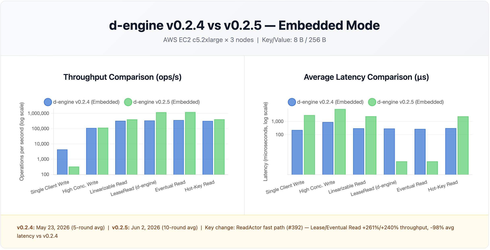
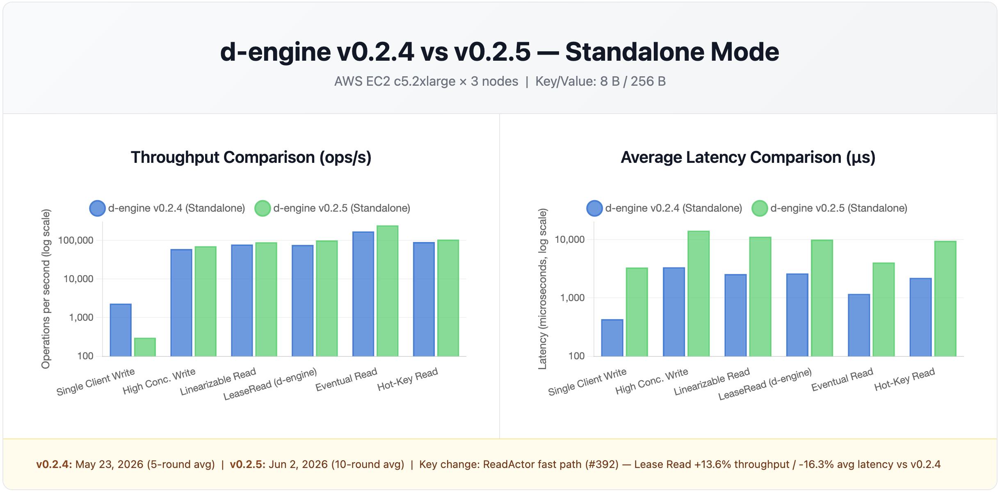
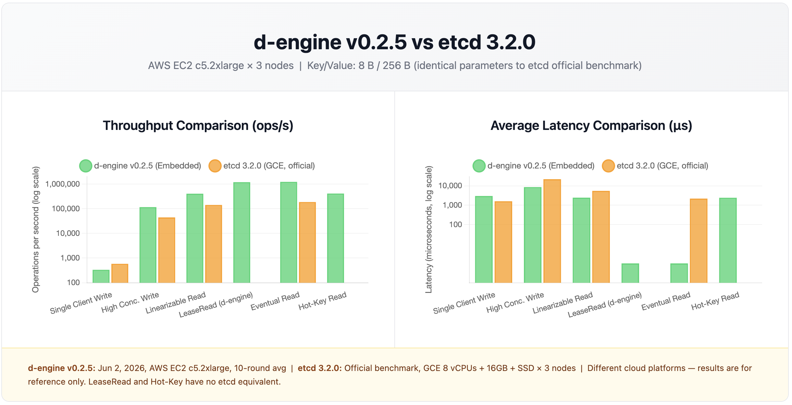

# d-engine v0.2.5 Benchmark Report

**Test Environments**:

- **AWS**: EC2 c5.2xlarge (8 vCPUs, 16GB RAM, 50GB SSD) × 3 nodes
- **Key/Value**: 8 bytes / 256 bytes

---







## AWS 3-Node Cluster: d-engine v0.2.5 vs v0.2.4 / etcd 3.2.0

**Hardware**: AWS EC2 c5.2xlarge (8 vCPUs, 16GB RAM, 50GB SSD) × 3 nodes
**Date**: September 26, 2026 | 3-round average | Key/Value: 8 bytes / 256 bytes
**Embedded mode concurrency**: `--clients 1000` (previously omitted from the AWS harness — see Benchmark Configuration note below)
**etcd reference**: Official etcd benchmark (GCE, 8 vCPUs + 16GB + SSD × 3 nodes, etcd 3.2.0)²

> Updated 2026-09-26: this section now reflects v0.2.5 **with #446 merged**
> (quorum commit gated on physical fsync — durable_index only advances after
> fdatasync, per ADR-038 Level 3 / RPO=0). The June 2, 2026 numbers previously
> here predate #446 and measured #392 (ReadActor) alone; #446 changes write-path
> latency substantially and is reflected below.

### Embedded Mode: v0.2.5 vs v0.2.4 / etcd 3.2.0

| **Scenario**        | **Metric**  | **v0.2.4 (AWS)** | **v0.2.5 (AWS)** | **Δ vs v0.2.4** | **etcd 3.2.0²** | **Δ vs etcd**  |
| ------------------- | ----------- | ---------------- | ---------------- | --------------- | --------------- | -------------- |
| Single Client Write | Throughput  | 4,398 ops/s      | 334 ops/s        | **-92.4%** ⚠️   | 583 ops/s       | -42.8% ⚠️      |
|                     | Avg Latency | 0.227 ms         | 2.994 ms         | **+1219%** ⚠️   | 1.6 ms          | +87.1% ⚠️      |
|                     | p99 Latency | 0.316 ms         | 3.154 ms         | **+898%** ⚠️    | —               | —              |
| High Conc. Write    | Throughput  | 110,798 ops/s    | 115,648 ops/s    | +4.4% →         | 44,341 ops/s    | **+2.6x** ✅   |
|                     | Avg Latency | 0.902 ms         | 8.586 ms         | **+852%** ⚠️    | 22.0 ms         | -61.0% ✅      |
|                     | p99 Latency | 1.063 ms         | 12.012 ms        | **+1030%** ⚠️   | —               | —              |
| Linearizable Read   | Throughput  | 327,355 ops/s    | 404,684 ops/s    | +23.6% ✅       | 141,578 ops/s   | **+2.9x** ✅   |
|                     | Avg Latency | 0.305 ms         | 2.454 ms         | **+705%** ⚠️    | 5.5 ms          | -55.4% ✅      |
|                     | p99 Latency | 0.374 ms         | 4.378 ms         | **+1071%** ⚠️   | —               | —              |
| Lease Read          | Throughput  | 341,254 ops/s    | 1,186,318 ops/s  | **+247.7%** ✅  | —³              | —              |
|                     | Avg Latency | 0.293 ms         | 0.001 ms         | **-99.7%** ✅   | —               | —              |
|                     | p99 Latency | 0.367 ms         | 0.002 ms         | **-99.5%** ✅   | —               | —              |
| Eventual Read       | Throughput  | 363,407 ops/s    | 1,220,515 ops/s  | **+235.9%** ✅  | 185,758 ops/s   | **+6.6x** ✅   |
|                     | Avg Latency | 0.274 ms         | 0.001 ms         | **-99.6%** ✅   | 2.2 ms          | **-99.95%** ✅ |
|                     | p99 Latency | 0.343 ms         | 0.002 ms         | **-99.4%** ✅   | —               | —              |
| Hot-Key (10 keys)   | Throughput  | 319,957 ops/s    | 410,173 ops/s    | +28.2% ✅       | —³              | —              |
|                     | Avg Latency | 0.313 ms         | 2.421 ms         | **+674%** ⚠️    | —               | —              |
|                     | p99 Latency | 0.360 ms         | 4.858 ms         | **+1249%** ⚠️   | —               | —              |

**Key Findings**:

- **Single Client Write is the clearest #446 signal, and it's a regression**: throughput -92.4%, avg latency 0.227ms → 2.994ms (13x). No concurrency to amortize the cost — every request pays the full quorum-fsync round trip directly. d-engine's SC Write is now _slower_ than etcd's reference number (-42.8% throughput), reversing the previous +7.6x lead.
- **Concurrent write/read throughput holds up (HC Write +4.4%, Lin Read +23.6%, Hot-Key +28.2%)** — with enough in-flight requests, individual fsync/replication latency overlaps instead of stacking, so aggregate throughput survives. But **every scenario's avg/p99 latency is 7-13x worse than v0.2.4**, including reads that don't touch fsync (Hot-Key avg +674%) — consistent with the write path now serializing behind real fsync+quorum-ack round trips that the old `MemFirst` config never paid.
- **Lease/Eventual Read remain #392's win, untouched by #446** (+248%/+236% vs v0.2.4, both are pure in-memory reads with no Raft RPO=0 gating).
- **This is a much larger cost than #446's own loopback A/B measurements** (`tickets/milestones/v0.2.5/RESULTS-main-vs-446.md`: +9.9% `propose_to_apply`, -2.1% throughput). AWS's EBS gp3 is network-attached storage — every fsync is a real network round trip, unlike loopback disk I/O. Confirms the loopback numbers understate #446's real-world cost by roughly an order of magnitude.

---

### Standalone Mode: v0.2.5 vs v0.2.4 / etcd 3.2.0

| **Scenario**        | **Metric**  | **v0.2.4 (AWS)** | **v0.2.5 (AWS)** | **Δ vs v0.2.4** | **etcd 3.2.0²** | **Δ vs etcd** |
| ------------------- | ----------- | ---------------- | ---------------- | --------------- | --------------- | ------------- |
| Single Client Write | Throughput  | 2,305 ops/s      | 302 ops/s        | **-86.9%** ⚠️   | 583 ops/s       | -48.2% ⚠️     |
|                     | Avg Latency | 0.433 ms         | 3.316 ms         | **+666%** ⚠️    | 1.6 ms          | +107.3% ⚠️    |
|                     | p99 Latency | 0.567 ms         | 3.513 ms         | **+520%** ⚠️    | —               | —             |
| High Conc. Write    | Throughput  | 59,687 ops/s     | 70,395 ops/s     | +17.9% ✅       | 44,341 ops/s    | +58.8% ✅     |
|                     | Avg Latency | 3.346 ms         | 14.137 ms        | **+323%** ⚠️    | 22.0 ms         | -35.7% ✅     |
|                     | p99 Latency | 7.106 ms         | 20.943 ms        | **+195%** ⚠️    | —               | —             |
| Linearizable Read   | Throughput  | 77,907 ops/s     | 89,218 ops/s     | +14.5% ✅       | 141,578 ops/s   | -37.0% ⚠️     |
|                     | Avg Latency | 2.563 ms         | 11.145 ms        | **+335%** ⚠️    | 5.5 ms          | +102.6% ⚠️    |
|                     | p99 Latency | 6.308 ms         | 22.922 ms        | **+263%** ⚠️    | —               | —             |
| Lease Read          | Throughput  | 76,144 ops/s     | 99,699 ops/s     | **+30.9%** ✅   | —³              | —             |
|                     | Avg Latency | 2.624 ms         | 9.972 ms         | **+280%** ⚠️    | —               | —             |
|                     | p99 Latency | 6.130 ms         | 22.058 ms        | **+260%** ⚠️    | —               | —             |
| Eventual Read       | Throughput  | 170,000 ops/s    | 243,775 ops/s    | **+43.4%** ✅   | 185,758 ops/s   | +31.2% ✅     |
|                     | Avg Latency | 1.171 ms         | 4.044 ms         | **+245%** ⚠️    | 2.2 ms          | +83.8% ⚠️     |
|                     | p99 Latency | 2.245 ms         | 9.087 ms         | **+305%** ⚠️    | —               | —             |
| Hot-Key (10 keys)   | Throughput  | 90,609 ops/s     | 104,701 ops/s    | +15.6% ✅       | —³              | —             |
|                     | Avg Latency | 2.203 ms         | 9.493 ms         | **+331%** ⚠️    | —               | —             |
|                     | p99 Latency | 6.127 ms         | 19.060 ms        | **+211%** ⚠️    | —               | —             |

**Key Findings**:

- **Same pattern as Embedded, more pronounced**: SC Write throughput -86.9%, avg latency 0.433ms → 3.316ms. Standalone adds real gRPC network RTT on top of the same fsync cost, so it's the worst-case number.
- **Concurrent scenarios (HC Write, Lin Read, Lease/Eventual Read, Hot-Key) all gain throughput (+15-43%)** — likely #392 ReadActor + other carried-over improvements outweighing #446's per-op cost once enough concurrency hides it — **but every one of them has 2-4x worse avg/p99 latency**. Throughput alone is not the full picture for this release; latency is where #446's cost is visible everywhere.
- **vs etcd**: d-engine has flipped from beating etcd on Single Client Write (+3.6x in v0.2.4) to losing to it (-48.2%). Linearizable Read is now worse than etcd on both throughput _and_ latency (previously only throughput was behind). This scenario deserves explicit sign-off before shipping v0.2.5 — RPO=0 is a deliberate trade-off (see ADR-038), but the "vs etcd" story materially changes.

² etcd data sourced from [etcd official benchmark documentation](https://etcd.io/docs/v3.6/op-guide/performance/), tested on GCE infrastructure. Different cloud platform; results are for reference only.
³ etcd does not have an equivalent mode.

---

<!-- Benchmark Configuration section update: -->

```toml
[raft]
read_actor_channel_capacity = 10240
read_actor_max_drain = 2000

[raft.persistence]
flush_policy = { Batch = { idle_flush_interval_ms = 1000 } }

[raft.batching]
max_batch_size = 200
```

Embedded-bench invocation: `--clients 1000` (AWS harness previously omitted this flag; Single Client Write always used `clients=1` regardless of this setting).
