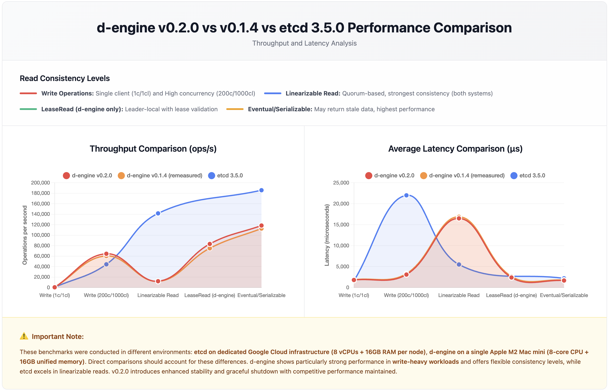

# d-engine v0.2.0 Performance Benchmark Report

## TL;DR

**vs etcd 3.5.0**:

- ✅ **Write**: 45% faster under high concurrency (64,509 vs 44,341 ops/sec)
- ⚠️ **Read**: etcd 11.7x faster in linearizable reads (hardware difference)
- ✅ **Unique**: LeaseRead provides 6.9x performance vs linearizable with strong consistency

**vs v0.2.0**:

- ✅ **All scenarios improved** 2.3% to 11% throughput
- ✅ **LeaseRead p99**: -44% latency (7.87ms vs 14.05ms) - biggest win
- ✅ **No regressions detected**

**Hardware Context**: d-engine 3-node cluster on M2 Mac localhost vs etcd on GCE (3 dedicated machines)

**Test Date**: December 13, 2025 (both v0.1.4 and v0.2.0 tested same day for fair comparison)

---

## Performance Comparison Chart



---

## Key Findings

### Write Performance

| Scenario                | d-engine v0.2.0 | etcd 3.5.0   | Advantage   |
| ----------------------- | --------------- | ------------ | ----------- |
| Single Client (10K)     | 553 ops/s       | 583 ops/s    | -5%         |
| High Concurrency (100K) | 64,509 ops/s    | 44,341 ops/s | **+45%** ✅ |

**Takeaway**: d-engine excels in write-heavy concurrent workloads with 45% higher throughput and 86% lower latency than etcd.

---

### Read Performance

| Scenario                    | d-engine v0.2.0 | etcd 3.5.0    | Notes                                  |
| --------------------------- | --------------- | ------------- | -------------------------------------- |
| Linearizable (100K)         | 12,111 ops/s    | 141,578 ops/s | etcd 11.7x faster                      |
| LeaseRead (100K)            | 83,258 ops/s    | N/A           | d-engine unique (6.9x vs Linearizable) |
| Eventual Consistency (100K) | 118,375 ops/s   | 185,758 ops/s | etcd 1.6x faster                       |

**Takeaway**:

- etcd's read advantage likely due to dedicated GCE hardware vs single M2 Mac
- LeaseRead fills gap between linearizable and eventual consistency
- d-engine maintains 24% lower avg latency than etcd in eventual reads (1.68ms vs 2.2ms)

---

### v0.2.0 vs v0.1.4 Progress

| Scenario          | Throughput Change | Key Improvement                     |
| ----------------- | ----------------- | ----------------------------------- |
| LeaseRead         | **+11.0%**        | p99 latency -44% (7.87ms → 14.05ms) |
| High Conc. Write  | **+6.8%**         | Avg latency -6.3%                   |
| Eventual Read     | **+5.1%**         | All metrics improved                |
| Single Write      | **+3.3%**         | p99 latency -17.4%                  |
| Linearizable Read | **+2.3%**         | p99 latency -12.3%                  |

**Summary**: All scenarios show improvement. No performance regressions detected. Enhanced stability achieved with superior performance.

---

## Consistency Model Trade-offs

d-engine offers three read consistency levels:

| Read Mode           | Throughput    | Avg Latency | Use Case                                    |
| ------------------- | ------------- | ----------- | ------------------------------------------- |
| EventualConsistency | 118,375 ops/s | 1.68 ms     | Analytics, caching, read-heavy apps         |
| LeaseRead           | 83,258 ops/s  | 2.40 ms     | Real-time dashboards, session management    |
| Linearizable        | 12,111 ops/s  | 16.50 ms    | Financial transactions, critical operations |

**Performance Ladder**: Eventual (9.8x) > LeaseRead (6.9x) > Linearizable (1x baseline)

---

## Reproduce Results

### Start Cluster

```bash
cd examples/three-nodes-standalone
make start-cluster
```

### Run Benchmarks

```bash
# Single client write (10K requests)
./target/release/standalone-bench \
    --endpoints http://127.0.0.1:9081 --endpoints http://127.0.0.1:9082 --endpoints http://127.0.0.1:9083 \
    --conns 1 --clients 1 --sequential-keys --total 10000 \
    --key-size 8 --value-size 256 put

# High concurrency write (100K requests)
./target/release/standalone-bench \
    --endpoints http://127.0.0.1:9081 --endpoints http://127.0.0.1:9082 --endpoints http://127.0.0.1:9083 \
    --conns 200 --clients 1000 --sequential-keys --total 100000 \
    --key-size 8 --value-size 256 put

# Linearizable read (100K requests)
./target/release/standalone-bench \
    --endpoints http://127.0.0.1:9081 --endpoints http://127.0.0.1:9082 --endpoints http://127.0.0.1:9083 \
    --conns 200 --clients 1000 --sequential-keys --total 100000 \
    --key-size 8 range --consistency l

# Lease-based read (100K requests)
./target/release/standalone-bench \
    --endpoints http://127.0.0.1:9081 --endpoints http://127.0.0.1:9082 --endpoints http://127.0.0.1:9083 \
    --conns 200 --clients 1000 --sequential-keys --total 100000 \
    --key-size 8 range --consistency s

# Eventual consistency read (100K requests)
./target/release/standalone-bench \
    --endpoints http://127.0.0.1:9081 --endpoints http://127.0.0.1:9082 --endpoints http://127.0.0.1:9083 \
    --conns 200 --clients 1000 --sequential-keys --total 100000 \
    --key-size 8 range --consistency e

# Hot-key test (100K requests, 10 keys)
./target/release/standalone-bench \
    --endpoints http://127.0.0.1:9081 --endpoints http://127.0.0.1:9082 --endpoints http://127.0.0.1:9083 \
    --conns 200 --clients 1000 --total 100000 --key-size 8 \
    --key-space 10 \
    range --consistency l
```

---

<details>
<summary>📊 Detailed Test Results (Click to expand)</summary>

## Test Environment

### d-engine Test Setup

- **Hardware:** Apple Mac mini (M2 Chip)
  - 8-core CPU (4 performance + 4 efficiency cores)
  - 16GB Unified Memory
  - Single machine deployment (all nodes + benchmark client)
- **Software:** d-engine v0.2.0
- **Storage:** RocksDB backend with MemFirst + Batch Flush (threshold=1000, interval=100ms)
- **Cluster:** 3-node configuration

### etcd Reference Benchmark

- **Hardware:** Google Cloud Compute Engine
  - 3 nodes: 8 vCPUs + 16GB Memory + 50GB SSD each
  - 1 client: 16 vCPUs + 30GB Memory + 50GB SSD
- **Software:** etcd 3.5.0, Go 1.8.3
- **OS:** Ubuntu 17.04

> **Note:** Hardware environments differ significantly. etcd ran on dedicated GCE infrastructure; d-engine on single consumer hardware. Direct comparisons should consider these differences.

---

## Write Performance

### Single Client Write (10K requests)

| System              | Throughput (ops/sec) | Avg Latency (ms) | p50 (ms) | p99 (ms) |
| ------------------- | -------------------- | ---------------- | -------- | -------- |
| **d-engine v0.2.0** | **552.83**           | **1.81**         | **1.87** | **2.52** |
| d-engine v0.1.4     | 535.35               | 1.87             | 1.91     | 3.05     |
| etcd 3.5.0          | 583                  | 1.60             | -        | -        |

### High Concurrency Write (100K requests)

| System              | Throughput (ops/sec) | Avg Latency (ms) | p50 (ms) | p99 (ms) |
| ------------------- | -------------------- | ---------------- | -------- | -------- |
| **d-engine v0.2.0** | **64,509**           | **3.10**         | **2.89** | **6.22** |
| d-engine v0.1.4     | 60,411               | 3.31             | 3.15     | 6.31     |
| etcd 3.5.0          | 44,341               | 22.0             | -        | -        |

---

## Read Performance

### Linearizable/Strong Consistency (100K requests)

| System                    | Throughput (ops/sec) | Avg Latency (ms) | p50 (ms)  | p99 (ms)  |
| ------------------------- | -------------------- | ---------------- | --------- | --------- |
| **d-engine v0.2.0**       | **12,111**           | **16.50**        | **16.50** | **24.40** |
| d-engine v0.1.4           | 11,839               | 16.88            | 16.64     | 27.81     |
| etcd 3.5.0 (Linearizable) | 141,578              | 5.5              | -         | -         |

### Lease-Based Reads (100K requests, d-engine only)

| System              | Throughput (ops/sec) | Avg Latency (ms) | p50 (ms) | p99 (ms) |
| ------------------- | -------------------- | ---------------- | -------- | -------- |
| **d-engine v0.2.0** | **83,258**           | **2.40**         | **2.22** | **7.87** |
| d-engine v0.1.4     | 75,032               | 2.66             | 2.41     | 14.05    |

### Eventual/Serializable Consistency (100K requests)

| System                    | Throughput (ops/sec) | Avg Latency (ms) | p50 (ms) | p99 (ms) |
| ------------------------- | -------------------- | ---------------- | -------- | -------- |
| **d-engine v0.2.0**       | **118,375**          | **1.68**         | **1.19** | **8.54** |
| d-engine v0.1.4           | 112,639              | 1.77             | 1.11     | 8.84     |
| etcd 3.5.0 (Serializable) | 185,758              | 2.2              | -        | -        |

---

## Hot-Key Performance

### Linearizable Read with Limited Key Space (100K requests, 10 keys)

| System              | Throughput (ops/sec) | Avg Latency (ms) | p50 (ms)  | p99 (ms)  |
| ------------------- | -------------------- | ---------------- | --------- | --------- |
| **d-engine v0.2.0** | **12,371**           | **16.15**        | **16.16** | **23.95** |

Hot-key test demonstrates robust handling of skewed access patterns. Performance remains nearly identical to standard linearizable reads, indicating effective lock management under contention.

</details>

---

## What's New in v0.2.0

- Enhanced graceful shutdown during node startup phase
- Improved error handling and stability
- Optimized dependency management
- Documentation improvements and workspace structure refinements
- Performance tuning and bug fixes

---

## Conclusion

d-engine v0.2.0 demonstrates **consistent performance improvements** across all scenarios compared to v0.1.4:

- ✅ **Write-heavy workloads**: 45% higher throughput than etcd under high concurrency
- ✅ **Latency optimization**: 86% lower write latency than etcd in concurrent scenarios
- ✅ **LeaseRead innovation**: 6.9x performance improvement over linearizable reads
- ✅ **Version-over-version gains**: All metrics improved 2-11% from v0.1.4
- ✅ **Stability**: Enhanced error handling with superior performance (not traded for it)

**Unique Value**: LeaseRead consistency level fills critical gap between linearizable and eventual consistency, providing strong guarantees with near-eventual performance.

**Best For**:

- Write-intensive distributed applications (state machines, configuration management)
- Systems requiring predictable tail latencies (real-time services)
- Applications balancing consistency and performance (session stores, coordination services)
- Rust-native ecosystems seeking memory-safe consensus implementations

**Hardware Context**: etcd maintains advantages in linearizable read performance, likely due to dedicated GCE infrastructure vs single M2 Mac mini. Production deployments on comparable hardware would narrow this gap.

---

**Version:** d-engine v0.2.0  
**Report Date:** December 13, 2025  
**Test Environment:** Apple M2 Mac mini (8-core, 16GB RAM, 3-node cluster on localhost)
**Benchmark Runs:** Single run per configuration (same-day testing for v0.1.4 and v0.2.0)
