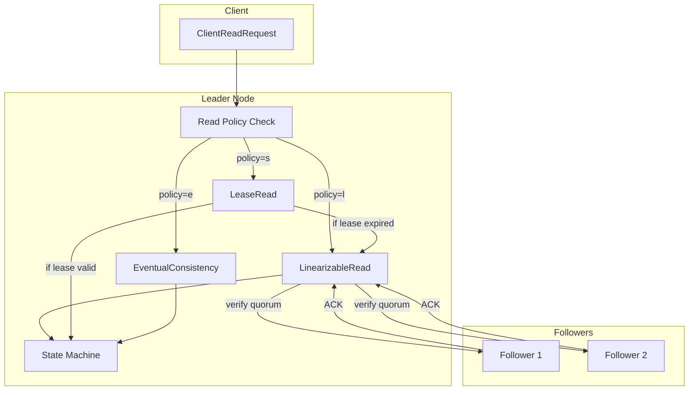

# Read Path Architecture

This document describes the internal implementation of read request processing in d-engine's Raft layer.

## Overview

d-engine supports three read consistency levels, each with different performance and consistency trade-offs:



## 1. LinearizableRead Path

**Guarantee**: Reads return the most recent committed value as of the moment the request arrives.

### Request Flow

```
┌──────┐                    ┌────────┐                 ┌──────────┐
│Client│                    │ Leader │                 │ Followers│
└──┬───┘                    └───┬────┘                 └────┬─────┘
   │                            │                           │
   │  ClientReadRequest         │                           │
   │ ─────────────────────────> │                           │
   │                            │                           │
   │                            │ verify_leadership()       │
   │                            │ ──────────────────────────>
   │                            │                           │
   │                            │ <────────────── Quorum ACK
   │                            │                           │
   │                            │ ensure_state_machine_upto_commit_index()
   │                            │                           │
   │                            │ read_from_state_machine(keys)
   │                            │                           │
   │  Response (success)        │                           │
   │ <───────────────────────── │                           │
```

### Code Path

```rust
// leader_state.rs
ServerReadConsistencyPolicy::LinearizableRead => {
    // Step 1: Verify leadership with quorum (ReadIndex protocol)
    if !self.verify_leadership_limited_retry(vec![], true, ctx, &role_tx)
        .await
        .unwrap_or(false)
    {
        return Err(Status::failed_precondition("Leadership verification failed"));
    }

    // Step 2: Ensure state machine is up-to-date
    self.ensure_state_machine_upto_commit_index(
        &ctx.handlers.state_machine_handler,
        last_applied_index,
    )?;

    // Step 3: Serve the read from state machine
    read_operation()
}
```

### Performance Characteristics

- **Network RTT**: 1 round-trip to verify quorum
- **Latency**: ~2.1ms p50 (dominated by network verification)
- **Throughput**: Baseline (limited by verification overhead)
- **Safety**: Strongest guarantee, no stale reads possible

## 2. LeaseRead Path

**Guarantee**: Reads return a value that was committed within the lease window.

### Lease Mechanism

```
┌────────┐
│ Leader │
└───┬────┘                  ┌──────────┐
    │                       │ Followers│
    │                       └────┬─────┘
    │                            │
    │  Periodic Heartbeat       │
    │  (AppendEntries, 100ms)   │
    │ ───────────────────────>  │
    │                           │
    │  <────────────────────────│ Quorum ACK
    │                           │
    │ update_lease_timestamp()  │
    │ ┌──────────────────────┐  │
    │ │ lease_timestamp =    │  │
    │ │ now + 500ms          │  │
    │ └──────────────────────┘  │
    │                           │

┌──────┐                    ┌────────┐
│Client│                    │ Leader │
└──┬───┘                    └───┬────┘
   │                            │
   │  ClientReadRequest         │
   │ ─────────────────────────> │
   │                            │
   │                            │ is_lease_valid()?
   │                            │ ┌──────────────────────────────┐
   │                            │ │ now < lease_timestamp?       │
   │                            │ │ YES: Skip network RTT        │
   │                            │ │ NO:  Fallback to Linearizable│
   │                            │ └──────────────────────────────┘
   │                            │
   │                            │ read_from_state_machine(keys)
   │                            │
   │  Response (success)        │
   │ <───────────────────────── │
```

### Code Path

```rust
// leader_state.rs
ServerReadConsistencyPolicy::LeaseRead => {
    if self.is_lease_valid(ctx) {
        // Serve immediately (no network RTT)
        read_operation()
    } else {
        // Lease expired, verify leadership
        if self.verify_leadership_limited_retry(...).await? {
            // Update lease after successful verification
            self.update_lease_timestamp();
            read_operation()
        } else {
            Err(Status::unavailable("Lease renewal failed"))
        }
    }
}

// Lease check
pub fn is_lease_valid(&self, ctx: &RaftContext<T>) -> bool {
    let lease_duration_ms = ctx.node_config.raft.read_consistency.lease_duration_ms;
    let lease_timestamp = self.lease_timestamp.load(Ordering::Acquire);
    let now = current_timestamp_ms();
    now < lease_timestamp + lease_duration_ms
}
```

### Performance Characteristics

- **Network RTT**: 0 (during lease period)
- **Latency**: ~0.3ms p50 (no network, only state machine read)
- **Throughput**: ~7x LinearizableRead
- **Safety**: Relies on bounded clock drift (<100ms)

### Lease Renewal Timeline

```
Time (ms) ───────────────────────────────────────────────>

0:     Heartbeat sent ────────────────> Followers
       │
100:   │ <───────── Quorum ACK
       │ lease_timestamp = 100
       │ lease valid until: 100 + 500 = 600ms
       │
150:   Read1 → Lease valid (150 < 600) → Serve immediately
       │
200:   Heartbeat sent ────────────────> Followers
       │
300:   │ <───────── Quorum ACK
       │ lease_timestamp = 300
       │ lease valid until: 300 + 500 = 800ms
       │
550:   Read2 → Lease valid (550 < 800) → Serve immediately
       │
850:   Read3 → Lease expired (850 > 800) → Verify leadership → Update lease
```

## 3. EventualConsistency Path

**Guarantee**: Reads see a valid committed state (may be stale).

### Request Flow

```
┌──────┐                    ┌──────┐
│Client│                    │ Node │ (Leader/Follower/Candidate)
└──┬───┘                    └───┬──┘
   │                            │
   │  ClientReadRequest         │
   │ ─────────────────────────> │
   │                            │
   │                            │ read_from_state_machine(keys)
   │                            │ (no verification)
   │                            │
   │  Response (success)        │
   │ <───────────────────────── │
```

### Code Path

```rust
// leader_state.rs
ServerReadConsistencyPolicy::EventualConsistency => {
    // Serve immediately, no verification
    read_operation()
}
```

### Performance Characteristics

- **Network RTT**: 0
- **Latency**: ~0.1ms p50 (pure state machine read)
- **Throughput**: ~20x LinearizableRead
- **Staleness**: Bounded by replication lag (typically <100ms)

## Comparison Matrix

| Feature | LinearizableRead | LeaseRead | EventualConsistency |
|---------|------------------|-----------|---------------------|
| **Network verification** | Every read | Only on lease expiry | Never |
| **Latency (p50)** | 2.1ms | 0.3ms | 0.1ms |
| **Throughput** | Baseline | ~7x | ~20x |
| **Clock dependency** | None | Low (NTP required) | None |
| **Staleness risk** | None | Clock drift only | Up to replication lag |
| **Node types** | Leader only | Leader only | Any node |

## Metrics

### LinearizableRead

- `raft.leadership_verification.initiated` - Total verifications triggered
- `raft.leadership_verification.duration_us` - Verification latency histogram
- `raft.linearizable_read.success` - Successful linearizable reads
- `raft.linearizable_read.failed` - Failed linearizable reads

### LeaseRead

- `raft.lease_renewal.success` - Heartbeats that successfully renewed lease
- `raft.lease_renewal.failed` - Failed heartbeats (lease not renewed)

## Future Optimizations

### Follower Read

Extend LinearizableRead to followers via ReadIndex RPC:

```rust
// Follower receives read
let read_index = self.request_read_index_from_leader().await?;
self.wait_for_apply(read_index).await?;
read_operation()
```

**Expected improvement**: 3x throughput (distributed reads).

## References

- Raft paper §8: Read-only queries
- etcd ReadIndex: https://etcd.io/docs/v3.5/learning/api/#read-operations
- Leadership verification: `leader_state.rs`
- Lease implementation: `leader_state.rs`
