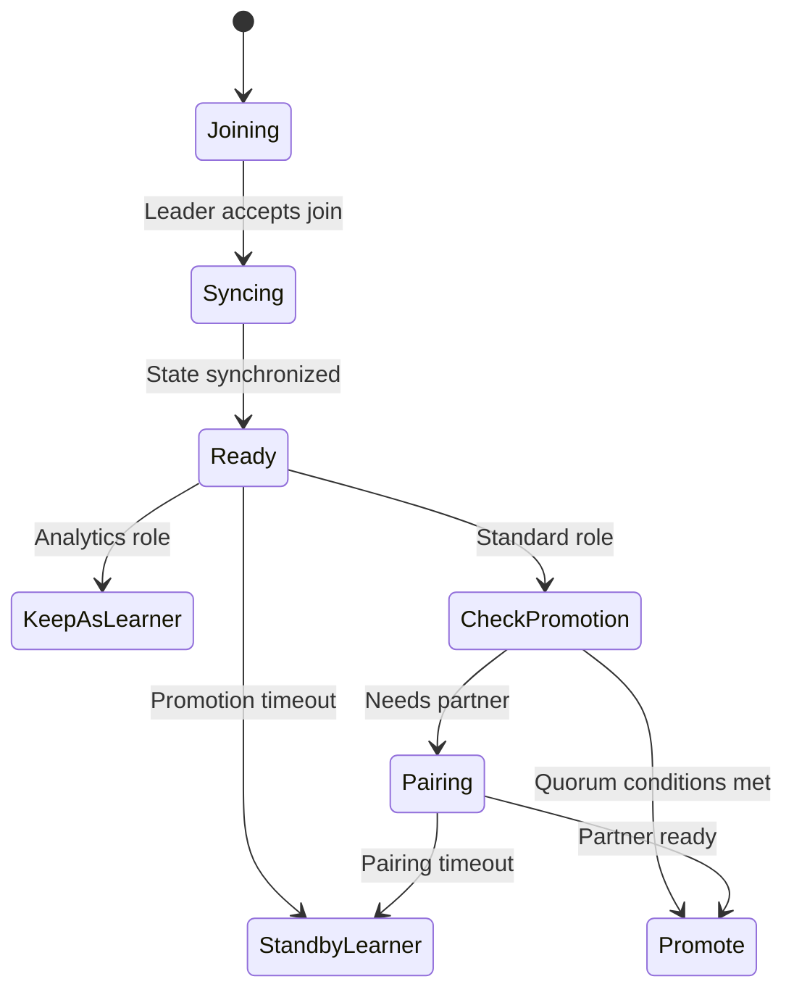
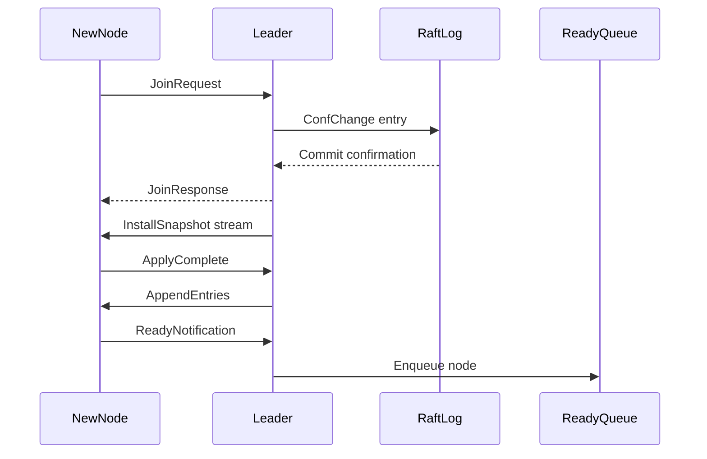
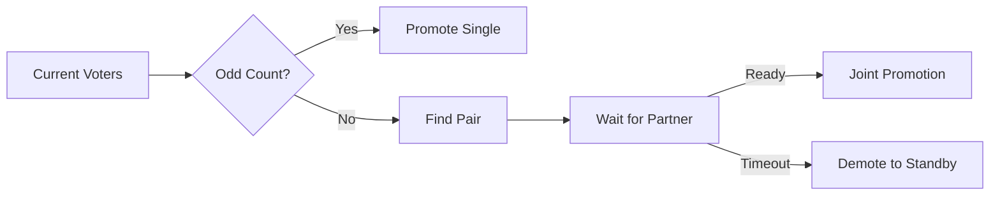

# **Raft Node Join & Promotion Architecture**

## **Business Objectives**

1. **Read Load Distribution** — Learners are promoted to Followers to share read traffic.
2. **High Availability for Mission-Critical Systems** — Maintain odd-numbered quorum for safe scaling.
3. **Offline Analysis / Disaster Recovery** — Support non-voting Learners for analytical or backup roles.

---

## **Architecture Principles**

| **Principle**                 | **Description**                                                                |
| ----------------------------- | ------------------------------------------------------------------------------ |
| **Even-Count Expansion Only** | Nodes must be added in pairs to keep the voting member count odd.              |
| **Sequential Join Handling**  | Leader handles join requests one at a time.                                    |
| **Atomic Join Semantics**     | Node either fully joins as ActiveFollower or rolls back on failure.            |
| **Retry on Join Failure**     | Join attempts include retry logic while waiting for peer readiness.            |
| **OpsAdmin Involvement**      | Manual intervention support planned for future releases (not implemented yet). |

## Node State Lifecycle

## Core Integration Flow

## Key Architectural Components

### **1. Connection Isolation**

- **Control Plane:** Heartbeats and votes with low latency.
- **Data Plane:** Log replication with high throughput.
- **Bulk Plane:** Snapshot transfer which is bandwidth intensive.

### **2. State Synchronization**

- **Immediate Snapshot:** New nodes always receive the latest snapshot first.
- **Atomic Replacement:** Crash-safe application of state.
- **Incremental Logs:** Catch-up via incremental log entries after snapshot.

### **3. Promotion System**

- **Quorum-Aware Batching:**
  - Maintains odd voter count for quorum safety.
  - FIFO processing of join and promotion requests.
  - Batch multiple promotions when possible.
- **Timeout Enforcement:**
  - Join Request timeout: 30 seconds.
  - Promotion window: 5 minutes.
  - Pairing wait timeout: 2 minutes.
- **Pairing Mechanism:**
  - Groups nodes that require partners for promotion.
  - Jointly promotes paired nodes once both are ready.

### **4. Failure Handling**

- **Stale Learner Detection:** Periodic status checks trigger automatic downgrade and operator alert.
- **Zombie Node Removal:** Removes unresponsive nodes through batch proposals and maintenance.

---

## Quorum Preservation

## Timeout Enforcement Summary

| **Scenario**      | **Timeout** | **Action**               |
| ----------------- | ----------- | ------------------------ |
| Join Request      | 30s         | Abort configuration      |
| Snapshot Transfer | Dynamic     | Resume from last chunk   |
| Promotion Window  | 5min        | Demote to StandbyLearner |
| Pairing Wait      | 2min        | Cancel pairing           |

## Lifecycle Example

1. **New Analytics Node**:

   `Joining → Syncing → Ready → KeepAsLearner`

2. **Standard Node Promotion**:

   `Joining → Syncing → Ready → Promote`

3. **Paired Promotion**:

   `Ready → Pairing → Promote` (when partner ready)

4. **Failed Node**:

   `Syncing → [Timeout] → Zombie → Removed`
