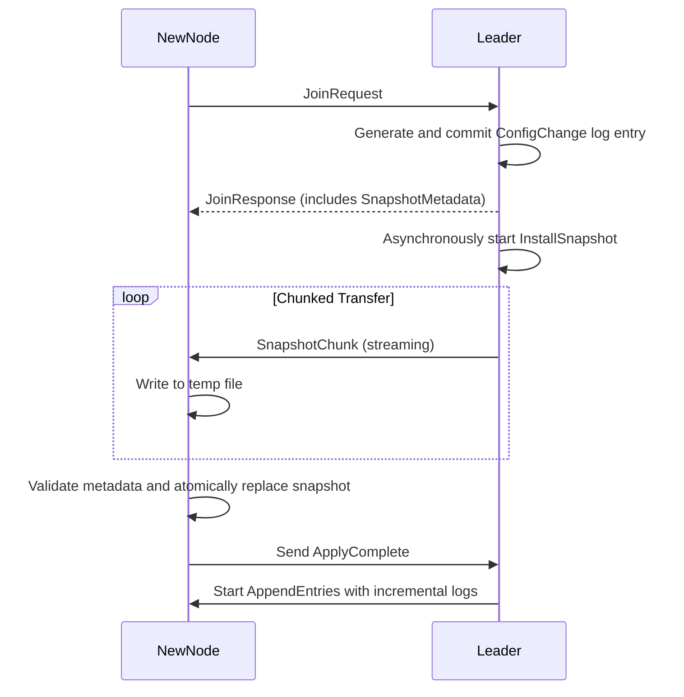

**Adding a Learner Node to a Raft Cluster**
When integrating a new learner node into an existing Raft cluster, it must first receive a snapshot of the current state to catch up with the leader’s log. The following sequence diagram outlines the typical flow for this process:

---
### **Synchronization Policy**
#### **Default Snapshot First:**

- A newly joined learner always receives the leader’s latest snapshot immediately, even if it previously held partial logs.
- This avoids log reconciliation complexity and ensures the learner starts from a fully consistent state.
- Historical logs (if any) on the learner are discarded after snapshot installation.
---
### **Step-by-Step Explanation**

1. **Join Request**:
    
    The NewNode sends a JoinRequest to the Leader, indicating it wants to join the cluster as a learner.
    
2. **Config Change Log Generation**:
    
    The Leader generates a ConfChange entry (typically of type AddLearnerNode) and appends it to its log. Once committed, the learner is officially part of the configuration.
    
3. **Join Response and Snapshot Metadata**:
    
    The Leader responds with a JoinResponse, which includes snapshot metadata required to initiate the state transfer.
    
4. **Snapshot Installation Initiation**:
    
    The Leader asynchronously starts the snapshot transfer process using the InstallSnapshot mechanism.
    
5. **Snapshot Chunk Transfer**:
    
    The snapshot is transferred in chunks. Each SnapshotChunk is sent to the NewNode, which writes them to a temporary file.
    
6. **Snapshot Replacement**:
    
    After all chunks are received, the learner:
    - Validates the snapshot against the metadata (index, term, checksum).
    - Atomically replaces its current state with the new snapshot.
    
7. **Apply Complete**:
    
    After applying the snapshot, the NewNode sends an ApplyComplete message to the Leader.
    
8. **Log Synchronization**:
    
    The Leader begins streaming incremental logs via AppendEntries to bring the learner up-to-date.
    

### **Important Notes**

- **Atomic Snapshot Replacement**:
    
    The learner must ensure the snapshot is atomically replaced only after full verification to avoid partial application.
    
- **Streaming Must Be Reliable**:
    
    Chunked snapshot transfer should be handled with backpressure, retries, and integrity checks to ensure robustness.
    
- **Learner Is Non-Voting**:
    
    Learner nodes do not affect quorum and are typically used for read scaling or preparing a node for promotion.
    
- **No Log Entries Until Snapshot Applied**:
    
    The leader should not send AppendEntries until the snapshot is fully installed and acknowledged.