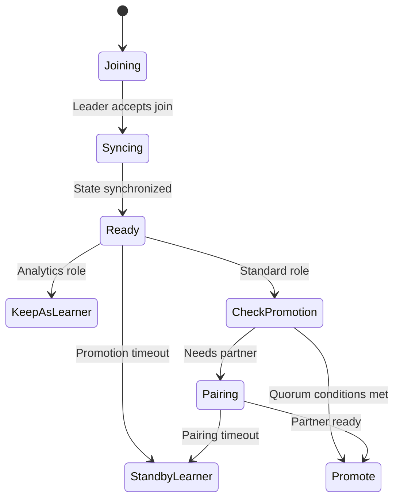
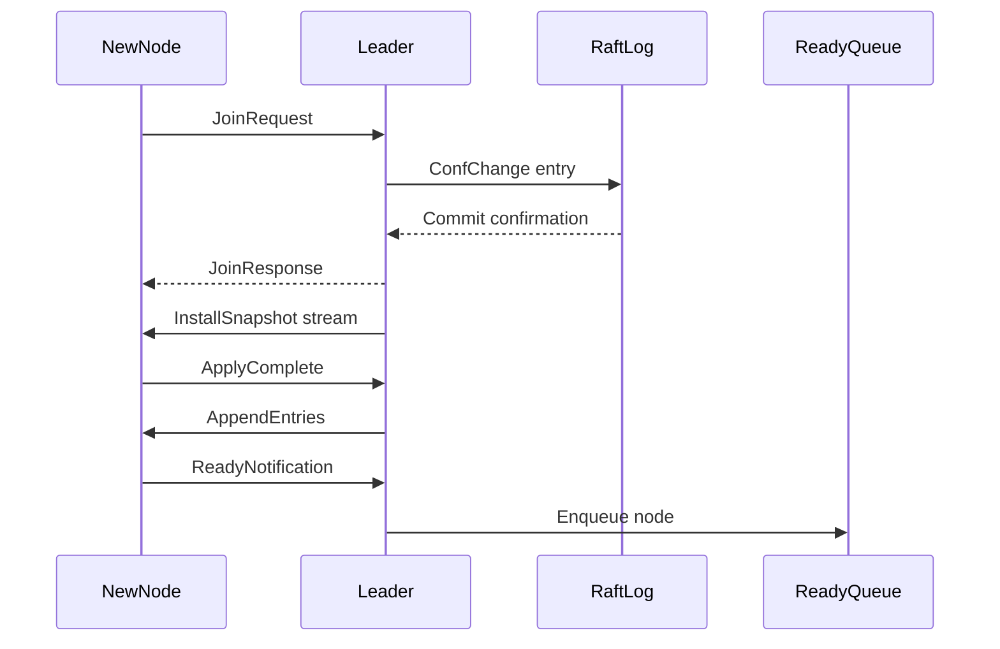
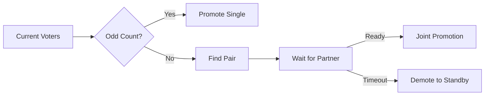
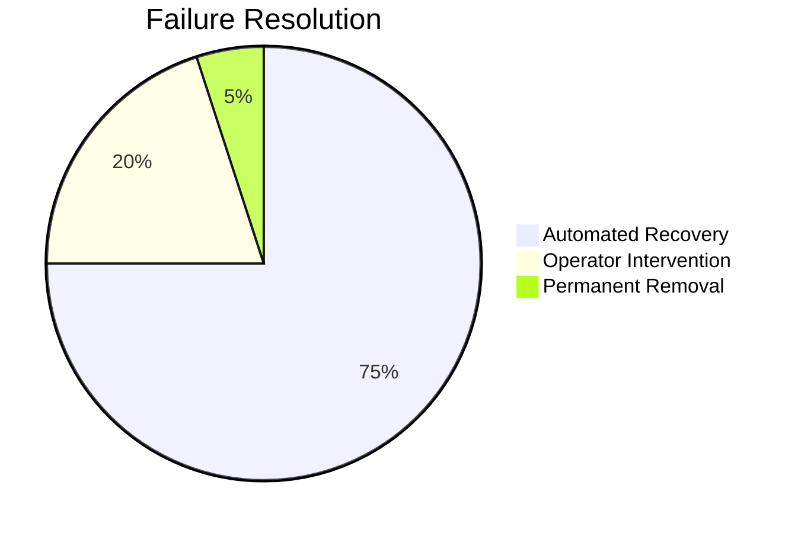

# Raft Node Promotion Architecture

## State Lifecycle

## Core Integration Flow

## Key Architectural Components

### 1. Connection Isolation

- **Control Plane**: Heartbeats/votes (low latency)
- **Data Plane**: Log replication (high throughput)
- **Bulk Plane**: Snapshots (bandwidth-intensive)

### 2. State Synchronization

- **Immediate Snapshot Strategy**: New nodes always receive latest snapshot
- **Atomic Replacement**: Crash-safe state application
- **Incremental Logs**: Catch-up after snapshot

### 3. Promotion System

- **Quorum-Aware Batching**:
  - Maintains odd voter count
  - Processes nodes FIFO
  - Batches multiple promotions
- **Timeout Enforcement**:
  - 5-minute promotion window
  - Automatic demotion to standby
- **Pairing Mechanism**:
  - Groups nodes needing partners
  - Joint promotion when ready

### 4. Failure Handling

- **Stale Learner Detection**:
  - Periodic queue inspection
  - Automated status downgrade
  - Operator alerts
- **Zombie Node Removal**:
  - Identifies non-responsive nodes
  - Batch removal proposals
  - Periodic maintenance checks

## Critical Design Decisions

### 1. Leader-Driven Synchronization

- Leader initiates snapshot transfer
- Ensures consistent starting point
- Avoids complex log reconciliation

### 2. Quorum Preservation

### 3. Operational Resilience

- **Connection Pre-warming**: Faster failover
- **Compressed Snapshots**: Reduced bandwidth
- **Progressive Backoffs**: Network failure handling

## Timeout Enforcement

| **Scenario**      | **Timeout** | **Action**               |
| ----------------- | ----------- | ------------------------ |
| Join Request      | 30s         | Abort configuration      |
| Snapshot Transfer | Dynamic     | Resume from last chunk   |
| Promotion Window  | 5min        | Demote to StandbyLearner |
| Pairing Wait      | 2min        | Cancel pairing           |

## Benefits

1. **Crash Safety**: Atomic state transitions
2. **Operational Simplicity**: Automated failure handling
3. **Progressive Scalability**: Learners don't affect quorum
4. **Resource Efficiency**: Connection type isolation
5. **Predictable Performance**: FIFO processing

## Failure Handling Strategy

## Lifecycle Example

1. **New Analytics Node**:

   `Joining → Syncing → Ready → KeepAsLearner`

2. **Standard Node Promotion**:

   `Joining → Syncing → Ready → Promote`

3. **Paired Promotion**:

   `Ready → Pairing → Promote` (when partner ready)

4. **Failed Node**:

   `Syncing → [Timeout] → Zombie → Removed`
