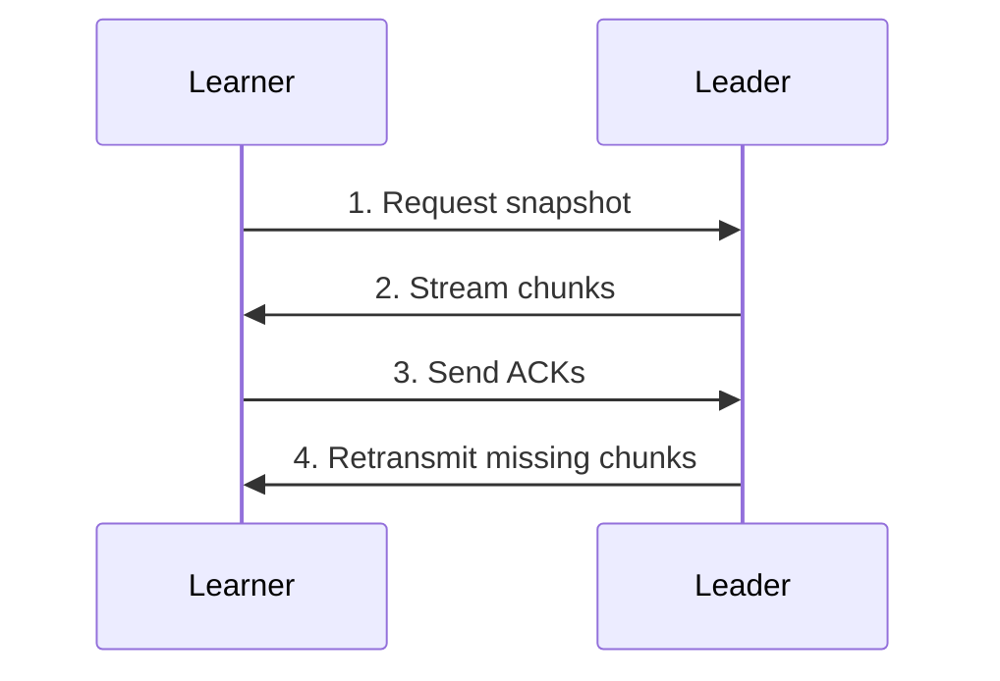
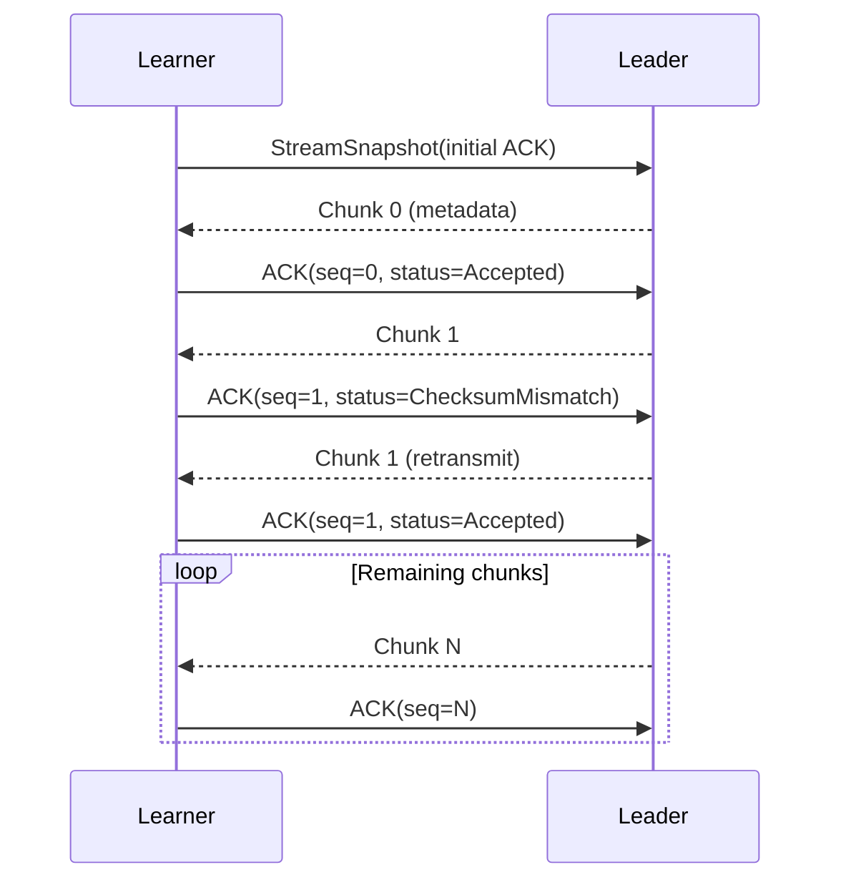
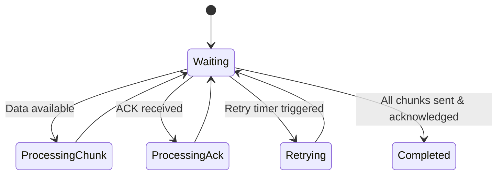
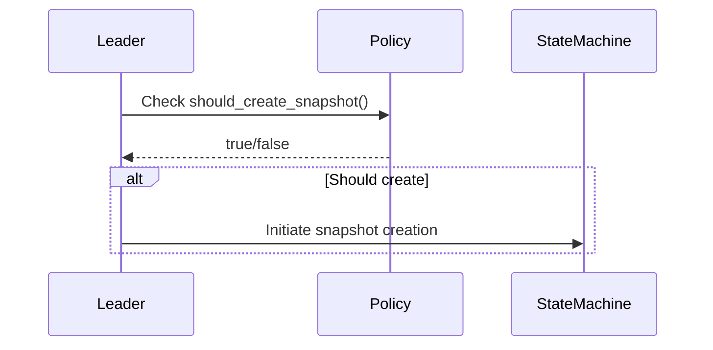
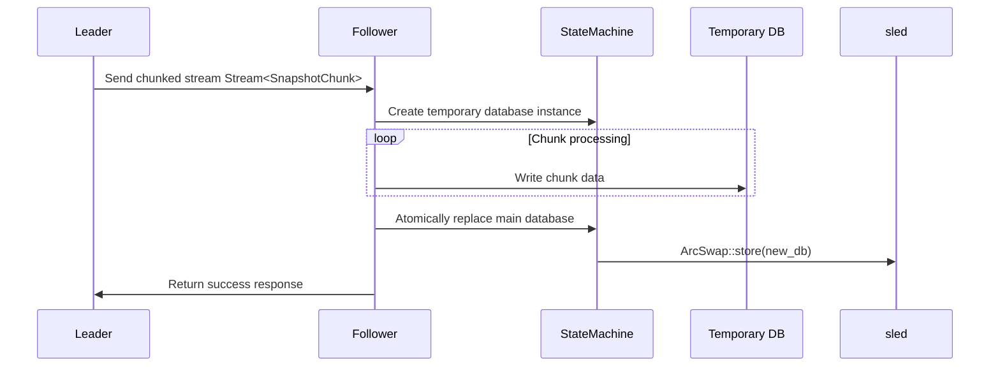
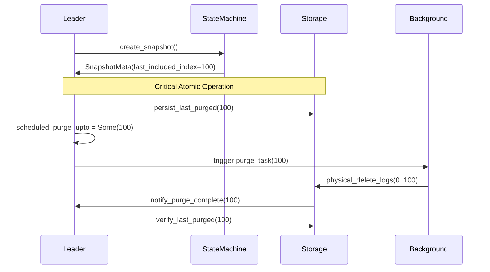
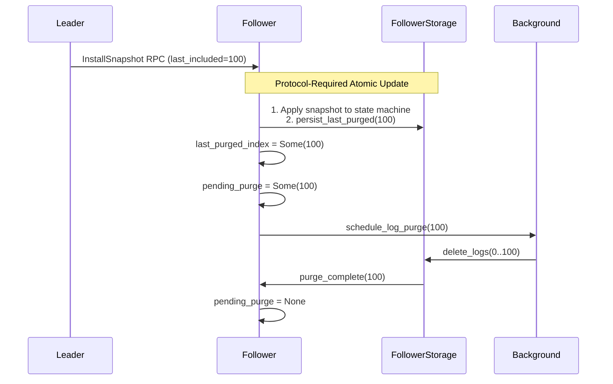

# Snapshot Module


Defines interface and behaviors for snapshot operations in `d-engine` Raft implementation.

## Design Philosophy

- **Pluggable strategy**: Intentional flexibility for snapshot policies and storage implementations
- **Zero-enforced approach**: No default snapshot strategy - implement based on your storage needs
- **Reference implementation**: `sled`-based demo included (not production-ready)

## Core Concepts

### Snapshot Transfer: Bidirectional Streaming Design




1. **Dual-channel communication**:
    - Data channel: Leader → Learner (SnapshotChunk stream)
    - Feedback channel: Learner → Leader (SnapshotAck stream)
2. **Key benefits**:
    - **Flow control**: ACKs regulate transmission speed
    - **Reliability**: Per-chunk CRC verification
    - **Resumability**: Selective retransmission of failed chunks
    - **Backpressure**: Explicit backoff when receiver lags
3. **Sequence**:



#### The bidirectional snapshot transfer is implemented as a state machine, coordinating both data transmission (chunks) and control feedback (ACKs) between Leader and Learner.



**Data Flow Summary**:
```text
Leader                          Learner
  |                                |
  |--> Stream<SnapshotChunk> ----> |
  |                                |
  |<-- Stream<SnapshotAck> <------ |
  |                                |
```


### **Snapshot Policies**

Fully customizable through **`SnapshotPolicy`** trait:

```rust,ignore
pub trait SnapshotPolicy {
    fn should_create_snapshot(&self, ctx: &SnapshotContext) -> bool;
}

pub struct SnapshotContext {
    pub last_included_index: u64,
    pub last_applied_index: u64,
    pub current_term: u64,
    pub unapplied_entries: usize,
}
```
Enable customized snapshot policy:

```rust,ignore
let node = NodeBuilder::new()
    .with_snapshot_policy(Arc::new(TimeBasedPolicy {
        interval: Duration::from_secs(3600),
    }))
    .build();
```

By default, Size-Based Policy is enabled.

#### Snaphot policy been used when generate new snapshot


**Common policy types**:

- Size-based (default)
- Time-based intervals
- Hybrid approaches
- External metric triggers


### Leader generate snapshot sequence diagram



### **Transfer Mechanics**

1. **Chunking**:
    - Fixed-size chunks (configurable 4-16MB)
    - First chunk contains metadata
    - CRC32 checksum per chunk
2. **Rate limiting**:

```rust,ignore
if config.max_bandwidth_mbps > 0 {
    let min_duration = chunk_size_mb / config.max_bandwidth_mbps;
    tokio::time::sleep(min_duration).await;
}
```

1. **Error recovery**:
    - Checksum mismatches trigger single-chunk retransmission
    - Out-of-order detection resets stream position
    - 10-second ACK timeout fails entire transfer

### **Module Responsibilities**

| **Component** | **Responsibilities** |
| --- | --- |
| **StateMachineHandler** | - Chunk validation- Temporary file management- ACK generation- Error handling- Snapshot finalization |
| **StateMachine** | - Snapshot application- Online state replacement- Consistency guarantees |

#### Generating a new snapshot:
1. [**StateMachine**] Generate new DB based on the temporary file provided by the [**StateMachineHandler**] → 
2. [**StateMachine**] Generate data → 
3. [**StateMachine**] Dump current DB into the new DB → 
3. [**StateMachineHandler**] Verify policy conditions and finalize the snapshot and updating the snapshot version.

#### Applying a snapshot:
1. [**StateMachineHandler**] Snapshot chunk reception and validation → 
2. [**StateMachineHandler**] Write chunks into a temporary file until success → 
3. [**StateMachineHandler**] Error handling and sends error response back to the sender and terminates the process → 
4. After all chunks have been successfully processed and validated, the [**StateMachineHandler**] finalizes the snapshot →  
5. [**StateMachineHandler**] Passing the snapshot file to the [**StateMachine**] → 
6. [**StateMachine**] Apply Snapshot and do online replacement - replacing the old state with the new one based on the snapshot. 

#### Cleaning up old snapshots:
[**StateMachineHandler**] automatically maintains old snapshots according to version policies, while the **StateMachine** is not aware of it.

## **Purge Log Design**

### Leader Purge Log State Management



### Follower Purge Log State Management

