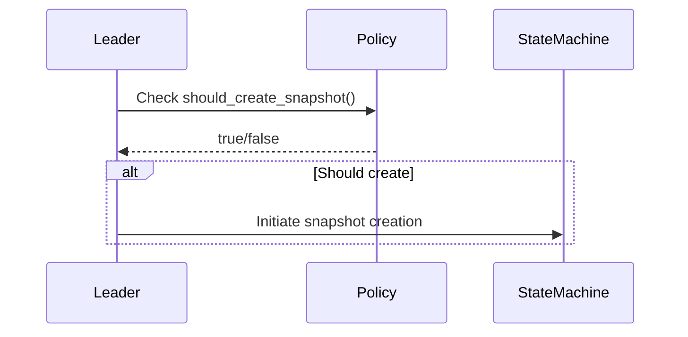
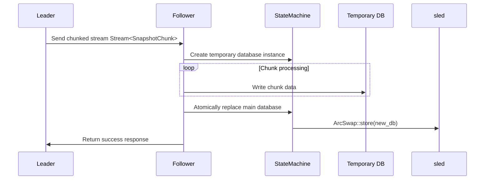
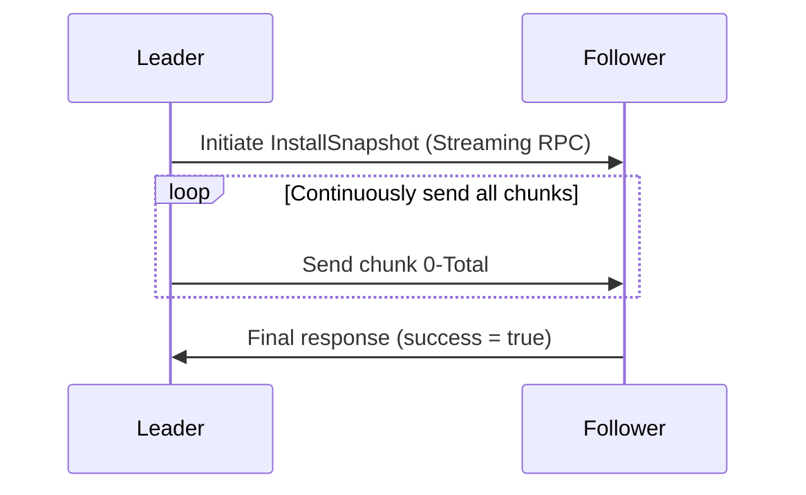
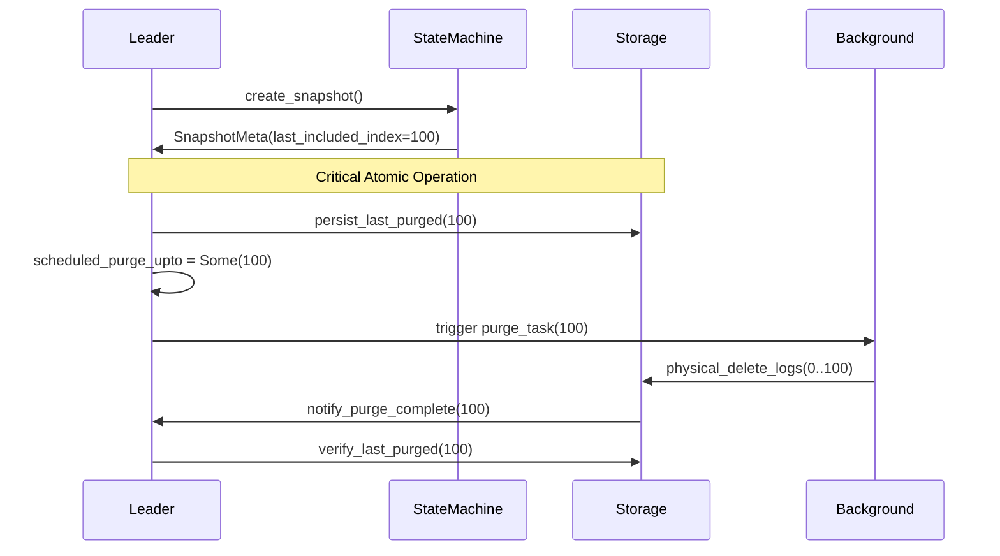
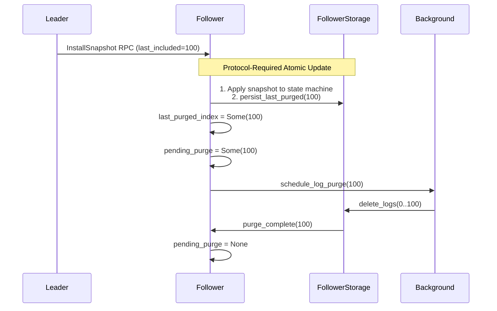

# Snapshot Module

This module defines the interface and expected behaviors for snapshot generation and application in the Raft protocol implementation of `d-engine`.

## Snapshot Design Philosophy

Snapshotting is a critical component of any Raft-based system. However, the exact strategy for generating and applying snapshots can vary widely depending on the type of storage engine, system requirements, and performance characteristics.

Rather than enforce a single implementation, `d-engine` **intentionally leaves the snapshot generation strategy including snapshot policy customization open to the developer**. This provides flexibility for different use cases and backend storage systems.

### Pluggable Snapshot Strategy

Different databases and distributed systems adopt different approaches to snapshotting. For example:

- Some systems take full on-disk snapshots by pausing the world.
- Others implement incremental snapshotting using copy-on-write or changelogs.
- Some persist in-memory state periodically or through a background thread.

To accommodate this diversity, `d-engine` provides:

- **A trait-based interface** that defines the core behaviors required by any snapshot implementation.
- **A reference implementation** based on the `sled` embedded database to demonstrate how a snapshot strategy can be implemented.

### Included Example

The `sled`-based snapshot implementation included in `d-engine` is meant to serve as a **working demo**, not a production-ready solution. It demonstrates:

- How to implement the `SnapshotBuilder` and `SnapshotApplier` traits.
- A simple full-state serialization approach using `sled` key-value pairs.
- How to restore state from a binary snapshot blob.

## **Generate Snapshot**

### Snapshot Policy Configuration

#### Custom Snapshot Policies
The snapshot generation strategy is fully customizable through the SnapshotPolicy trait. Developers can implement their own policies based on specific requirements like:

- Log size thresholds
- Time-based intervals
- Combination of multiple conditions
- External system metrics

```rust,ignore
/// Trait to implement custom snapshot policies
pub trait SnapshotPolicy: Send + Sync + 'static {
    /// Determine if a snapshot should be generated
    /// - ctx: Contains snapshot generation context (last applied index, term, etc.)
    /// - config: Current node configuration
    fn should_create_snapshot(&self, ctx: &SnapshotContext, config: &SnapshotConfig) -> bool;
}

/// Context for policy decision
pub struct SnapshotContext {
    pub last_included_index: u64,
    pub last_applied_index: u64,
    pub current_term: u64,
    pub unapplied_entries: usize,
}
```

#### Implementing a Custom Policy
1. Implement the trait:

```rust,ignore
struct TimeBasedPolicy {
    interval: Duration,
}

impl SnapshotPolicy for TimeBasedPolicy {
    fn should_create_snapshot(&self, ctx: &SnapshotContext, _: &SnapshotConfig) -> bool {
        SystemTime::now()
            .duration_since(LAST_SNAPSHOT_TIME.load(Ordering::Relaxed))
            .unwrap() >= self.interval
    }
}
```
2. Register with NodeBuilder:

#### Install Snapshot Sequence Diagram


## **Install Snapshot**

```rust,ignore
let node = NodeBuilder::new()
    .with_snapshot_policy(Arc::new(TimeBasedPolicy {
        interval: Duration::from_secs(3600),
    }))
    .build();
```

By default, Size-Based Policy is enabled.

### Sequence diagram



## **Snapshot Transfer**

**Use Stream-based Chunking**:

1. **Memory Efficiency**: Transmit snapshots as a sequence of chunks via streaming RPC to avoid loading entire snapshots into memory.
2. **Fault Tolerance**: Implement retry logic per chunk (e.g., CRC checks) and resume from the last failed chunk.
3. **Parallelism**: Allow concurrent processing of received chunks (e.g., writing to disk while receiving).
4. **Flow Control**: Dynamically adjust chunk size based on network conditions (e.g., 4MB–16MB chunks).
    

#### **Stream<Chunk> vs. Direct Chunk (Even Chunk Size Is Controlled)**

| Criteria           | Stream<Chunk>                                    | Direct Chunk (One Chunk per Request)                       |
|--------------------|--------------------------------------------------|------------------------------------------------------------|
| Connection Overhead | Single long-lived connection for all chunks.    | New TCP/TLS handshake per chunk (high overhead).           |
| Order Guarantee    | Chunks are sent/received in order (built-in).     | Requires manual tracking of chunk sequence.                |
| Atomicity          | Stream can be canceled mid-transfer (e.g., leader change). | Partial failures leave inconsistent state (no cleanup). |
| Error Recovery     | Resumable from last failed chunk (server retains state). | Client must track progress and retry manually.           |
| Backpressure       | Built-in flow control (gRPC manages data pacing). | No backpressure; clients/server may overload.              |
| Code Complexity    | Server handles chunks as a unified stream.       | Client must orchestrate chunk order and retries.           |

The Leader continuously sends snapshot chunks to the Follower through an RPC stream.


---
### Module responsbilitiies - Statemachine and StateMachineHandler

#### Generating a new snapshot:
1. [**StateMachine**] Generate new DB based on the temporary file provided by the [**StateMachineHandler**] → 
2. [**StateMachine**] Generate data → 
3. [**StateMachine**] Dump current DB into the new DB → 
3. [**StateMachineHandler**] Verify policy conditions and finalize the snapshot and updating the snapshot version.

#### Applying a snapshot:
1. [**StateMachineHandler**] Snapshot chunk reception and validation → 
2. [**StateMachineHandler**] Write chunks into a temporary file until success → 
3. [**StateMachineHandler**] Error handling and sends error response back to the sender and terminates the process → 
4. After all chunks have been successfully processed and validated, the [**StateMachineHandler**] finalizes the snapshot →  
5. [**StateMachineHandler**] Passing the snapshot file to the [**StateMachine**] → 
6. [**StateMachine**] Apply Snapshot and do online replacement - replacing the old state with the new one based on the snapshot. 

#### Cleaning up old snapshots:
[**StateMachineHandler**] automatically maintains old snapshots according to version policies, while the **StateMachine** is not aware of it.

## **Purge Log Design**

### Leader Purge Log State Management



### Follower Purge Log State Management
