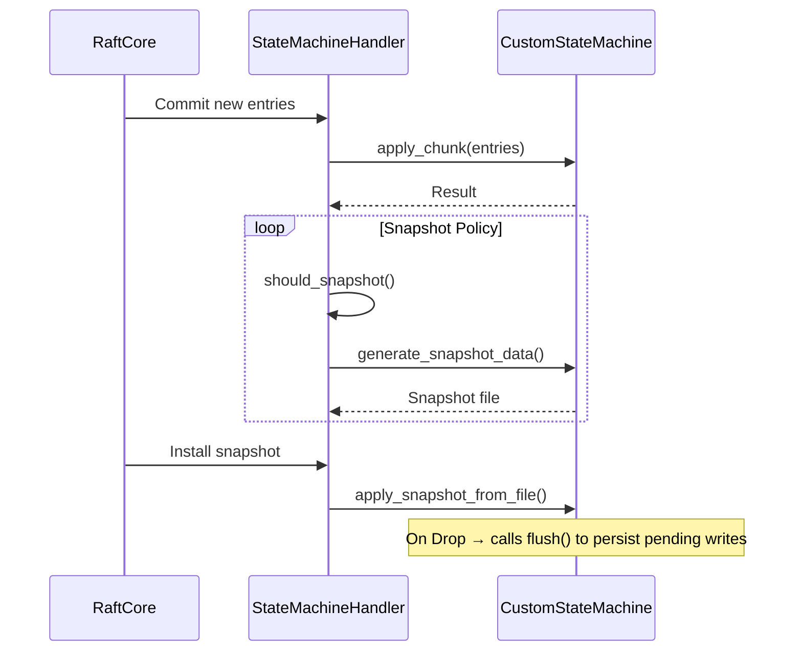

## **Implementing Custom State Machines**

d-engine supports **pluggable state machines** through the `StateMachine` trait. This is where your application's core logic executes - processing committed log entries to update application state.

### **Architecture Context**

- The **StateMachine** is the **application logic layer** that processes committed Raft log entries
- The **StateMachineHandler** manages the lifecycle: applying entries, triggering snapshots, handling purges
- **Default integration** uses File-based storage but can be replaced
- Custom implementations enable specialized behaviors for key-value stores, document databases, etc.

### 1. Implement the Trait

```rust,ignore
use d_engine::{StateMachine, Result, Entry, LogId, SnapshotMetadata};
use async_trait::async_trait;

struct CustomStateMachine {
    // Your storage backend
    backend: Arc<dyn ApplicationStorage>,
    last_applied: AtomicU64,
    snapshot_meta: Mutex<Option<SnapshotMetadata>>
}

impl Drop for CustomStateMachine {
    fn drop(&mut self) {
        if let Err(e) = self.flush() {
            // Log error but don't panic in drop
            tracing::error!("Failed to flush state machine: {}", e);
        }
    }
}

#[async_trait]
impl StateMachine for CustomStateMachine {
    async fn apply_chunk(&self, chunk: Vec<Entry>) -> Result<()> {
        // Deserialize and process entries
        for entry in chunk {
            let cmd: AppCommand = bincode::deserialize(&entry.data)?;
            self.backend.execute(cmd)?;
        }
        Ok(())
    }

    async fn apply_snapshot_from_file(
        &self,
        meta: &SnapshotMetadata,
        path: PathBuf
    ) -> Result<()> {
        // 1. Validate checksum
        // 2. Load snapshot
        // 3. Atomically replace state
    }

    // Other required methods...
}

```

### **2. Key Implementation Notes**

- **Atomic Operations**: Ensure `apply_chunk()` either fully applies or fails the entire batch
- **Idempotency**: Handle duplicate entries safely
- **Snapshot Isolation**: `apply_snapshot_from_file()` must atomically replace state
- **Checksum Validation**: Mandatory for snapshot integrity
- **Concurrency Control**: Use appropriate locking for state mutations

---

### **3. StateMachine API Reference**

| **Method**                           | **Purpose**                                | **Invoked When**                       |
| ------------------------------------ | ------------------------------------------ | -------------------------------------- |
| start()                              | Start the state machine service            | Node initialization                    |
| stop()                               | Stop the state machine service gracefully  | Node shutdown                          |
| is_running()                         | Check if service is active                 | Health checks                          |
| get(key: &[u8])                      | Read current state by key                  | Handling client read requests          |
| entry_term(entry_id: u64)            | Get term for specific log index            | Log consistency checks                 |
| apply_chunk(chunk: Vec<Entry>)       | Apply committed log entries                | New entries are committed              |
| len()                                | Return number of entries                   | Monitoring / debugging                 |
| is_empty()                           | Check if state machine has no entries      | Used internally by RaftCore            |
| update_last_applied(last: LogId)     | Update last applied index in memory        | During entry application               |
| last_applied()                       | Get last applied index and term            | Recovery and node restart              |
| persist_last_applied(last: LogId)    | Persist last applied index to storage      | Periodically and during shutdown       |
| update_last_snapshot_metadata(meta)  | Update snapshot metadata in memory         | After snapshot is created or installed |
| snapshot_metadata()                  | Retrieve current snapshot metadata         | Snapshot transfer initialization       |
| persist_last_snapshot_metadata(meta) | Persist snapshot metadata to storage       | During snapshot lifecycle              |
| apply_snapshot_from_file()           | Replace state with snapshot                | Installing leader snapshot             |
| generate_snapshot_data()             | Create new snapshot in specified directory | Snapshot creation                      |
| save_hard_state()                    | Persist term/voting state                  | On term changes / elections            |
| flush()                              | Ensure all pending writes are persisted    | Called in Drop and before shutdown     |
| reset()                              | Reset state machine to initial state       |                                        |

---

### **4. State Machine Lifecycle**



---

### **5. Register with NodeBuilder**

```rust,ignore
let custom_sm = Arc::new(CustomStateMachine::new());

NodeBuilder::new(config, shutdown_rx)
    .state_machine(custom_sm.clone())  // Set state machine
    .build();

```

---

### **6. Drop Implementation Example**

# Drop Implementation

Implementors MUST ensure that the state machine properly persists its state
when dropped. The recommended pattern is:

```rust,ignore
impl Drop for YourStateMachine {
    fn drop(&mut self) {
        if let Err(e) = self.flush() {
            // Log error but don't panic in drop
            tracing::error!("Failed to flush state machine: {}", e);
        }
    }
}
```
