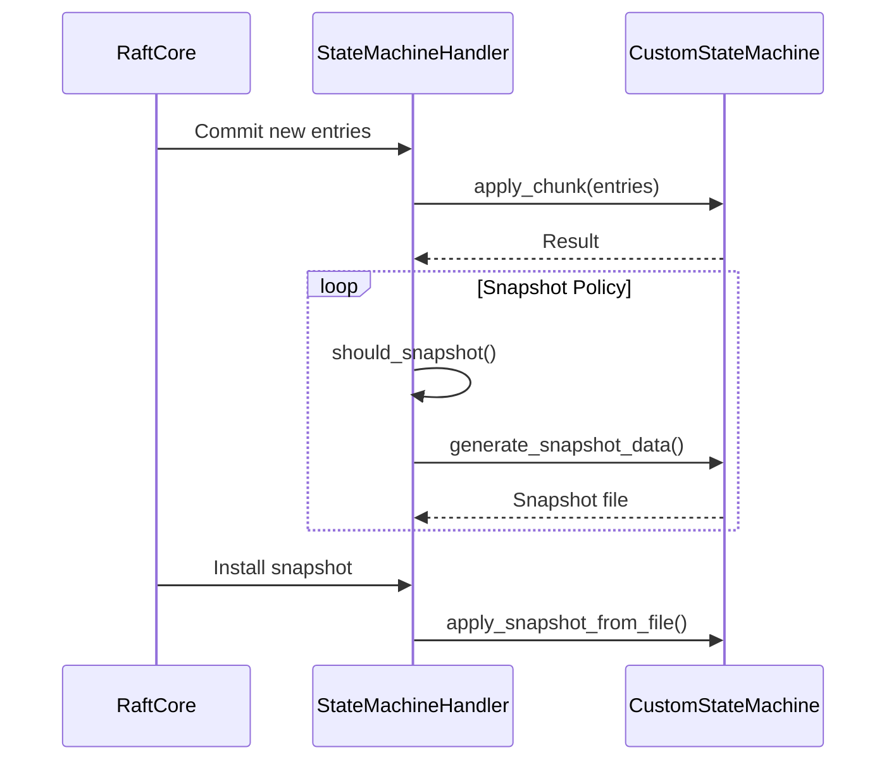

## **Implementing Custom State Machines**

d-engine supports **pluggable state machines** through the `StateMachine` trait. This is where your application's core logic executes - processing committed log entries to update application state.

### **Architecture Context**

- The **StateMachine** is the **application logic layer** that processes committed Raft log entries
- The **StateMachineHandler** manages the lifecycle: applying entries, triggering snapshots, handling purges
- **Default integration** uses Sled-based storage but can be replaced
- Custom implementations enable specialized behaviors for key-value stores, document databases, etc.

### 1. Implement the Trait

```rust,ignore
use d_engine::{StateMachine, Result, Entry, LogId, SnapshotMetadata};
use async_trait::async_trait;

struct CustomStateMachine {
    // Your storage backend
    backend: Arc<dyn ApplicationStorage>,
    last_applied: AtomicU64,
    snapshot_meta: Mutex<Option<SnapshotMetadata>>
}

#[async_trait]
impl StateMachine for CustomStateMachine {
    fn apply_chunk(&self, chunk: Vec<Entry>) -> Result<()> {
        // Deserialize and process entries
        for entry in chunk {
            let cmd: AppCommand = bincode::deserialize(&entry.data)?;
            self.backend.execute(cmd)?;
        }
        Ok(())
    }

    async fn apply_snapshot_from_file(
        &self,
        meta: &SnapshotMetadata,
        path: PathBuf
    ) -> Result<()> {
        // 1. Validate checksum
        // 2. Load snapshot
        // 3. Atomically replace state
    }

    // Other required methods...
}

```

### **2. Key Implementation Notes**

- **Atomic Operations**: Ensure `apply_chunk()` either fully applies or fails the entire batch
- **Idempotency**: Handle duplicate entries safely
- **Snapshot Isolation**: `apply_snapshot_from_file()` must atomically replace state
- **Checksum Validation**: Mandatory for snapshot integrity
- **Concurrency Control**: Use appropriate locking for state mutations

---

### **3. StateMachine API Reference**

| **Method**                       | **Purpose**                                | **Invoked When**                      |
| -------------------------------- | ------------------------------------------ | ------------------------------------- |
| `apply_chunk(chunk: Vec<Entry>)` | Process batch of committed log entries     | New entries are committed             |
| `get(key: &[u8])`                | Read current state by key                  | Handling client read requests         |
| `entry_term(entry_id: u64)`      | Get term for specific log index            | Log consistency checks                |
| `last_applied()`                 | Get last applied (index, term)             | Node initialization/recovery          |
| `persist_last_applied()`         | Save last applied index to durable storage | Periodically and during shutdown      |
| `snapshot_metadata()`            | Get current snapshot metadata              | Snapshot transfer initialization      |
| `apply_snapshot_from_file()`     | Replace state with snapshot from file      | Installing leader snapshot            |
| `generate_snapshot_data()`       | Create new snapshot in specified directory | Snapshot creation triggered by policy |
| `save_hard_state()`              | Persist voting/term information            | Term changes                          |

---

### **4. State Machine Lifecycle**



---

### **5. Register with NodeBuilder**

```rust,ignore
let custom_sm = Arc::new(CustomStateMachine::new());

NodeBuilder::new(config, shutdown_rx)
    .state_machine(custom_sm.clone())  // Set state machine
    .with_custom_state_machine_handler(  // Optional handler override
        Arc::new(CustomHandler::new(custom_sm))
    .build();

```
